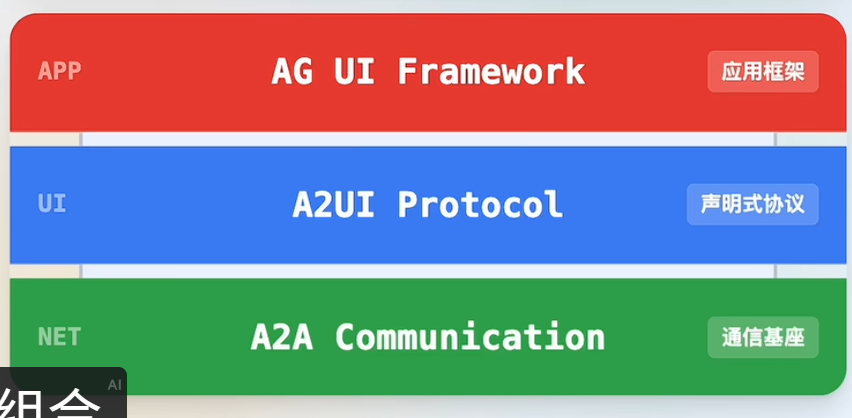

## [A2UI](https://github.com/google/A2UI)

- AI2GUI, AIUI，A2UI通用Agent协议：直接按照用户的需求，给出一些可选表单让用户一次性填完关键信息、指定参数，而不用大模型多轮乒乓交互，盲人摸象般地高负载串行

1. 安全：Agent不直接发代码，而是结构化数据蓝图，如json格式数据
2. surfaceUpdate描述页面要求, dataModelUpdate注入数据约束
3. 给各渲染器发送UI的json描述，让各组件自行渲染，一份协议，多端落地

只负责表达

- A2UI餐厅预定，https://github.com/google/A2UI

## [AG-UI](https://github.com/ag-ui-protocol/ag-ui/)

基于A2UI的结构化数据蓝图，快速搭建前端组件库、会话状态管理及后端握手逻辑，实现UI生成

### 功能介绍

- function calling：函数调用，大模型与agent的交互，使大模型能够按照函数要求进行格式化调用，如函数名，参数等  
- MCP：Model Context Protocol，模型上下文协议，让AI模型能够读取（加载整个MCP工具所有信息）外部工具并进行选择调用
- Skill：技能，即外部工具，如搜索引擎、计算器等，AI模型能够读取skill的信息（metadata描述信息等）并进行技能的选择调用
