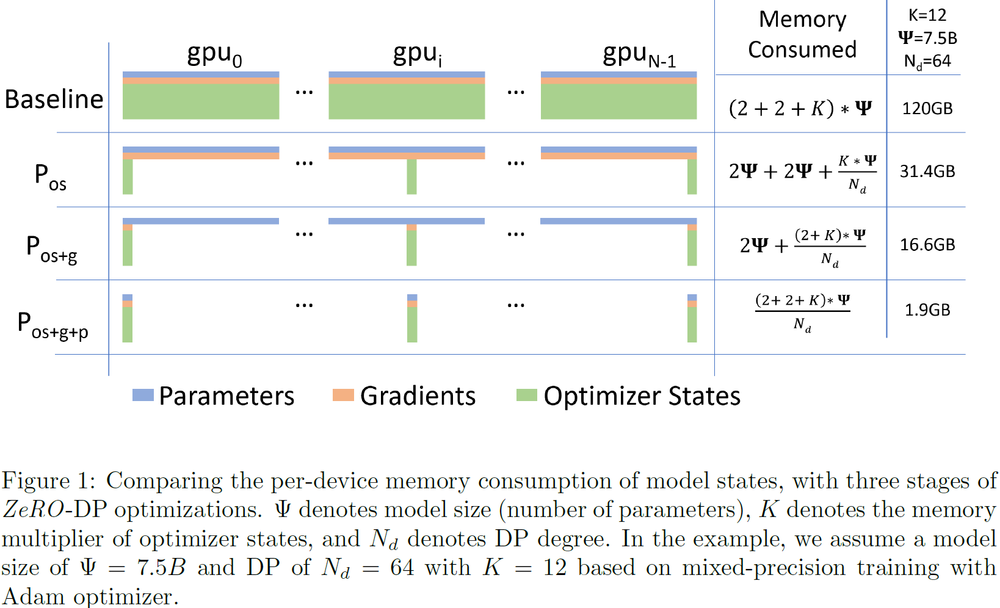

## ZeRO
> 论文：ZeRO: Memory Optimizations Toward Training Trillion Parameter Models  
> ZeRO：**Ze**ro **R**edundancy **O**ptimizer  
> Github：[DeepSpeed](https://github.com/deepspeedai/DeepSpeed)  
> Microsoft, 2019 Oct, SC2020

### 主要内容
DeepSpeed 是由微软开发的一个开源深度学习优化库，基于 ==并非所有梯度和参数的状态在任何时候都是必需的这一见解== ，增加可高效训练的模型规模，同时优化内存，大幅提高训练速度。

#### ZeRO-DP

    

以[AMP](../../Paper_Reading/Trick/Light_Weighting/Quantization/quantization.md#amp) FP32/FP16训练场景为例，$\Psi$ 表示模型总参数量

1. **ZeRO-1 $P_{os}$** 划分 Optimizer State (e.g., momentum and variances in Adam) ，$3*4 = K$

2. **ZeRO-2 $P_{os + g}$**，+ 划分 Gradient 

    > 通过 `one-reduce` 操作分桶规约包含指定分片的梯度

3. **ZeRO-3 $P_{os + g + p}$**，+ 划分 Parameter Weight
    - 执行一次`all-gather`完成forward，并在得到activation后便舍弃相应权重参数
    - 执行一次`all-gather`完成backward，并在得到gradient后便舍弃相应权重参数
    - 较DP 额外引入了 `all-gather`通信开销（ all-reduce $2\Psi \rightarrow$ 2 all-gather + reduce-scatter gradient $3\Psi$），但是能将存储空间减为$\frac{1}{N_d}$

#### ZeRO-R

1. **Partitioned Activation Checkpointing** 搭配activation checkpoint使用
    - $P_a$ 只存储分片部分中的activation checkpointing
    > 在backward中activation recomputation时，需要进行`all-gather`操作
    - $P_{a + cpu}$在极端存储受限情况下，将activation checkpointing卸载至CPU
    > 额外新增了GPU⟷CPU的数据移动开销，当CPU内存足够大时，只要GPU⟷CPU的数据移动开销小于GPU间通信开销，`batch_size`理论上可以无限大
2. **Constant Size Buffers $C_B$** 使用性能高效且常数大小的 `fuzed buffer size`
3. **Memory Defragmentation** 当无足够的连续内存来满足张量空间请求，那么即使总共可用空间大于请求的空间，可能会 1)报错OOM；2) 搜索分配连续空间效率低下。
    - $M_D$ 在activation checkpointing和梯度计算完成前预分配连续内存块，并在计算后存入

