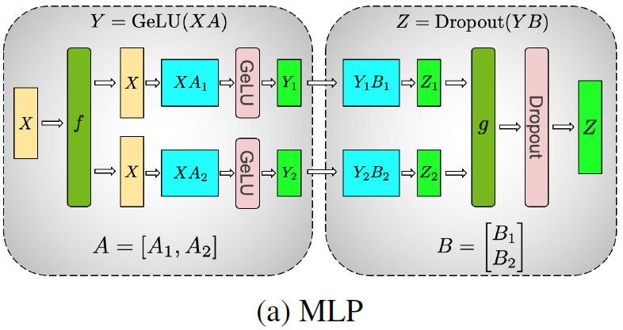
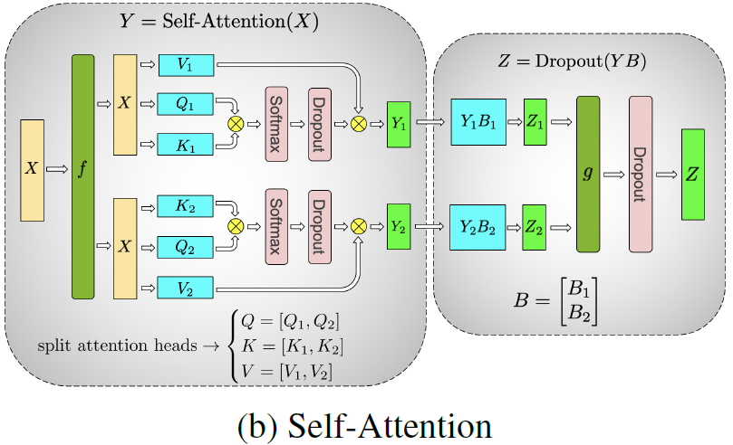

## Megatron-LM
> 论文：Megatron-LM: Training Multi-Billion Parameter Language Models Using
Model Parallelism  
> Github：[Megatron-LM](https://github.com/NVIDIA/Megatron-LM)  
> Nvidia, 2019 Sep

### 主要内容
Megatron-LM基于PyTorch的分布式训练框架，只需在forward和backward过程中增加少量额外的`all-reduce` 操作，无需对编译器修改。

#### MLP Parallel

    
    <!-- 
LoRA在Attention各部分权重上的消融实验效果
 -->

> $f$ 表示forward中的恒等算子，backward中的all-reduce操作；$g$ 则相反

1. **MLP 1st GEMM Column Parallelism** $Y=\text{GeLU}(XA)$，由于`GeLU`为非线性变换且$\text{GeLU}(a+b)$$ \ne \text{GeLU}(a) + \text{GeLU}(b)$，因此对1st Layer权重参数 $A$ 进行列拆分，即
 
    $$
        [Y_1, Y_2] = \text{GeLU}(X[A_1, A_2]) = \text{GeLU}([XA_1, XA_2])
    $$

2. **MLP 2nd GEMM Row Parallelism** 为适配对1st Layer权重参数 $A$ 进行列拆分，对2nd Layer权重参数参数 $B$ 进行行拆分，即

    $$
        Y=  [X_1, X_1][B_1; B_2] = [X_1B_1 + X_2B_2]
    $$

#### Self-Attention Parallel

    
    <!-- 
LoRA在Attention各部分权重上的消融实验效果
 -->

> $f$ 表示forward中的恒等算子，backward中的all-reduce操作；$g$ 则相反

1. **Q, K, V  Column Parallelism, O  Row Parallelism** 对投影函数$W_Q, W_K, W_V$进行列拆分，以保证各head的Self-Attention运算在不同设备上进行计算，为适配Self-Attention结果，对输出函数 $W_O$ 进行行拆分，即

    $$
    \begin{aligned}
        Q_i =& Q[(i-1)\times d_k:i\times d_{k}] \\
        K_i =& K[(i-1)\times d_k:i\times d_{k}] \\
        V_i =& V[(i-1)\times d_k:i\times d_{k}] \\
        A_i =& \text{Softmax}\left(\frac{Q_iK_i^T}{\sqrt{d_k}}\right)V_i \\
        O =& [A_1, A_2, \dots, A_h][W_{O, 1}; W_{O, 2}, \dots, W_{O, h}] \\
        =& [A_1W_{O, 1} + A_2W_{O, 2} + \cdots + A_hW_{O, h}]
    \end{aligned}
    $$

#### Embedding Parallelism
在生成模型中，`next_token_prediction` 通过将隐层向量与`input_embedding` $E \in \mathbb{R}^{d \times \vert V \vert}$ 进行GEMM计算得到logits

1. **Embedding Weight Column Parallelism**

    $$
    [Y_1, Y_2] = X[E_1, E_2] = [XE_1, XE_2]\\
    $$

!!! success 
    为避免`all-gather`操作的通信开销，可将logits结果$[Y_1, Y_2]$ 与cross-entropy融合在一起，从而将复杂度从$bs \times l \times \vert V \vert$的减少为$bs \times l$

- 15.1\*1000/(39\*512)=75.6%
- BERT-style 的larger model训练使用pre-Norm较post-Norm更加有效, the placement of layer normalization in BERT-like models is critical to achieving increased performance as the model size grows
- To synchronize residual connection dropout across model parallel workers we seed the random number generators at the beginning of training with the same seed. 相同的dropout random seed
- To achieve each worker to achieve randomness across the entire operation, we maintain a separate random number generator for dropout within model parallel regions. This random number generator is uniquely seeded for each model parallel worker.

## LLM using Megatron-LM
> 论文：Efficient Large-Scale Language Model Training on GPU Clusters Using Megatron-LM  
> Nvidia & Stanford University & MSR, 2021 Apr, SC 2021

### 主要内容

## Megatron-DeepSpeed