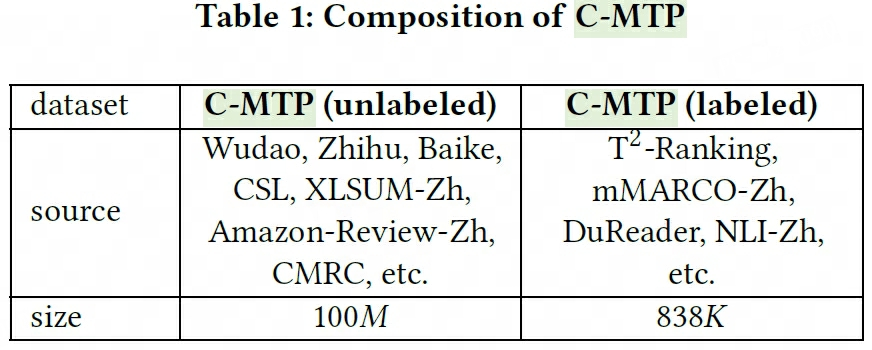
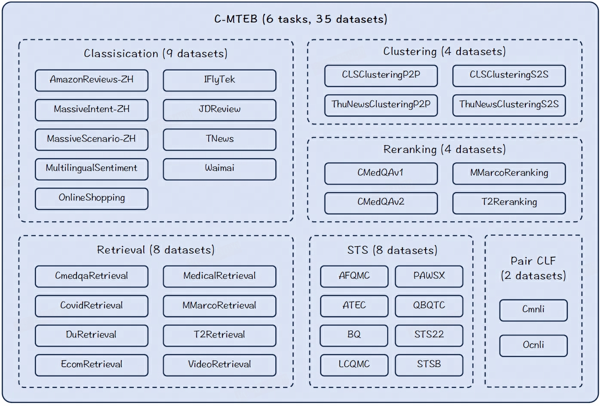
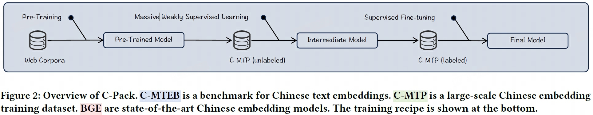
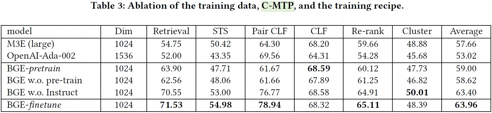

## BGE
> 论文：C-Pack: Packed Resources For General Chinese Embeddings  
> BGE：**B**AAI **G**eneral **E**mbeddings  
> Github：[FlagEmbedding](https://github.com/FlagOpen/FlagEmbedding)  
> BAAI & Renmin University of China & HuggingFace & USTC & University of Montreal, 2023 Sep, SIGIR 2024

### 主要内容
bge，智源研究院推出 1, 1.5, 2, pro
C-Park为一个中文的通用文本embedding资源包，包含以下部分：
#### C-MTP
C-MTP（Chinese Massive Text Pairs）

- semantically related text pairs leveraging the rich-structured information within the data, such as title-to-document, subtitle-to-passage, question-to-answer, question-to-similar-question, etc. further cleaned for the massive weakly supervised training of the text embeddings.
- a question and its answer
- two documents on the same topic
- topic to review
- title-body
- C-MTP (unlabeled), 100M text pairs

    - 去除重复、无语义和恶意文本
    - 基于[Text2VecChinese](https://huggingface.co/GanymedeNil)过滤语义低相关文本对，

- C-MTP (high-quality labeled) 838,465 text pairs
- 200M text pairs for English

#### C-MTEB
C-MTEB（Chinese Massive Text Embedding Benchmark）：comprehensive benchmark for Chinese text embeddings covering 6 tasks and 35 datasets

#### BGE+Train Recipe
BGE：a family of embedding models covering multiple sizes

1. pre-training with plain texts, MAE-style方法类似于ELECTRA，通过encoder进行text MASK，随后通过轻量级decoder恢复

    $$
    \min \sum_{x \in X} -\log \text{Dec}(x\vert h_{\tilde{X}}), h_{\tilde{X}} = \text{Enc}(\tilde{X})
    $$

2. contrastive learning with C-MTP text-pair (unlabeled), using in-batch negatives and big batch size
3. （multi-task） contrastive learning with C-MTP (labeled)，由于含有多个任务，不同任务一起进行学习可能存在矛盾现象，因此通过以下方式避免该问题

    - 基于指令来进行多任务SFT，不同任务使用不同指令加以区分  
    - 通过ANN方式从相应语料中获取hard negative增强负样本，进一步强化对比学习效果

#### 消融实验

- BGE-pretrain：pretrained by plain texts, and then weakly SFT by MTP（unlabeled）
- BGE w.o. pre-train：initialized with chinese-roberta, and then weakly SFT by MTP（unlabeled）
- BGE w.o. Instruct：SFT by MTP（labeled）without a hard prompt
- BGE-finetune：BGE

## BGE-M3
> 论文：M3-Embedding: Multi-Linguality, Multi-Functionality, Multi-Granularity Text Embeddings Through Self-Knowledge Distillation  
> Github：[FlagEmbedding](https://github.com/FlagOpen/FlagEmbedding)  
> BAAI & USTC, 2024 Mon, ACL 2024

### 主要内容