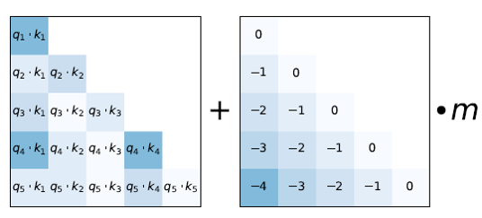
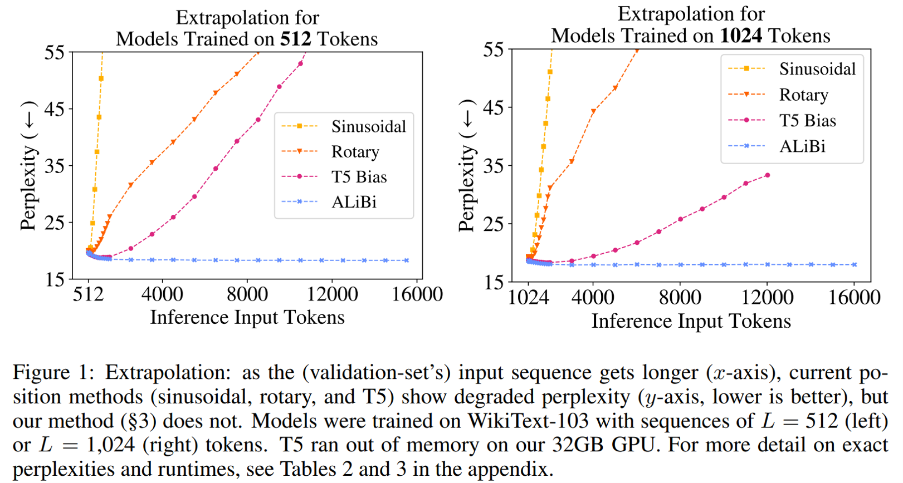
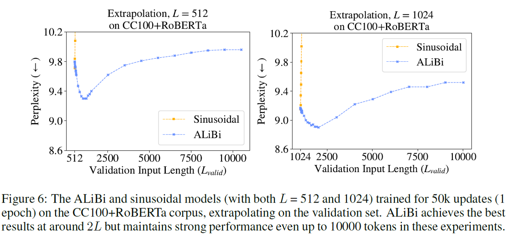
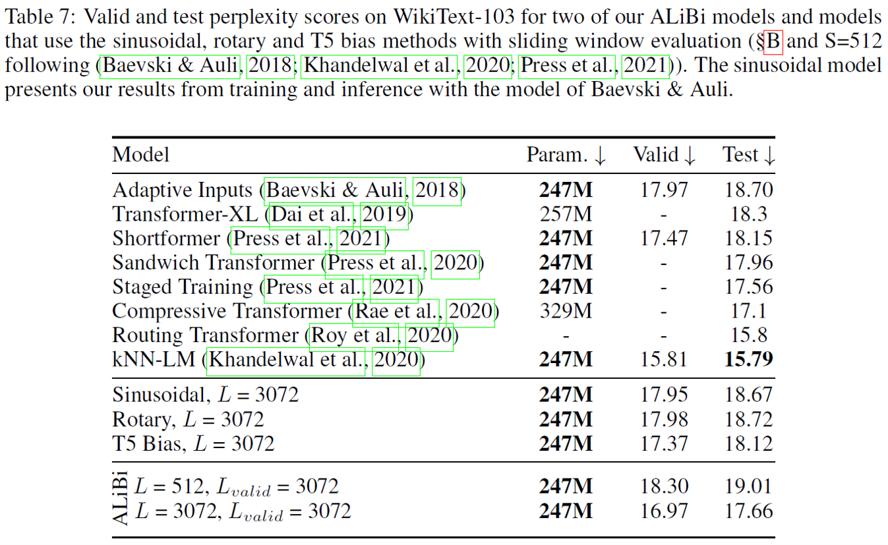
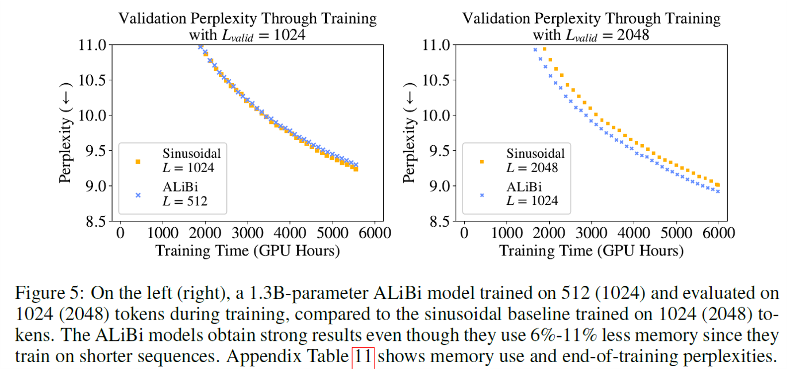

ALiBi (Attention with Linear Biases) 无需在embedding层对加入位置编码，而是在Softmax之前，将Attention的计算$q_m^Tk_n$加上一个与相对位置距离成比例的负常数偏置bia实现相对位置编码

- [x] train short, test long: context_window由1024直接外推至2048
- [x] context_window=1024 + ALiBi 直接外推至2048效果等价于 context_window=2048 + 正弦位置编码，前者比后者快11%且gpu占用少11%
---
- 机构：FAIR、Allen AI、UW
- [Paper](media/pdf/ALiBi.pdf)
- [Github](https://github.com/ofirpress/attention_with_linear_biases)

### 方法介绍
#### 基本原理
与直接在embedding层增加位置编码不同，ALiBi在Attention (非RoPE) 中增加与token间相对距离成正比的偏差以注入token位置信息，即  

$$\text{softmax}(q_iK^T - m[i-1, \dots,2, 1, 0])$$

其中$m$是一个和attention head相关、多层共享的标量，每个head对应符合公式

$$m_k={2^{-\frac{8}{k}}}$$

<figure markdown>
  
  <figcaption>ALiBi单个attention head分数计算示意图</figcaption>
</figure>

>- 作者比对过trainable $m$的结果，发现效果没什么明显增益，且训练的时间性能会下降
>- 未展示的实现补充，对$q_iK^T$缩放会损伤模型效果
>- ALiBi也可以视作局部Attention方案，相对位置大的地方惩罚系数大，趋近于MASK中的-INF

#### 实验结果
<figure markdown>
  
</figure>
- 外推性表现：正弦位置编码 < ROPE < T5 bias (基于分桶的"粗"相对位置编码) < ALiBi

<figure markdown>
  
</figure>
- ALiBi在$L^{'}\approx 2*L$能有最好的外推效果表现

<figure markdown>
  
</figure>
- $L=512$外推至$L^{'}=3072$的效果与直接训练微调的其他PE方案效果相当
- 相同$L$下ALiBi较其它PE方案也能取得最佳性能表现

<figure markdown>
  
</figure>
- ALiBi以更少的资源和更高时间性能，外推一倍长度的效果与应用正弦位置编码方法微调的效果相当