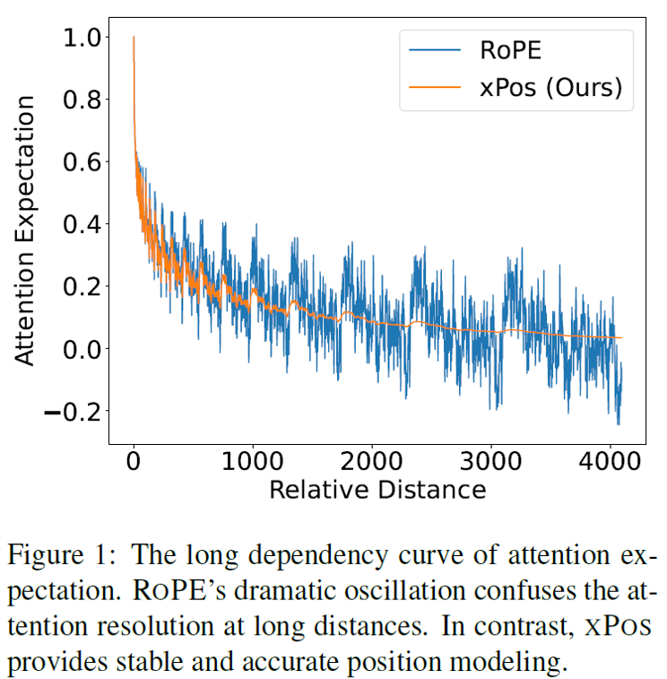
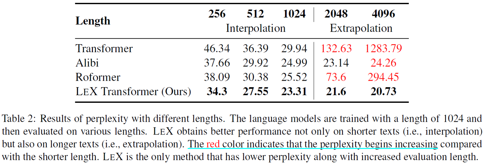
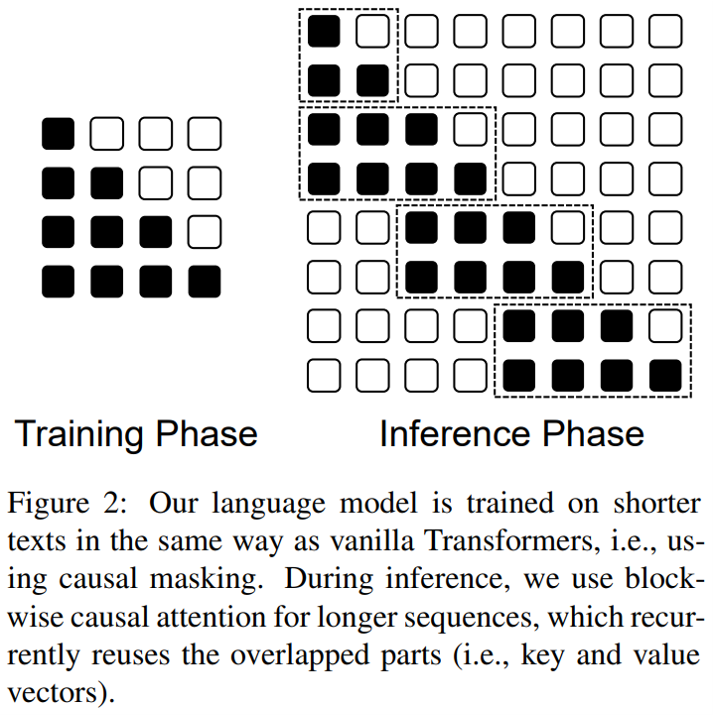
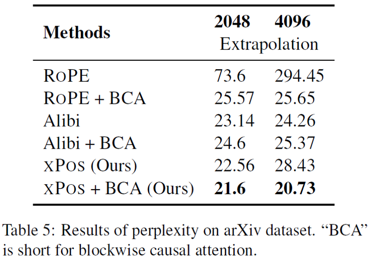

LeX (Length-Extrapolatable)

- [x] train short, test long
- [x] XPos (Extrapolatable Position Embedding)在RoPE的基础上，增进了长距离依赖的表现
- [x] 利用局部注意力机制BCA (Blockwise Causal Attention) 增进模型外推效果
---
- 机构：MSR
- [Paper](media/LeX.pdf)
- [Github](https://github.com/sunyt32/torchscale)

### 方法介绍

#### 基本原理
RoPE对$q$和$k$分别注入绝对位置信息$p_q$和$p_k$，通过乘性变换最终获得关于相对位置$p_q-p_k$的变换，即

$$
\begin{equation}
 ⟨f_q(q,p_q),f_k(k,p_k) ⟩=⟨ f_q(q, p_q-p_k), f_k(k, 0)⟩
\end{equation}
$$

传统的RoPE二维旋转变换为

$$f_q(q, n)=qe^{i\theta m}$$

而XPoS的二维旋转变换对旋转结果额外缩放变换，即

$$f_q(q, m)=A_qqe^{i\theta m}=e^{\xi * m}qe^{i\theta m}$$

$$
f_k(k, n)=A_kke^{i\theta n}=e^{-\xi * n}ke^{i\theta n}
$$

$$
⟨f_q(q,m),f_k(k,n)⟩=e^{(m-n)\xi}\text{RoPE(q, m, k, n)}=\tilde{\xi}^{(m-n)}\text{RoPE(q, m, k, n)} \\
$$

$$
\tilde{\xi}_i = \frac{i/(d/2)+\gamma}{1+\gamma} \in [0, 1] \\$$

- 其中$\theta=10000^{-\frac{2*i}{d}}$在函数周期内随着$i$增大而减小，但随着相对位置$m-n$增大，$(m-n)\theta$会超出周期$\pi$，三角函数表现为震荡；
- $\xi_i$随着增大而增大，但随着相对位置$m-n$增大，幂指数$\xi^{(m-n)}$减小，缩放操作因此能够缓解外推时Attention震荡
> [0, 1]内值的指数操作，使用时注意下溢现象
- $\lambda$是一个常数标量

#### 实验结果
<figure markdown>
  {width=300}
  <!-- <figcaption>RoPE vs. XPos的attention期望分数与距离的曲线</figcaption> -->
</figure>
- $\tilde{\xi}_i$的引入能一定程度上增加RoPE的稳定性

<figure markdown>
  
</figure>
- LeX方案在context windows $[0, L]$和外推$[L, l^{'}]$场景下，效果均表现最好

<figure markdown>
  {width=250, align=left}
  {width=350, align=right}
</figure>
- Attention MASK：训练时下三角MASK、测试时BCA (Block Causal Attention，每个block长度为$L/2$)
- 类似于其他训练时使用局部Attention提升Long Dependency的方法，预测试利用局部Attention能够提升模型外推性，提升Long Dependency效果