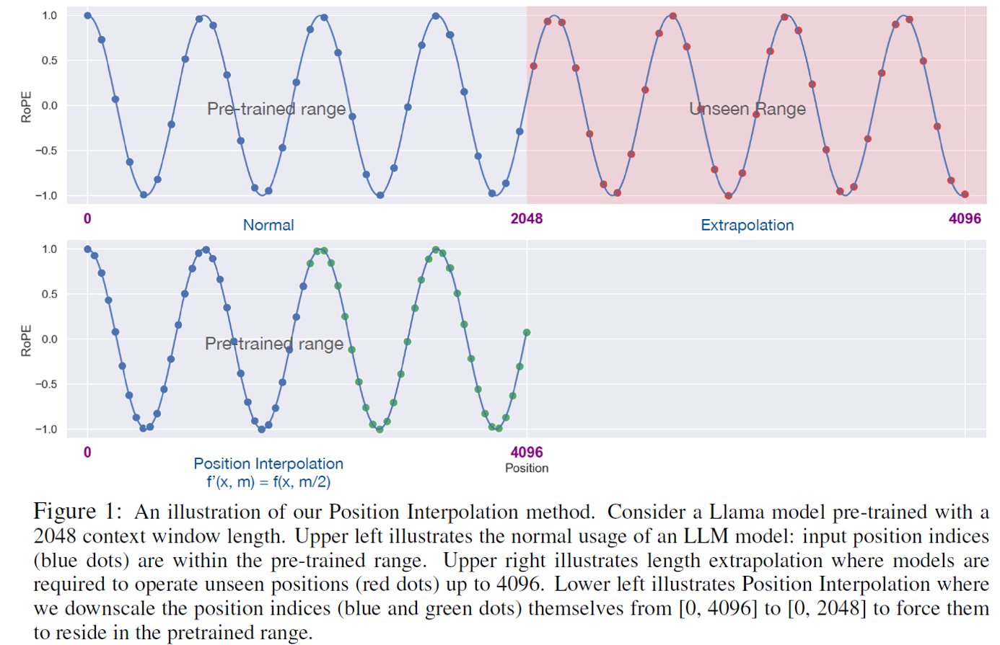
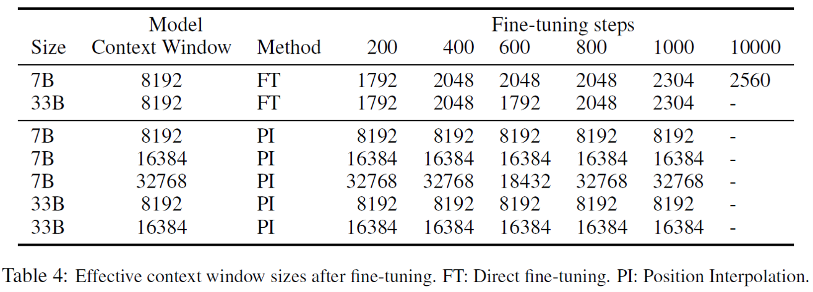
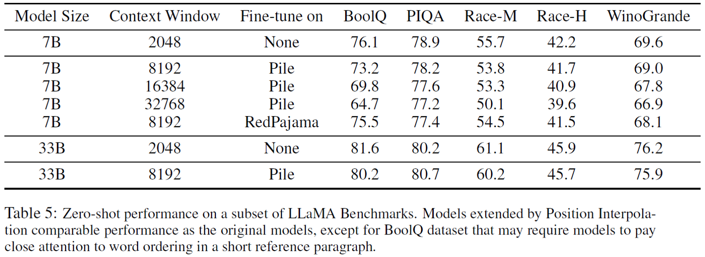
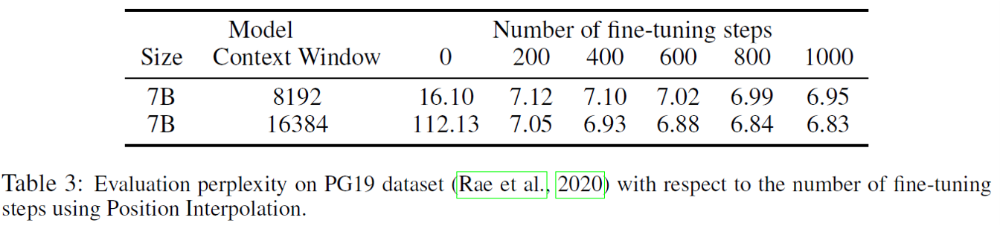

## Position Interpolation
PI通过插值方法，经过二次微调PLM，增大模型的`context_window`处理能力

- [x] 只需要1000 steps，即可实现context_window拓展，e.g., LLaMA 2048 ->32768
- [x] 微调拓展后的模型在original_context_window内的效果表现和微调前效果相当
---
- [Paper](media/pdf/Position_Interpolation.pdf)

### 主要内容

#### 基本原理

$$f^{'}(x,m)=f\large( x, \frac{mL}{L^{'}} \large)$$

- 将 $m$ 替换为 $m^{'} = \frac{m}{k}, k=\frac{L^{'}}{L}$，后者表示长度外推倍数

<figure markdown>
  {width=600}
</figure>
>- RoPE只利用了整数粒度
>- PI将大区间$[0, L^{'}]$缩小量化为$[0, L]$，进一步利用小数粒度

#### 实验结果
<figure markdown>
  
</figure>
- PI方案(1000 steps)比直接训练微调(10000 steps)效率更高，效果表现更好

<figure markdown>
  
</figure>
- 直接微调花费时间多存在上升瓶颈，训练困难

<figure markdown>
  
</figure>
- PI训练微调后的模型，在原有context window $[0, L]$中效果表现与微调前效果相当
- PI对训练微调样本敏感度不高 (row 2, 5效果对比相差不大)

<figure markdown>
  
</figure>
- \#step=0, LLaMA 7B $L=2048$插值拓展至$L^{'}=8096$的困惑度<20，一定程度上表示RoPE学到了数值间大小的相对关系，e.g., 3 < 4，插值后依然满足3/k < 4/k
- \#step=200，LLaMA 7B的困惑度已经超越了直接训练微调10000 steps的效果，PI泛化、适应能力较高