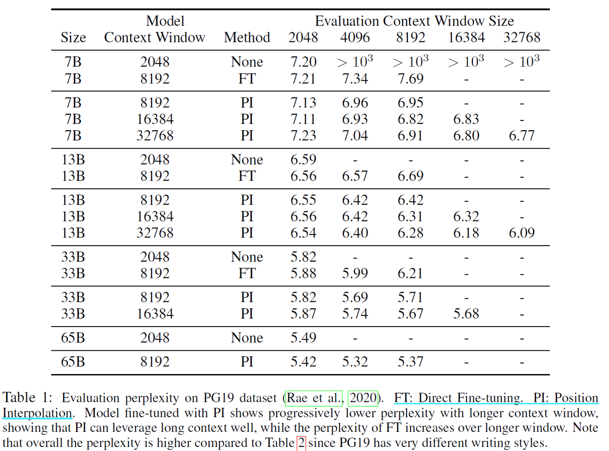
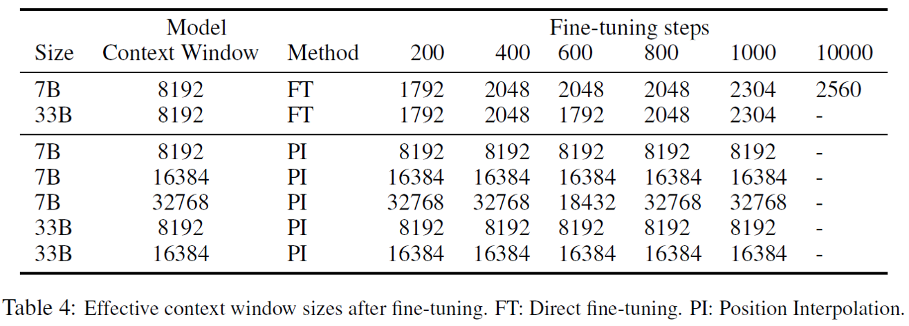

## Position Interpolation
> 论文：Extending Context Window Of Large Language Models Via Position Interpolation  
> Github：[Extend_Context_Window_Position_Interpolation](https://github.com/Math1019/Extend_Context_Window_Position_Interpolation)  
> Meta Platforms Inc., 2023 Jun, ACL 2024

### 主要内容

PI通过插值方法二次训练PLM，增大模型的`context_window`处理能力

- [x] 只需要1000 steps，即可实现`context_window` $L^{'}$ 拓展，e.g., LLaMA 2K -> 32K
- [x] PI模型在`original_context_window` $L$ 内的效果表现和微调前效果相当

!!! info ""
    由于线性插值后增加了新的小数空间，而模型未获取小数空间的相对大小，因此需要进行训练微调矫正

#### 基本原理

    

$$
  f^{'}(x,m)=f\large( x, m\frac{L}{L^{'}} \large)
$$

> - RoPE只利用了整数粒度（e.g., 1 < 2），PI进一步使用了小数粒度（e.g., 1 < 1.5 < 2）  
> - 内插倍数 $k=\frac{L^{'}}{L}$

#### Evaluation
1. **PI-FT对比**：PI方案(1000 steps) 较Fine-tune方案(10000 steps)效率更高，效果表现更好
    

        
    

    

        
    

2. **PI模型在`original_context_window`表现**：PI方案效果表现与微调前效果相当，且PI方案对SFT样本敏感度不高（Row 2 on Pipe v.s. Row 5 RedPajama）
    

        
    

3. **PI模型效果与训练step的关系**：只需要1000 steps，即可实现`context_window` $L^{'}$ 拓展
    

        
    

