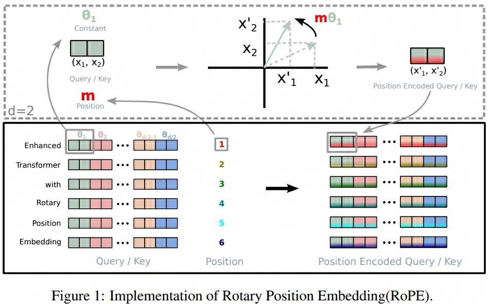
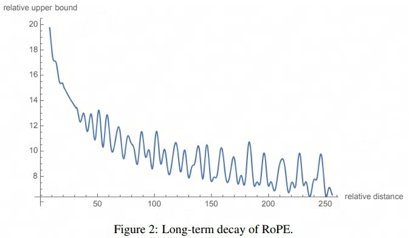

## RoPE

- 论文：[RoFormer: Enhanced Transformer with **Ro**tary **P**osition **E**mbedding](pdf/RoFormer.pdf)  
- Github：[roformer](https://github.com/ZhuiyiTechnology/roformer)
- [苏剑林](https://spaces.ac.cn/) 2021, Neurocomputing 2024

### 主要内容
1. Attentino机制中：在计算注意力分数之前，需根据Query和Key向量对Query执行相对位置旋转 
 
    > ==RoPE与Value向量无关==

2. [远距离衰减](https://zhuanlan.zhihu.com/p/705492804)，相对距离越大注意力分数相对越小
- [x] 加快模型的训练收敛速度

#### RoPE
1. **位置向量间保持乘性相对关系**，即$\langle f_q(x_m, m), f_k(x_n, n) \rangle =g(x_m, x_n, n-m)$， RoPE设计了以下满足上述关系的 $f$ 和 $g$

    - $d=2$ 形式

    $$
    \begin{aligned}
        f_q(x_m, m) =& e^{im\theta}q_m =  \begin{pmatrix}
            \cos m\theta & -\sin m\theta \\
            \sin m\theta & \cos m\theta 
        \end{pmatrix}W^Q\begin{pmatrix}
            x_m^{(1)} \\
            x_m^{(2)}
        \end{pmatrix}  \\
        f_k(x_n, n) =& e^{in\theta}k_n= \begin{pmatrix}
            \cos n\theta & -\sin n\theta \\
            \sin n\theta & \cos n\theta 
        \end{pmatrix}W^K\begin{pmatrix}
            x_n^{(1)} \\
            x_n^{(2)}
        \end{pmatrix} \\
        g(x_m, x_n, n-m) =& f_q(x_m, m)^Tf_k(x_n, n) \\
        =& q_m^T \begin{pmatrix}
            \cos m\theta & \sin m\theta \\
            -\sin m\theta & \cos m\theta 
        \end{pmatrix} \begin{pmatrix}
            \cos n\theta & -\sin n\theta \\
            \sin n\theta & \cos n\theta 
        \end{pmatrix} k_n \\
        =& q_m^T \begin{pmatrix}
            \cos (n-m)\theta & -\sin (n-m)\theta \\
            \sin (n-m)\theta & \cos (n-m)\theta 
        \end{pmatrix}  k_n \\
        = & q_m^T e^{i(n-m)\theta} k_n
    \end{aligned}
    $$

    - 拓展至多维形式，且$d\%2==0$
  
    $$
    \begin{aligned}
        R_{\Theta, m}^d \in \mathbb{R}^{d\times d} = \begin{pmatrix}
            \cos m\theta_0 & -\sin m\theta_0 & \cdots & 0 & 0 \\
            \sin m\theta_0 & \cos m\theta_0 & \cdots & 0 & 0 \\
            \vdots & \vdots  & \ddots & \vdots & \vdots \\
            0 & 0 &  \cdots & \sin m\theta_{d/2 - 1} & \cos m\theta_{d/2 - 1} \\
            0 & 0 &  \cdots & \sin m\theta_{d/2 - 1} & \cos m\theta_{d/2 - 1} \\
        \end{pmatrix}
    \end{aligned}
    $$

2. **位置信息注入优化**：由于$R_{\Theta, m}^d$ 的稀疏性，直接应用矩阵乘法浪费算力，可优化为

    $$
    \begin{aligned}
        R_{\Theta, m}^d = \begin{pmatrix}
            x_0 \\
            x_1 \\
            x_2 \\
            x_3 \\
            \vdots \\
            x_{d-2} \\
            x_{d-1} 
        \end{pmatrix} \otimes \begin{pmatrix}
            \cos m\theta_0 \\
            \cos m\theta_0 \\
            \cos m\theta_1 \\
            \cos m\theta_1 \\
            \vdots \\
            \cos m\theta_{d/2-1} \\
            \cos m\theta_{d/2-1} 
        \end{pmatrix} + \begin{pmatrix}
            -x_1 \\
            x_0 \\
            -x_3 \\
            x_2 \\
            \vdots \\
            -x_{d-1} \\
            x_{d-2} 
        \end{pmatrix} \otimes \begin{pmatrix}
            \sin m\theta_0 \\
            \sin m\theta_0 \\
            \sin m\theta_1 \\
            \sin m\theta_1 \\
            \vdots \\
            \sin m\theta_{d/2-1} \\
            \sin m\theta_{d/2-1}
        \end{pmatrix}
    \end{aligned}
    $$

    

        
    

!!! info ""
    - [RoPE推导过程](https://zhuanlan.zhihu.com/p/642884818)：==相对位置为【n-m】而不是【m-n】==
    - RoPE相当于在计算$q$与$k$内积前对$q$的每2个特征（各特征缩放频率不同）执行一次相对位置为$n-m$且不改变模长的旋转(本质上为矩阵相乘，但由于矩阵稀疏可以通过加性实现)，之后再执行内积计算
    - $\theta_i = 10000 ^{-2i/d}$，低维度特征大旋转角高频旋转，高维度特征小旋转角低频旋转（类比时钟，秒针走得最快）

#### Long-term Decay
1. **远距离衰减**：随着距离的增加（假定q在位置0，k在位置0~max_seq_len），内积结果表现如下图所示，模型对相对位置的敏感度会逐渐减弱（符合自然语言文本中相邻词语间语义相关相对更强的特性），相对距离内积结果相对越小（也会存在）。

    

