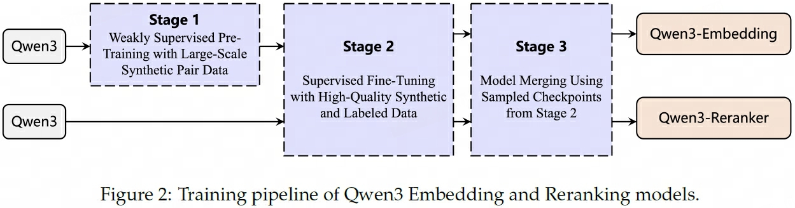
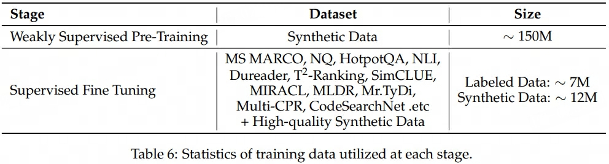
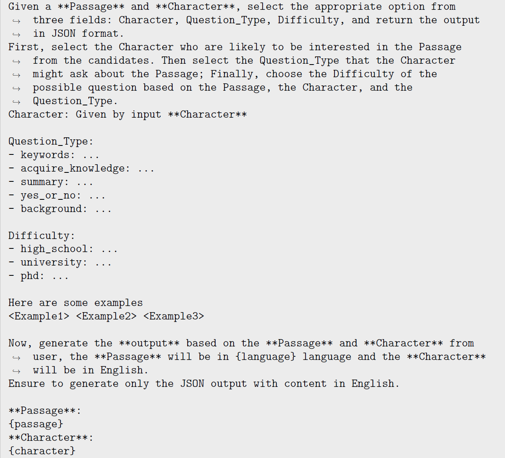
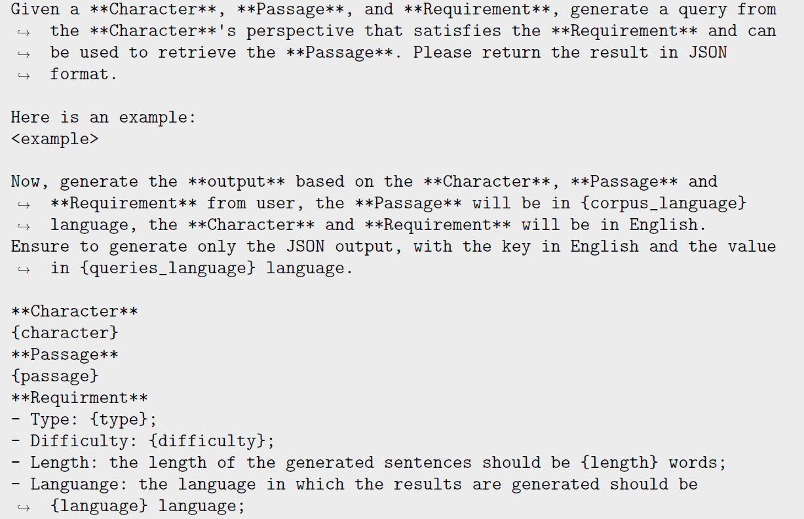
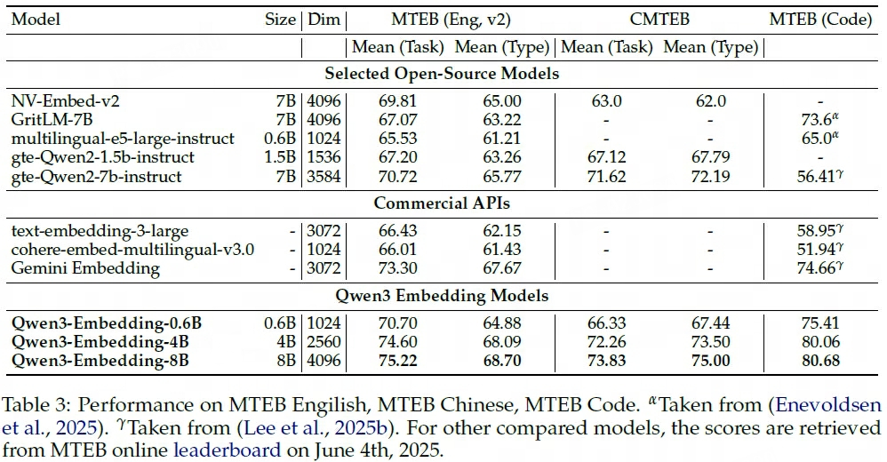
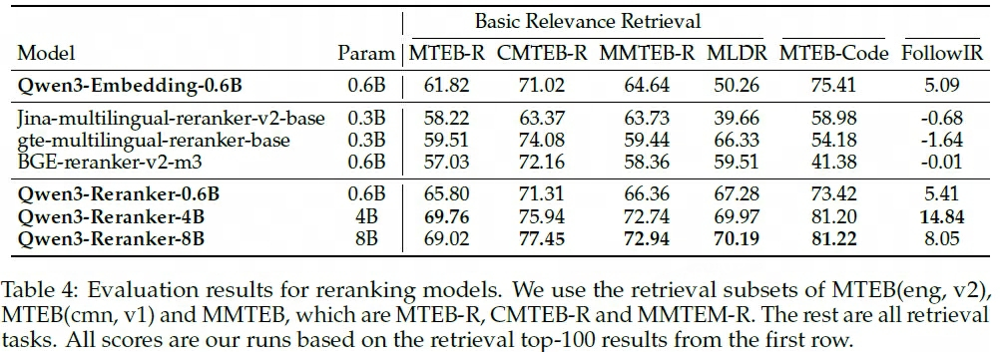
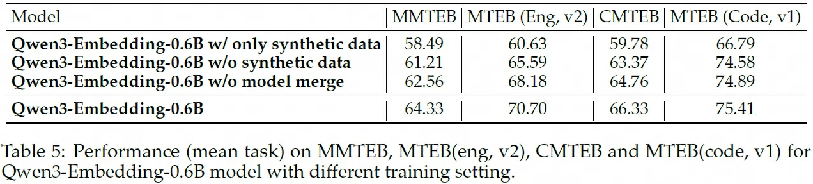

## GTE
> 论文：Towards **G**eneral **T**ext **E**mbeddings with Multi-stage Contrastive Learning  
> Alibaba Group, 2023 Aug

### 主要内容
GTE，阿里巴巴达摩院推出

- multi-stage contrastive learning pipeline  
    1. unsupervised text pairs from various data sources for contrastive pre-training
    2. high-quality supervised text pairs with human labels from multiple sources for contrastive fine-tuning
    3. Furthermore, since our model is trained using code data as well

- using a large batch size is crucial to better model performance by reducing the gap between training and inference
#### Unsupervised CL
- CPT, Contrastive Pre-Training
- unsupervised pre-training
- we exclusively utilized open-source data and did not employ any filtering or cleaning
methods. details in Appendix A
- text pair format including (title, body), (title, abstract), (citation, reference), (post, comment), (entity, description), (question, answer), (summary, content), (text, code)
- 788M pairs

- **data sources often differ significantly** in terms of the number of training instances. To address this imbalance, 对各个data source进行多项式采样$p_i = \frac{n_i^{\alpha}}{\sum_j n_j^{\alpha}}$
- 每个batch中的任务类型确保相同
- 大batch_size非常有必要
- 分布式并行训练，large batch_size, set max_seq_length=128
- pretrained models were initialized using the corresponding size MiniLM/BERT models
#### Supervised CL
- supervised fine-tuning
- two pieces of text and optional hard negatives mined by an extra retriever to form text triples.
- handle both symmetric tasks (e.g., semantic textual similarity) and asymmetric tasks (e.g., passage retrieval), collecting large variety of tasks and domains. details in Appendix A
- ∼3M pairs for fine-tuning
- a large batch size is unnecessary since hard negatives can already provide a reliable gradient estimation of the learning objective
- batch_size=128, 16 contrastive samples (1 positive + 1 hard + remaining in-batch random)
- max_seq_length=512

#### special optimization strategies
- enlarges the negative samples with both in-batched queries and documents
- amp with fp16, deepspeed zero, gradient checkpointing

#### Ablation Study
- pretrained: 三种dataset group对比。1) 5个最大的的数据集; 2) +随机抽取的10个数据集; 3) total 33数据集
- finetune: E5中的3个数据集 + MEDI中的数据集 + BERRI中的数据集
- multistages: full > PT > FT
- mixing ratio used in sampling distribution on pretraining data, 按dataset随机采样和按sample随机采样效果均不是最佳
    
- improved contrastive loss consistently improves model performance

#### Details about Pre-training Data
1. Web Page: short title + most relevant body texts from a set of randomly sampled texts
2. Academic Paper: title  + abstract
3. Hyperlink: citation argument + the text from reference
4. Community QA: text lengths and voting numbers are used to filter out low-quality data.
5. Social Media: post title + post body. post comment are also regared as positive pairs for data mining
6. News: title + body
7. Knowledge Base: entity/event + destribution
8. Code: text + code
9. Others: reviews about goods, debate websites about one argument, googaq q-a pairs by prompting google search box with search log queries.
#### Details about Training Data
(query, positive, hard negative) triple

1. Web Search
2. Open QA
3. Natural Language Inference
4. Fact Verification
5. Paraphrase
6. Others
#### Data Resources

## mGTE
> 论文：mGTE: Generalized Long-Context Text Representation and Reranking Models for Multilingual Text Retrieval  
> Alibaba Group, 2024 Jul，EMNLP 2024

## Qwen3 Embedding
> 论文：Qwen3 Embedding: Advancing Text Embedding and Reranking Through Foundation Models  
> Github：[Qwen3-Embedding](https://github.com/QwenLM/Qwen3-Embedding)  
> Blog：[Qwen3 Embedding](https://qwenlm.github.io/blog/qwen3-embedding/)  
> Alibaba Group, 2025 Jun

### 主要内容

#### Qwen3 Embedding Pipeline

    

Qwen3 Embedding模型使用Qwen3 Causal LLM初始化，经以下步骤得到目标模型：

1. **Weakly Supervised Pre-Training**：基于合成的弱监督文本对预训练模型  
2. **Supervised Fine Tuning**：基于高质量的合成数据和标注数据有监督微调模型  
3. **[Model Merging](../../../Trick/Ensemble/Ensemble/Model_Merging/self-positioning.md)**：采样训练过程中的多个Checkpoint，合并出最终模型

!!! info ""
    - [Embedding Model](#embedding-model)包含了完整的3个阶段  
    - [Reraning Model](#reranking-model)只包含了后2个阶段

#### Synthetic Dataset

    

1. **阶段1 Synthetic Data**：基于Qwen3-32B，生成大量的高质量、多任务（包括retrieval, bitext mining, classification, and STS）、多语种的弱监督文本相关数据对。 其中检索任务以Doc2Query方式生成数据，步骤如下：
    1. 使用检索模型对输入文档（源于Qwen3多语种预训练语料库）检索并保留top-5候选文档（源于Persona Hub）；
    2. 输入文档与top-5候选文档，使用Qwen3-32B自主选择文档可能感兴趣的候选文档，问题类型以及问题难度作为生成Query的设置要求，具体输出 `Character, Quetion_Type, Difficulty` 字段；
    

        
    

    3. 基于Query设置要求以及自定义的Qeury生成长度与语种类型进行Doc2Query生成
    

        
    

2. **阶段2 High-quality Synthetic Data**：从阶段1的 Synthetic Data 中随机抽取数据，保留阶段1结果中语义相关性 `cos_similarity > 0.7` 的样本，最终高质量合成样本数 ~12M

#### Embedding Model
1. **Prompt**：Embedding Model采用了（共享参数的）双塔结构分别处理查询 Query 和文档 Doc，其中

    - ^^Query Prompt^^: `{Embedding Instruction} + {Query} + [EOS]` 
    - ^^Doc Prompt^^: `{Doc} + [EOS]`
    > `[EOS]`为`<|endoftext|>`，该token对应的 `last_hidden_state` 即为句向量

2. **Training Objective**：Embedding Model在两个阶段中的训练目标损失函数相同，均为改善版InfoNCE loss，分母包括以下部分：
    - 查询与目标文档：$s(q_i, d_i^{+})$  
    - 查询与hard negative难分辨负样本：$\sum s(q_i, d_i^{-})$
    - 查询与in-batch文档：$\sum_{i\ne j} s(q_i, d_j)$  
    

        
    

    - 查询与in-batch查询：$\sum_{i\ne j} s(q_i, q_j)$  
    - 文档与in-batch查询：$\sum_{i\ne j} s(d_i, d_j)$

    $$
    \begin{aligned}
        L_\text{embedding} =& - \frac{1}{N} \sum_{i=1}^N \log \frac{e^{s(q_i, d_i^{+})/\tau}} {Z_i} \\
        Z_i =& e^{s(q_i, d_i^+)/\tau} + \sum_{k}^K m_{i,k} e^{s(q_i, d_{i,k}^-)/\tau} + \sum_{i\ne j} m_{i,j} e^{s(q_i, d_{j})/\tau} \\
        + & \sum_{i \neq j} m_{i,j} e^{s(q_i, q_j)/\tau} + \sum_{i \neq j} m_{i,j} e^{s(d_i^+, d_j)/\tau} \\
        m_{i, j} =& \begin{cases}
            0 & \text{if } s_{i, j} \gt s(q_i, d_i^+) + 0.1 \text{ or is_equal}(d_j, d_i^+)  \\
            1 & \text{otherwise}
        \end{cases}
    \end{aligned}
    $$

    > - $s_{i, j}$ 为相应对象的相关性分数  
    > - mask系数 $m_{i,j}$ 用于消除in-batch样本中的False Negatives

#### Reranking Model

1. **Prompt**：Reranking Model基于Point-wise Reranking（独立评估查询与每个候选文档的相关性分数） 的单塔结构处理 Query 和候选 Docs（如top-100），其中
    - `{Reranking Instruction} + {Query} + {Doc} + assistant: `
    - `next_token_prediction` 对应`yes`和`no`概率的softmax值即为分数

    $$
    score(q, d)  = \frac{e^{P(\text{yes}\vert I, q, d)}}{e^{P(\text{yes}\vert I, q, d)} + e^{P(\text{no}\vert I, q, d)}}
    $$

2. **Training Objective**：采用标准分类SFT方式微调模型，$l \in \{\text{yes}, \text{no}\}$

    $$
    L_\text{reranking} = -\log p(l \vert q, d)
    $$

#### Evaluations

    

    

!!! success ""
    - Qwen3 Embedding Model、Reranking Model能在各benchmarks中取得SOTA效果表现
#### Ablation Study

    

> `synthetic data` 为LLM生成的应用于阶段1的预训练数据

!!! success ""
    - LLM生成的弱监督数据与模型合并均对模型效果有提升
