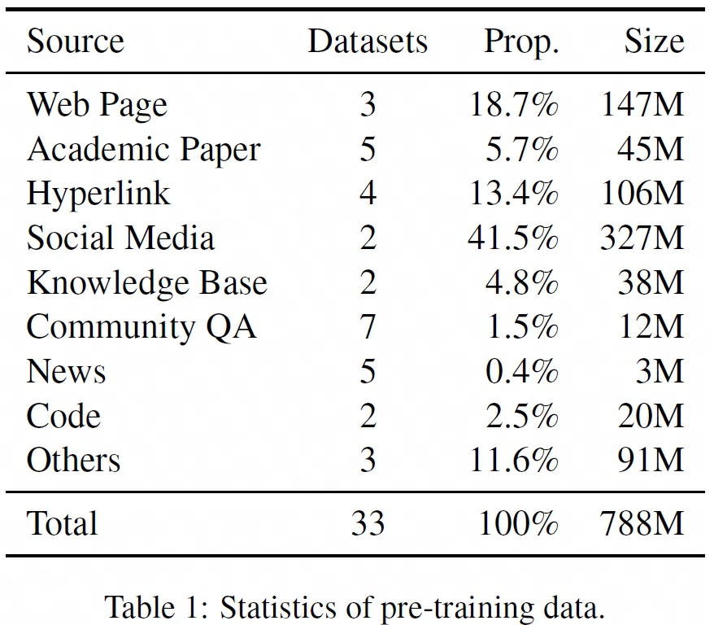
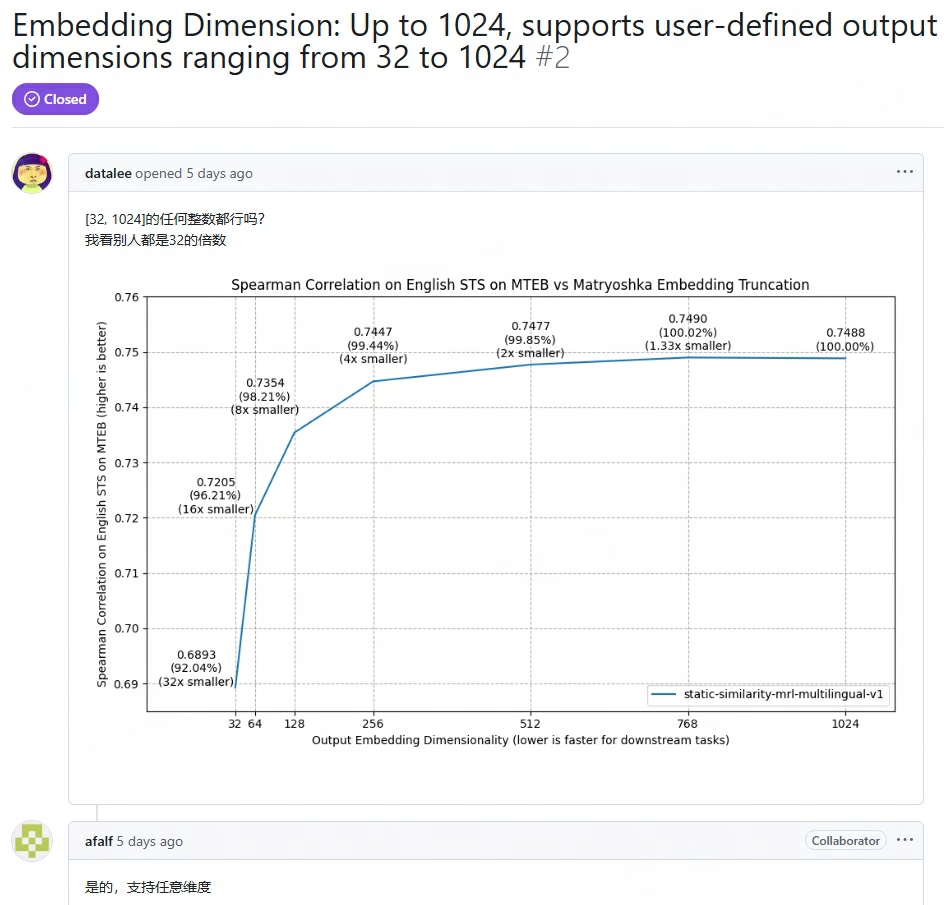
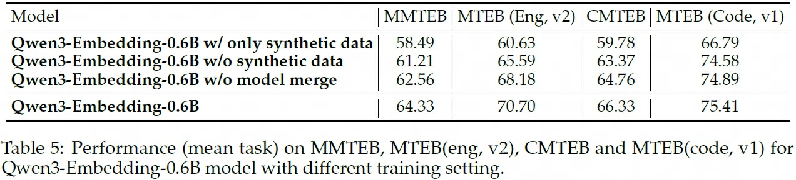

## GTE
> 论文：Towards **G**eneral **T**ext **E**mbeddings with Multi-stage Contrastive Learning  
> Alibaba Group, 2023 Aug

### 主要内容
GTE，阿里巴巴达摩院推出

- multi-stage contrastive learning pipeline  
    1. unsupervised text pairs from various data sources for contrastive pre-training
    2. high-quality supervised text pairs with human labels from multiple sources for contrastive fine-tuning
    3. Furthermore, since our model is trained using code data as well

- using a large batch size is crucial to better model performance by reducing the gap between training and inference
#### Unsupervised CL
- CPT, Contrastive Pre-Training
- unsupervised pre-training
- we exclusively utilized open-source data and did not employ any filtering or cleaning
methods. details in Appendix A
- text pair format including (title, body), (title, abstract), (citation, reference), (post, comment), (entity, description), (question, answer), (summary, content), (text, code)
- 788M pairs

- **data sources often differ significantly** in terms of the number of training instances. To address this imbalance, 对各个data source进行多项式采样$p_i = \frac{n_i^{\alpha}}{\sum_j n_j^{\alpha}}$
- 每个batch中的任务类型确保相同
- 大batch_size非常有必要
- 分布式并行训练，large batch_size, set max_seq_length=128
- pretrained models were initialized using the corresponding size MiniLM/BERT models
#### Supervised CL
- supervised fine-tuning
- two pieces of text and optional hard negatives mined by an extra retriever to form text triples.
- handle both symmetric tasks (e.g., semantic textual similarity) and asymmetric tasks (e.g., passage retrieval), collecting large variety of tasks and domains. details in Appendix A
- ∼3M pairs for fine-tuning
- a large batch size is unnecessary since hard negatives can already provide a reliable gradient estimation of the learning objective
- batch_size=128, 16 contrastive samples (1 positive + 1 hard + remaining in-batch random)
- max_seq_length=512

#### special optimization strategies
- enlarges the negative samples with both in-batched queries and documents
- amp with fp16, deepspeed zero, gradient checkpointing

#### Ablation Study
- pretrained: 三种dataset group对比。1) 5个最大的的数据集; 2) +随机抽取的10个数据集; 3) total 33数据集
- finetune: E5中的3个数据集 + MEDI中的数据集 + BERRI中的数据集
- multistages: full > PT > FT
- mixing ratio used in sampling distribution on pretraining data, 按dataset随机采样和按sample随机采样效果均不是最佳
    
- improved contrastive loss consistently improves model performance

#### Details about Pre-training Data
1. Web Page: short title + most relevant body texts from a set of randomly sampled texts
2. Academic Paper: title  + abstract
3. Hyperlink: citation argument + the text from reference
4. Community QA: text lengths and voting numbers are used to filter out low-quality data.
5. Social Media: post title + post body. post comment are also regared as positive pairs for data mining
6. News: title + body
7. Knowledge Base: entity/event + destribution
8. Code: text + code
9. Others: reviews about goods, debate websites about one argument, googaq q-a pairs by prompting google search box with search log queries.
#### Details about Training Data
(query, positive, hard negative) triple

1. Web Search
2. Open QA
3. Natural Language Inference
4. Fact Verification
5. Paraphrase
6. Others
#### Data Resources

## mGTE
> 论文：mGTE: Generalized Long-Context Text Representation and Reranking Models for Multilingual Text Retrieval  
> Alibaba Group, 2024 Jul，EMNLP 2024

## Qwen3 Embedding
> 论文：Qwen3 Embedding: Advancing Text Embedding and Reranking Through Foundation Models  
> Github：[Qwen3-Embedding](https://github.com/QwenLM/Qwen3-Embedding)  
> Blog：[Qwen3 Embedding](https://qwenlm.github.io/blog/qwen3-embedding/)  
> Alibaba Group, 2025 Jun

### 主要内容
- multistage training pipeline: large-scale unsupervised pre-training followed by supervised fine-tuning on high-quality datasets.
- task/instruction-aware sample $\{I_i, q_i, d_i^{+}, d_{i, 1}^{-}, \dots, d_{i, n}^{-}\}$，$I_i$ 为embedding or reranking instruction, $d_{i, n}^{-}$ 为 n 个 hard negatives
- 基于Qwen3 基础模型的LoRA 微调 (causal attention)
- both stages of training: $L_\text{embedding}$
- self.tokenizer.padding_side = "left"
- MRL: Matryoshka Representation Learning
- **truncate_dim**: embeddings = embeddings[:, :self.truncate_dim]
- extract the unnormalized embedding (MRL before embedding normalization)

#### Embedding Model
- Embedding model：双塔模型分别输入`{Instruction} + {Query} + [EOS]` 和 `{Doc} + [EOS]`, `[EOS]`为`<|endoftext|>`

- both stages of training, improved contrastive loss $L_\text{embedding} = - \frac{1}{N} \sum_{i=1}^N \log \frac{e^{s(q_i, d_i^{+})/\tau}}{Z_i}$
    1. `q v.s. d+`
    2. `q v.s. all paired d-`
    3. `q v.s. in batch positive_negative d` 
    4. `q v.s. in batch q`
    5. `d+ v.s. in batch positive_negative d`

    $$
    \begin{aligned}
        Z_i =& e^{s(q_i, d_i^+)/\tau} + \sum_{k}^K m_{i,k} e^{s(q_i, d_{i,k}^-)/\tau} + \sum_{i\ne j} m_{i,j} e^{s(q_i, d_{j})/\tau} + \sum_{j \neq i} m_{i,j} e^{s(q_i, q_j)/\tau} + \sum_{j \neq i} m_{i,j} e^{s(d_i^+, d_j)/\tau} \\
        m_{i, j} =& \begin{cases}
            0 & \text{if } s_{i, j} \gt s(q_i, d_i^+) + 0.1 \text{ or is_equal}(d_j, d_i^+)  \\
            1 & \text{otherwise}
        \end{cases}
    \end{aligned}
    $$

    > $m_{i,j}$为用于消除False Negatives的mask系数, $s_{i, j}$ 为相应对象的相关性分数

#### Reranking Model
- Reranking model: point-wise reranking（用于评估每个文档与查询的相关性，并生成独立的分数进行排序） + 单塔模型输入 `{Instruction} + {Query} + {Doc} + assistant: `，next_token_prediction对应的yes和no结果的softmax值即为分数

    $$
    score(q, d)  = \frac{e^{P(\text{yes}\vert I, q, d)}}{e^{P(\text{yes}\vert I, q, d)} + e^{P(\text{no}\vert I, q, d)}}
    $$

- SFT $L_\text{reranking} = -\log p(l \vert q, d)$
- `(bs, seq_len, |V|) -idx_final-token→ (bs, |V|) → (bs, )_{no}, (bs, )_{yes} -stack→ (bs, 2) -softmax + idx_1→ (bs, 1)`
- rerank the top-100 candidates
#### Multi-Stage Training

1. Large-Scale Synthetic Data-Driven Weak Supervision Training: leveraging the text understanding and generation capabilities of foundation models to synthesize pair data directly
2. High-Quality Synthetic Data Utilization in Supervised Fine Tuning: selective incorporation of this highquality synthetic data further enhances the overall model performance and generalization capabilities.
3. Model Merging: applied a model merging technique based on spherical linear interpolation (slerp). merging multiple model checkpoints saved during the fine-tuning process. This step aims to boost the model’s robustness and generalization performance across various data distributions.

#### Synthetic Dataset

- first stage: synthetic data with specific roles to get injection of user perspectives to enhances the diversity and realism of the synthetic queries
    1. utilize a retrieval model to identify the top five role candidates for each document
    2. present these documents along with their role candidates to the prompt
    3. guides the model in outputting the most suitable role configuration for query generation
    4. the prompt incorporates various dimensions such as query type (e.g., keyword, factual, summary, judgment), query length, difficulty, and language. This multidimensional approach ensures the quality and diversity of the synthetic data

- four types of synthetic data—retrieval, bitext mining, semantic textual similarity, and classification
- synthetic data is a two-stage generation pipeline: 1) configuration; 2) query generation
    1. configuration: 让LLM决定question type（关键字，知识问答，总结，判断，背景）, difficulty（学历水平难度） and character （基于top-5中候选者的选择结果），通过{language}指定生成输出的语言类型
    2. query generation: 基于选择的配置并 explicitly specify the desired length and language of the generated query.
    - prompt中应用了few-shot方式

- second stage high-quality synthetic data: retaining those with a cosine similarity greater than 0.7 from randomly sampled data for further training

#### Ablation Study
- Effectiveness of Large-ScaleWeakly Supervised Pre-Training
- w/ only synthetic data (Weakly Supervised Pre-Training Dataset): first stage
- w/o synthetic data: without first stage

- Effectiveness of Model Merging