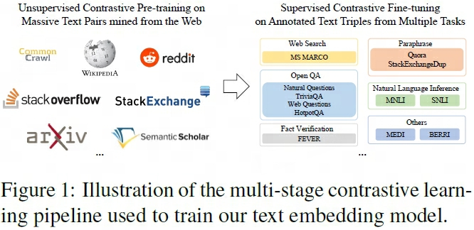
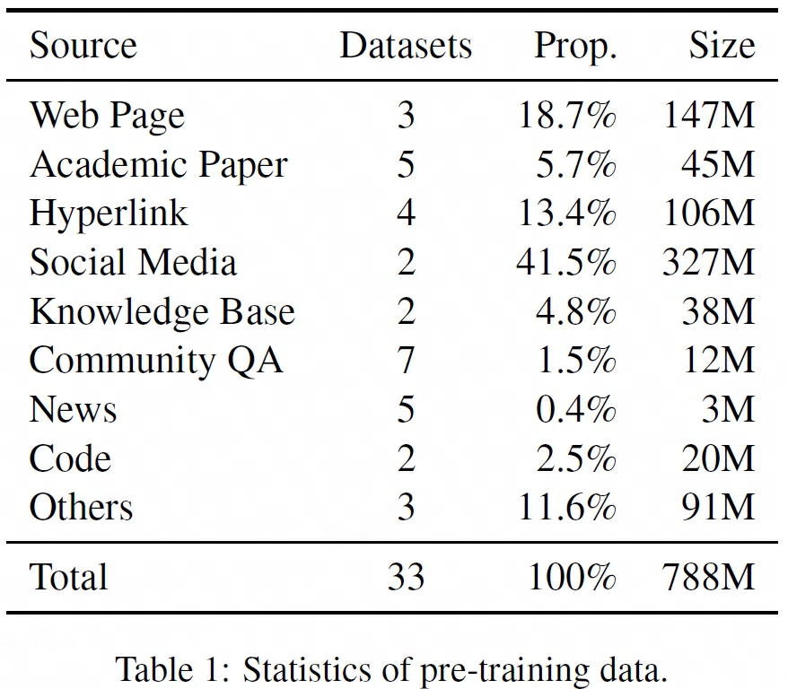
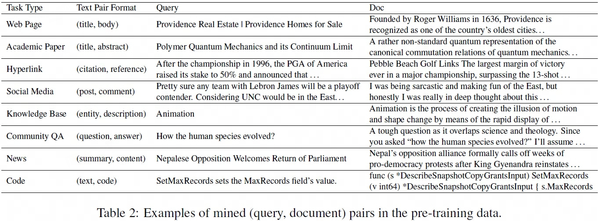
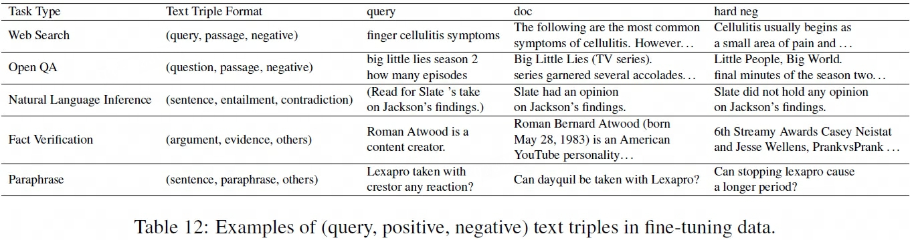
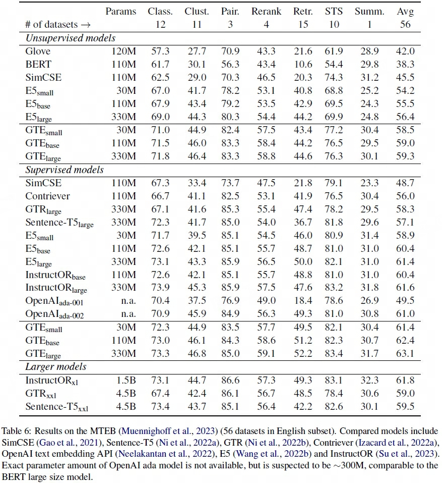
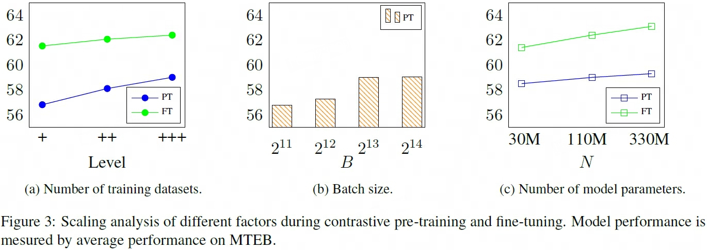
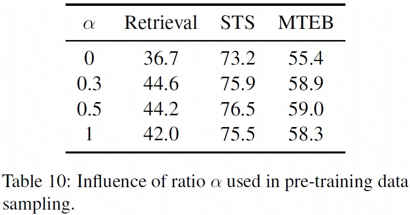
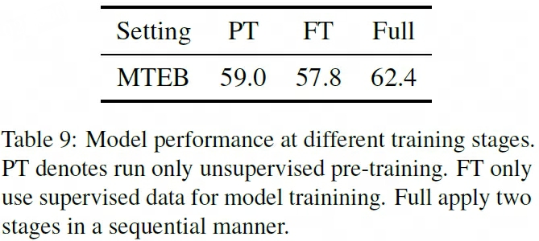
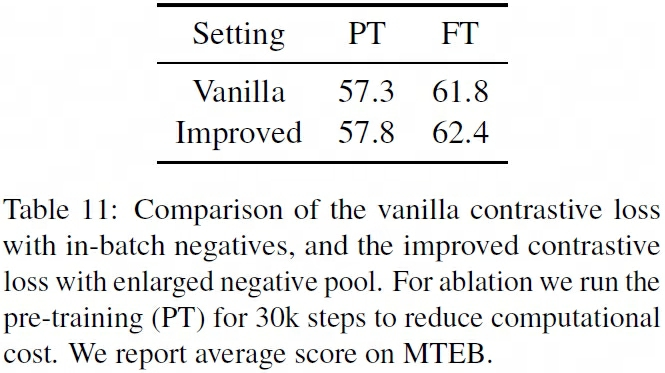

## GTE
> 论文：Towards **G**eneral **T**ext **E**mbeddings with Multi-stage Contrastive Learning  
> Alibaba Group, 2023 Aug

### 主要内容
#### GTE Training Pipeline

    

经由以下步骤训练得到GTE模型：

1. **Weakly Supervised Contrastive Pre-training**：使用大量无监督文本对进行对比预训练
2. **Supervised Contrastive Fine-tuning**：使用多个任务的高质量有标签数据三元组进行有监督对比训练微调

    > 该阶段使用了有标签代码数据训练微调

**Training Objective**：两阶段均的损失函数均为改善版InfoNCE loss，分母包括以下部分

- 查询与目标文档：$s(q_i, d_i^{+})$  
- 查询与hard negative难分辨负样本：$\sum s(q_i, d_i^{-})$
- 查询与in-batch文档：$\sum_{j\ne i} s(q_i, d_j)$  
- 查询与in-batch查询：$\sum_{j\ne i} s(q_i, q_j)$  
- 文档与in-batch查询：$\sum_{j\ne i} s(q_j, d_i)$  
- 文档与in-batch文档：$\sum_{i\ne i} s(d_j, d_i)$

    $$
    \begin{aligned}
        L_\text{icl} =& - \frac{1}{N} \sum_{i=1}^N \log \frac{e^{s(q_i, d_i^{+})/\tau}} {Z_i} \\
        Z_i =& \sum_{j}e^{s(q_i, d_j)/\tau} + \sum_{j \ne i}e^{s(q_i, q_j)/\tau} + \sum_{j \ne i}e^{s(q_j, d_i)/\tau} + \sum_{j \ne i}e^{s(d_j, d_i)/\tau} \\
    \end{aligned}
    $$

    > $\tau$ 温度系数此工作中设为 0.01

#### Dataset Collection

    

1. **Weakly Supervised Pre-training Data**：仅使用爬取的开源数据，没有采用任何过滤或清理方法。数据格式为文本对，包括以下几种数据来源

    - ^^Web Page^^：`(title, most_relevant_body_text from randomly_sampled_body_texts)`
    - ^^Academic Paper^^：`(title, abstract)`
    - ^^Hyperlink^^：`(citation_argument, text_from_reference)`
    - ^^Community QA^^：structured `(question, answer_by_text-length_and_voting-numbers_heuristics)`
    - ^^Social Media^^：structured `(post, comment)`
    - ^^News^^：structured `(highlighted_sentences, content)`
    - ^^Knowledge Base^^：`(entity, description)`
    - ^^Code Repository^^：`(requirement_text, code)`
    - ^^Others^^：`(good, review)`、`(argument, debeat)`、`(googaq_q, googqa_a)`, etc.
    > more details about data resource in Appendix A.1, A.3

    

        
    

2. **Supervised Fine-tuning Data**：包括既有的有标签文本对以及可选的特意挖掘的hard negatives难分辨负样本，以构成文本三元组，包括以下几种数据来源

    - ^^Web Search^^：`MS_MARCO + high-ranked hard negatives by doc retriever`  
    - ^^Open QA^^：`open QA datasets + top-ranked negative passages by retriever`  
    - ^^NLI^^：`entailment + contradiction`
    - ^^Fact Verification^^：`one argument and supporting source`
    - ^^Paraphrase^^：`two sentences with similar meanings`
    - ^^Others^^：`MEDI, BERRI and sub-sampled version of pre-training data`
    > 总样本数 ~3M，三元组的hard negative部分可为多个负样本  
    > more details about data resource in Appendix A.1, A.3

    

        
    

#### Unsupervised CPT
对比预训练 Contrastive Pre-Training 过程中具有以下训练细节

1. **Data Sampling**：由于各来源数据量存在巨大差异，要求每batch仅来源于同一任务，因此设计了多项式采样分布函数，各数据集样本采样概率为

    $$
    p_i = \frac{\vert  D_i \vert^{\alpha}}{\sum_{i=1}^m \vert D_i \vert ^\alpha}
    $$

    > $\alpha$ 为多项式各成分混合比例 mixing ratio

2. **Ensure Large Batch Size**：尽可能地通过各种技巧增大CPT阶段的 `batch_size`，得到更多的in-batch negatives，从而缩小训练和推理阶段（如检索）的差距，提高模型效果表现

    - `max_seq_len=128`
    - AMP training with fp16
    - 将分布在各GPU上的样本用作负样本
    - DeepSpeed ZeRO stage 1
    - gradient checkpointing

#### Supervised CFT
有监督对比训练微调Supervised Contrastive Fine-tuning 具有以下训练细节

1. **Unnecessary Large Batch Size**：由于使用了高质量数据和难区分负样本hard negatives进行SFT足够获取可靠的梯度估计，因此无需刻意保持大 `batch_size` 进行对比训练  

    - `batch_size=128`, 16 contrastive samples (1 positive + 1 hard + remaining in-batch random)
    - `max_seq_length=512` 使模型更好处理长文本问题
    - amp with fp16

#### Evaluation

    

!!! success "效果表现"
    - GTE预训练模型较BM25以及E5模型有更出色的效果表现
    - SFT情况下，GTE-small模型与E5-large模型效果表现相当（模型规模存在10×差距）
    - GTE-large效果表现优于多任务指令微调嵌入模型InstructOR-xl，且取得SOTA效果表现
    

    

> PT，**+**：5个最大数据集；**++**：5个最大数据集 + 10个随机抽取的数据集；**+++**：all 33数据集  
> FT，**+**：E5中3个数据集；**++**：E5中3个数据集 + MEDI；**+++**：E5中3个数据集 + MEDI + BERRI

!!! success "效果表现"
    - 更多样化的数据源可以持续提升模型在预训练和微调阶段的性能  
    - 随着`batch_size`增大，预训练模型效果越好，且在10000左右达到饱和

    

!!! success "效果表现"
    - 数据集均匀采样($\alpha=0$)和单纯基于数据集样本量采样($\alpha=1$)均不是最优选择  
    - mixing ratio $\alpha=0.5$ 的效果表现最佳

#### Ablation Study

    

        
        <!-- 
LoRA在Attention各部分权重上的消融实验效果
 -->
        <!-- <figcaption>这是图片的标题或描述。</figcaption> -->
    

    

        
        <!-- 
LoRA在Attention各部分权重上的消融实验效果
 -->
        <!-- <figcaption>这是图片的标题或描述。</figcaption> -->
    

!!! success "效果表现"
    - 两阶段训练对GTE效果表现均有提升效果
    - imporved in-batch negatives 较传统in-batch negatives有更佳效果提升

## mGTE
> 论文：mGTE: Generalized Long-Context Text Representation and Reranking Models for Multilingual Text Retrieval  
> Alibaba Group, 2024 Jul，EMNLP 2024

### 主要内容

## Qwen3 Embedding
> 论文：Qwen3 Embedding: Advancing Text Embedding and Reranking Through Foundation Models  
> Github：[Qwen3-Embedding](https://github.com/QwenLM/Qwen3-Embedding)  
> Blog：[Qwen3 Embedding](https://qwenlm.github.io/blog/qwen3-embedding/)  
> Alibaba Group, 2025 Jun

### 主要内容

#### Qwen3 Embedding Pipeline

    

Qwen3 Embedding模型使用Qwen3 Causal LLM初始化，经以下步骤得到目标模型：

1. **Weakly Supervised Pre-Training**：基于合成的弱监督文本对预训练模型  
2. **Supervised Fine Tuning**：基于高质量的合成数据和标注数据有监督微调模型  
3. **[Model Merging](../../../Trick/Ensemble/Ensemble/Model_Merging/self-positioning.md)**：采样训练过程中的多个Checkpoint，合并出最终模型

!!! info ""
    - [Embedding Model](#embedding-model)包含了完整的3个阶段  
    - [Reraning Model](#reranking-model)只包含了后2个阶段

#### Synthetic Dataset

    

1. **阶段1 Synthetic Data**：基于Qwen3-32B，生成大量的高质量、多任务（包括retrieval, bitext mining, classification, and STS）、多语种的弱监督文本相关数据对。 其中检索任务以Doc2Query方式生成数据，步骤如下：
    1. 使用检索模型对输入文档（源于Qwen3多语种预训练语料库）检索并保留top-5候选文档（源于Persona Hub）；
    2. 输入文档与top-5候选文档，使用Qwen3-32B自主选择文档可能感兴趣的候选文档，问题类型以及问题难度作为生成Query的设置要求，具体输出 `Character, Quetion_Type, Difficulty` 字段；
    

        
    

    3. 基于Query设置要求以及自定义的Qeury生成长度与语种类型进行Doc2Query生成
    

        
    

2. **阶段2 High-quality Synthetic Data**：从阶段1的 Synthetic Data 中随机抽取数据，保留阶段1结果中语义相关性 `cos_similarity > 0.7` 的样本，最终高质量合成样本数 ~12M

#### Embedding Model
1. **Prompt**：Embedding Model采用了（共享参数的）双塔结构分别处理查询 Query 和文档 Doc，其中

    - ^^Query Prompt^^: `{Embedding Instruction} + {Query} + [EOS]` 
    - ^^Doc Prompt^^: `{Doc} + [EOS]`
    > `[EOS]`为`<|endoftext|>`，该token对应的 `last_hidden_state` 即为句向量

2. **Training Objective**：Embedding Model在两个阶段中的训练目标损失函数相同，均为改善版InfoNCE loss，分母包括以下部分：
    - 查询与目标文档：$s(q_i, d_i^{+})$  
    - 查询与hard negative难分辨负样本：$\sum s(q_i, d_i^{-})$
    - 查询与in-batch文档：$\sum_{i\ne j} s(q_i, d_j)$  
    

        
    

    - 查询与in-batch查询：$\sum_{i\ne j} s(q_i, q_j)$  
    - 文档与in-batch文档：$\sum_{i\ne j} s(d_i, d_j)$

    $$
    \begin{aligned}
        L_\text{embedding} =& - \frac{1}{N} \sum_{i=1}^N \log \frac{e^{s(q_i, d_i^{+})/\tau}} {Z_i} \\
        Z_i =& e^{s(q_i, d_i^+)/\tau} + \sum_{k}^K m_{i,k} e^{s(q_i, d_{i,k}^-)/\tau} + \sum_{i\ne j} m_{i,j} e^{s(q_i, d_{j})/\tau} \\
        + & \sum_{i \neq j} m_{i,j} e^{s(q_i, q_j)/\tau} + \sum_{i \neq j} m_{i,j} e^{s(d_i^+, d_j)/\tau} \\
        m_{i, j} =& \begin{cases}
            0 & \text{if } s_{i, j} \gt s(q_i, d_i^+) + 0.1 \text{ or is_equal}(d_j, d_i^+)  \\
            1 & \text{otherwise}
        \end{cases}
    \end{aligned}
    $$

    > - $s_{i, j}$ 为相应对象的相关性分数  
    > - mask系数 $m_{i,j}$ 用于消除in-batch样本中的False Negatives

#### Reranking Model

1. **Prompt**：Reranking Model基于Point-wise Reranking（独立评估查询与每个候选文档的相关性分数） 的单塔结构处理 Query 和候选 Docs（如top-100），其中
    - `{Reranking Instruction} + {Query} + {Doc} + assistant: `
    - `next_token_prediction` 对应`yes`和`no`概率的softmax值即为分数

    $$
    score(q, d)  = \frac{e^{P(\text{yes}\vert I, q, d)}}{e^{P(\text{yes}\vert I, q, d)} + e^{P(\text{no}\vert I, q, d)}}
    $$

2. **Training Objective**：采用标准分类SFT方式微调模型，$l \in \{\text{yes}, \text{no}\}$

    $$
    L_\text{reranking} = -\log p(l \vert q, d)
    $$

#### Evaluation

    

    

!!! success "效果表现"
    - Qwen3 Embedding Model、Reranking Model能在各benchmarks中取得SOTA效果表现
#### Ablation Study

    

> `synthetic data` 为LLM生成的应用于阶段1的预训练数据

!!! success "效果表现"
    - LLM生成的弱监督数据与模型合并均对模型效果有提升
