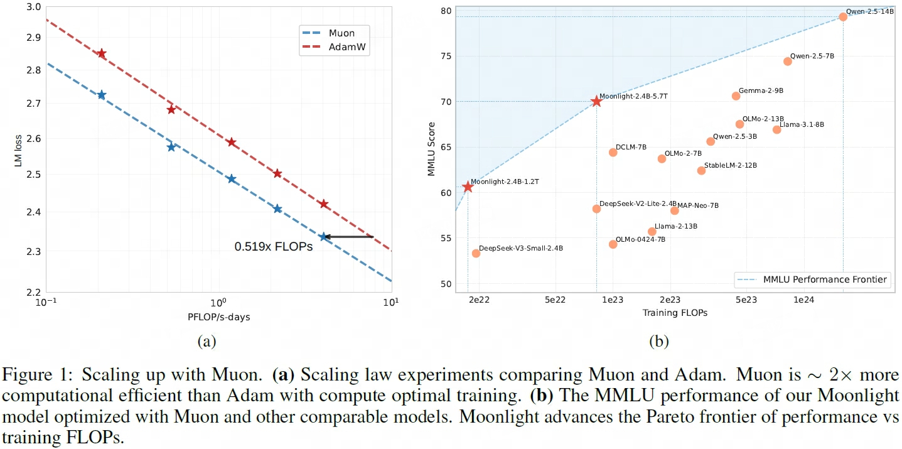
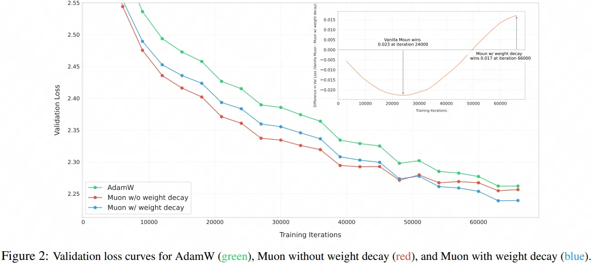
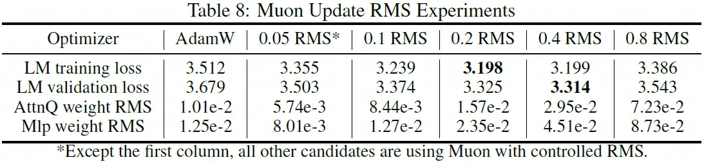

## MuonW
> 论文：Muon is Scalable for LLM Training  
> Moonshot AI & UCLA, 2025 Feb  

### 主要内容
- [x] 通过添加权重衰减项、将Muon RMS与AdamW优化器匹配等改进措施，提升大模型预训练的效率（~2x）与效果表现

    

        
    

#### Weight Decay
使用Muon预训练时，发现 ==无weight decay约束的权重参数 Root Mean Square 会一直增大，最终超出bf16的精度范围== ，影响模型训练效果。因此提出MounW

$$
\theta_t = \theta_{t-1} - \eta_t(o_t  + \lambda \theta_{t-1})
$$

    

!!! success ""
    - Muon较AdamW在小规模模型预训练效果表现更佳，但随着模型规模增大提升增益逐渐消失
    - MuonW表现优于Muon和AdamW，在大规模训练情况下实现了更低的valid loss

#### Update Rescale

$$
\theta_t = \theta_{t-1} - \eta_t(0.2\cdot o_t \cdot \sqrt{\max(n, m)} + \lambda \theta_{t-1})
$$

1. **theoretical Muon update**：给定权重参数（shape $[n, m]$），其梯度矩阵$g = USV^T$，正交化结果 $o = U_{[:, :r]}V_{[:r, :]}$，其中 $n \ge m \ge r$

    $$
    \begin{aligned}
        o_{i, j} =& \sum_{k=1}^r U_{i, k} V_{k, j} \\
        \text{RMS}(o)^2 =& \frac{1}{nm} \sum_{i=1}^{n}\sum_{j=1}^m \sum_{k=1}^r U_{i, k}^2 V_{k, j}^2 \\
        =& \frac{1}{nm} \sum_{k=1}^r \sum_{i=1}^n U_{i, k}^2 \sum_{j=1}^m V_{k, j}^2\\
        =& \frac{1}{nm} \sum_{k=1}^r 1\\
        =& \frac{r}{nm}
    \end{aligned}
    $$

    > $\text{RMS}(o)=\sqrt{r/nm}$，其中在满秩的情况下为 $\text{RMS}(o)=\sqrt{1/n}$

2. **maintain consistent update RMS**，由于 $\text{RMS}(o)$ 和矩阵型相关，需执行 $o_t \cdot \sqrt{\max(n, m)}$ 以保持RMS一致性，防止：

    - [ ] $\max(n, m)$ 过大：dense MLP梯度更新幅度过小，限制模型表征能力
    - [ ] $\max(n, m)$ 过小：

3. **match update RMS of AdamW**，由于Muon无法处理Embedding和Norm等非矩阵权重参数层，一般需要与AdamW搭配使用，为了共享优化器超参（$\eta, \lambda$），因此需要和AdamW的RMS相匹配，实验发现取0.2~0.4最佳

    

        
    

#### Evaluation
- Muon achieves ∼ 2× computational efficiency compared to AdamW with compute optimal training.
- achieving better performance with much fewer training FLOPs compared to prior models.

#### Abaltion