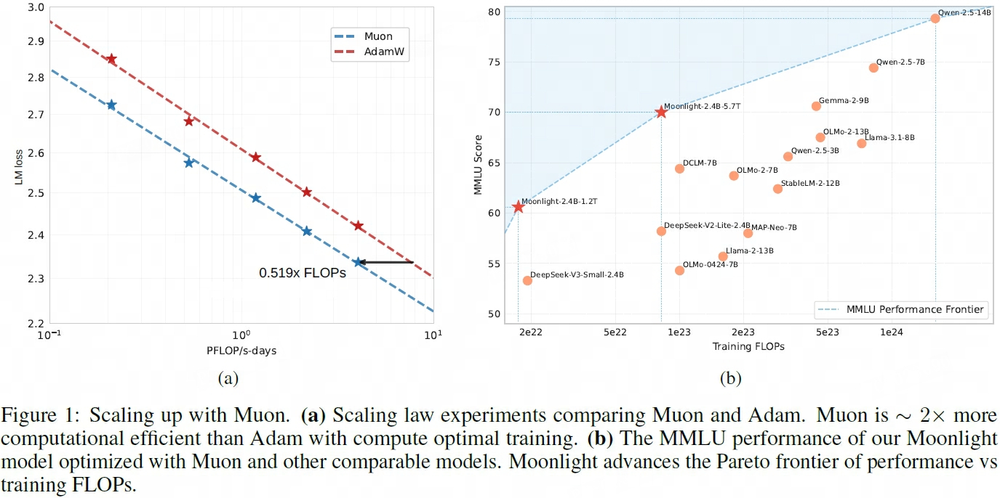

## MuonW
> 论文：Muon is Scalable for LLM Training  
> Moonshot AI & UCLA, 2025 Feb  

### 主要内容

#### Update Rescale + Weight Decay

- While Muon performs significantly better than AdamW on a small scale as shown by K. Jordan, we found the performance gains diminish when we scale up to train a larger model with more tokens, ==both the weight and the layer output’s RMS keep growing to a large scale, exceeding the high-precision range of bf16, which might hurt the model’s performance==

- 

#### Evaluation
- Muon achieves ∼ 2× computational efficiency compared to AdamW with compute optimal training.
- achieving better performance with much fewer training FLOPs compared to prior models.
- 

#### Abaltion