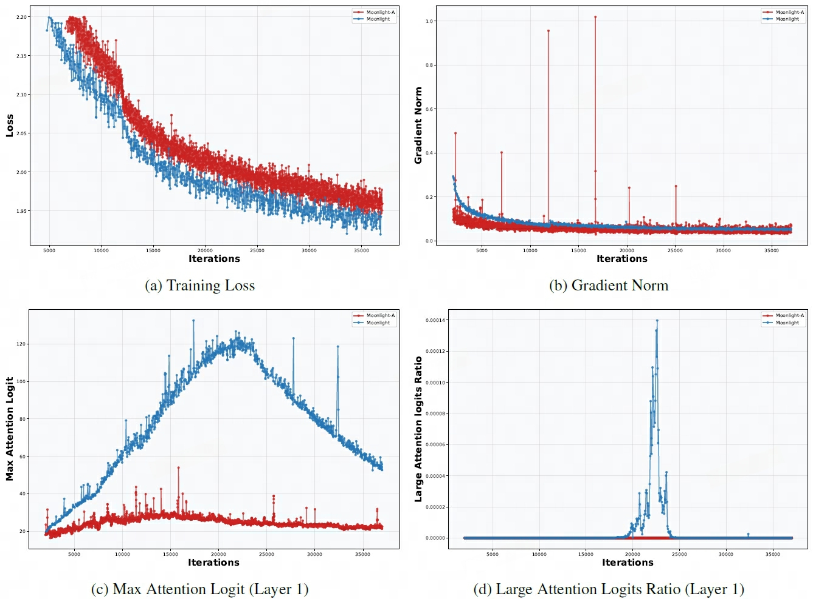
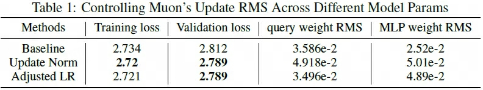
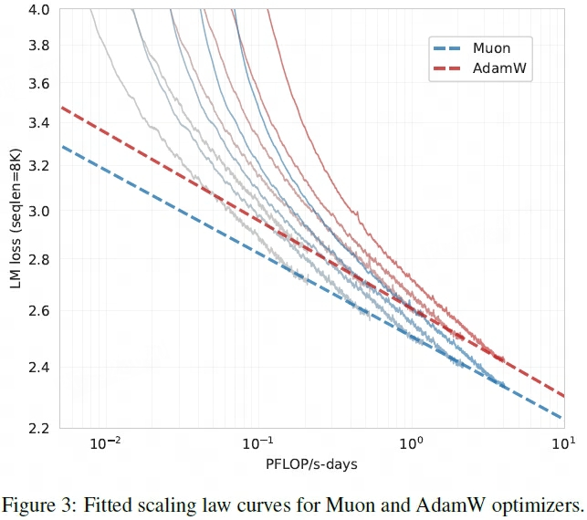
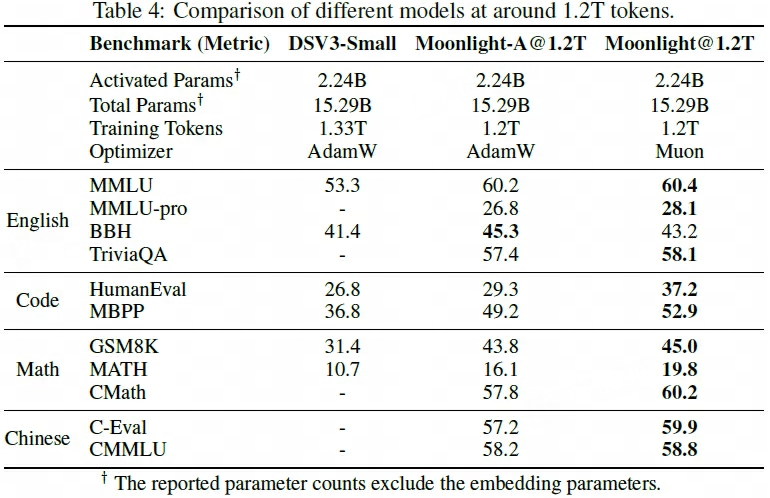
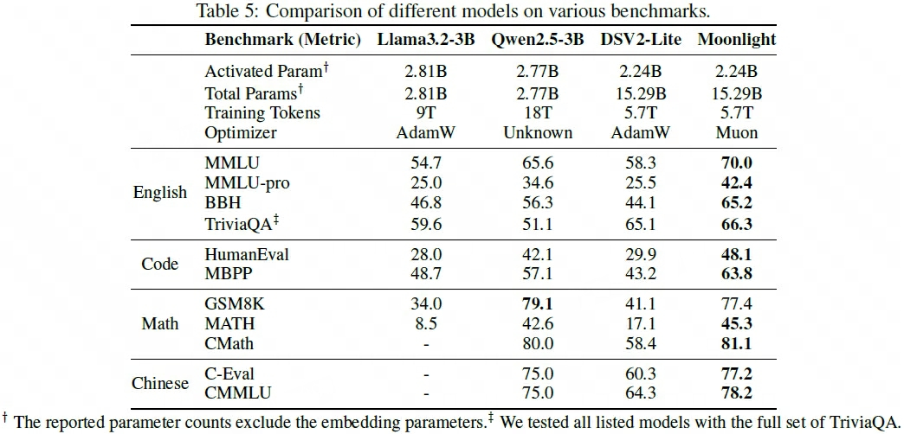
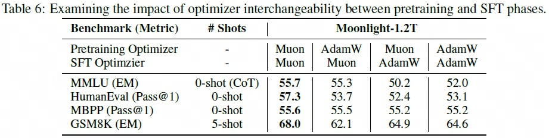
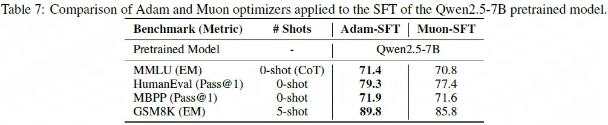
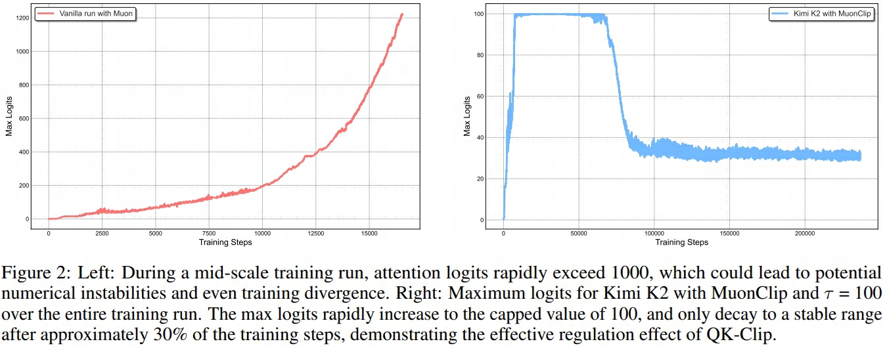

## MuonW
> 论文：Muon is Scalable for LLM Training  
> Moonshot AI & UCLA, 2025 Feb  

### 主要内容
- [x] 通过添加权重衰减项、将Muon RMS与AdamW优化器匹配等改进措施，提升大模型预训练的效率（~2x）与效果表现

    

        
    

#### Weight Decay
使用Muon预训练时，发现 ==无weight decay约束的权重参数 Root Mean Square 会一直增大，最终超出bf16的精度范围== ，影响模型训练效果。因此提出MounW

$$
\theta_t = \theta_{t-1} - \eta_t(o_t  + \lambda \theta_{t-1})
$$

    

!!! success ""
    - Muon较AdamW在小规模模型预训练效果表现更佳，但随着模型规模增大提升增益逐渐消失
    - MuonW表现优于Muon和AdamW，在大规模训练情况下实现了更低的valid loss

#### Update Rescale

$$
\theta_t = \theta_{t-1} - \eta_t(0.2\cdot o_t \cdot \sqrt{\max(n, m)} + \lambda \theta_{t-1})
$$

> 其中$0.2 \cdot \sqrt{\max(n, m)}$ 统称为为调整学习率 $\eta$ 操作

1. **theoretical Muon update**：给定权重参数（shape $[n, m]$），其梯度矩阵$g = USV^T$，正交化结果 $o = U_{[:, :r]}V_{[:r, :]}$，其中 $n \ge m \ge r$

    $$
    \begin{aligned}
        o_{i, j} =& \sum_{k=1}^r U_{i, k} V_{k, j} \\
        \text{RMS}(o)^2 =& \frac{1}{nm} \sum_{i=1}^{n}\sum_{j=1}^m \sum_{k=1}^r U_{i, k}^2 V_{k, j}^2 \\
        =& \frac{1}{nm} \sum_{k=1}^r \sum_{i=1}^n U_{i, k}^2 \sum_{j=1}^m V_{k, j}^2\\
        =& \frac{1}{nm} \sum_{k=1}^r 1\\
        =& \frac{r}{nm}
    \end{aligned}
    $$

    > $\text{RMS}(o)=\sqrt{r/nm}$，其中在满秩的情况下为 $\text{RMS}(o)=\sqrt{1/n}$

2. **maintain consistent update RMS**，由于 $\text{RMS}(o)$ 和矩阵型相关，需执行 $o_t \cdot \sqrt{\max(n, m)}$ 以保持RMS一致性，防止：

    - [ ] $\max(n, m)$ 过大：dense MLP matrix梯度更新幅度过小，限制模型表征能力
    - [ ] $\max(n, m)$ 过小：GQA或MLA中的各k、v head对应的权重矩阵中，更新幅度过大导致模型训练不稳定，削减模型效果表现

3. **match update RMS of AdamW**，由于Muon无法处理Embedding和Norm等非矩阵权重参数层，一般需要与AdamW搭配使用，同时为了进一步共享优化器超参（$\eta, \lambda$），因此需要和AdamW的RMS相匹配，实验发现取0.2~0.4最佳

    

        
    

#### Evaluation
1. **Learning Curve**
    - loss和gradient norm平滑下降，无显著突刺现象
    - 训练过程中attention logit数值、频率均存在不健康爆炸增长阶段

    

        
    

2. **Consistent Update RMS**  
    - **Baseline**：$\theta_t = \theta_{t-1} - \eta_t(0.2 \cdot o_t \cdot \sqrt{d_\text{hidden_state}} + \lambda \theta_{t-1})$  
    - **Update Norm**：$\theta_t = \theta_{t-1} - \eta_t(0.2 \cdot o_t/ \sqrt{\text{RMS}(o_t)} + \lambda \theta_{t-1})$  
    - **Adjusted LR**（MuonW）：$\theta_t = \theta_{t-1} - \eta_t(0.2 \cdot o_t \cdot \sqrt{\max(n, m)} + \lambda \theta_{t-1})$

    

        
    

    > attention query (shape $[H, H]$)，MLP（shape $[H, 4H]$）

    !!! success ""
        Update Norm 和 Adjusted LR loss表现均优于Baseline，且Adjusted LR效果更优

3. **Scaling Law of Muon**

    

        
    

    !!! success ""
        在最佳计算开销设置下，MuonW 仅需要约 52% 的训练 FLOPs 即可达到 AdamW 的效果表现，且MuonWScaling Law的优化曲线上限更佳。

#### Abaltion

1. Pretraining with Muon：使用MuonW Optmizer较AdamW在Pretained LLM时效果表现更佳

    

        

            
        

        

            
        

    

    > Moonlight-A表示使用AdamW Optimizer预训练
    
2. SFT with Muon  
    

        
    

    

        
    

    !!! success ""
        - 在Pretrain + SFT阶段中，均应用MuonW Optmizer模型效果表现最优
        - MuonW和AdamW优化器存在不匹配问题，在Pretrain和SFT阶段更换Optimizer会导致模型性能削弱

## Kimi-K2
> 论文：Kimi K2: Open Agentic Intelligence  
> [Blog](https://moonshotai.github.io/Kimi-K2/)  
> Kimi Team
### 主要内容
#### MounClip
由[MuonW](#evaluation)可知，在模型预训练过程中，一小部分head中attention logits的数值和出现频率会出现不健康的爆炸增长现象，实验发现该问题会导致训练不稳定。基于上述现象提出了`per-head QK-Clip`方案，对于每个head，执行

$$
\begin{aligned}
    q_i =& \eta^\alpha W_q x_i \\
    k_j =& \eta^{1-\alpha} W_k x_j \\
    q_i^Tk_j =& \eta (W_q x_i)^TW_k x_j \\
    \eta =& \min \left( \frac{\tau}{\max_{i, j} \frac{1}{\sqrt{d}}\left(\left(W_q x_i\right)^TW_k x_j\right)}, 1\right)
\end{aligned}
$$

> 截断attention logits上限为阈值 $\tau$

    

