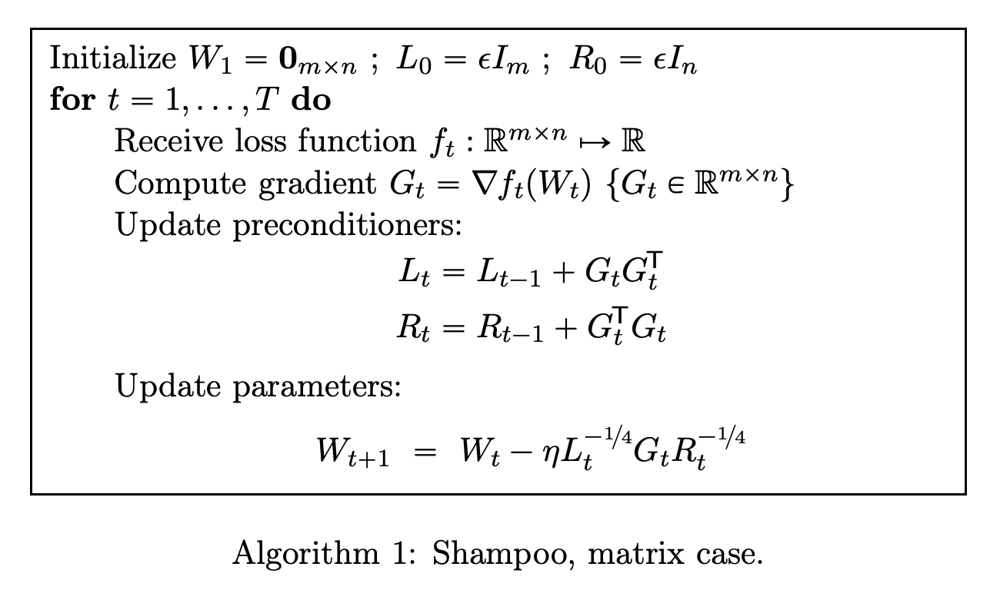
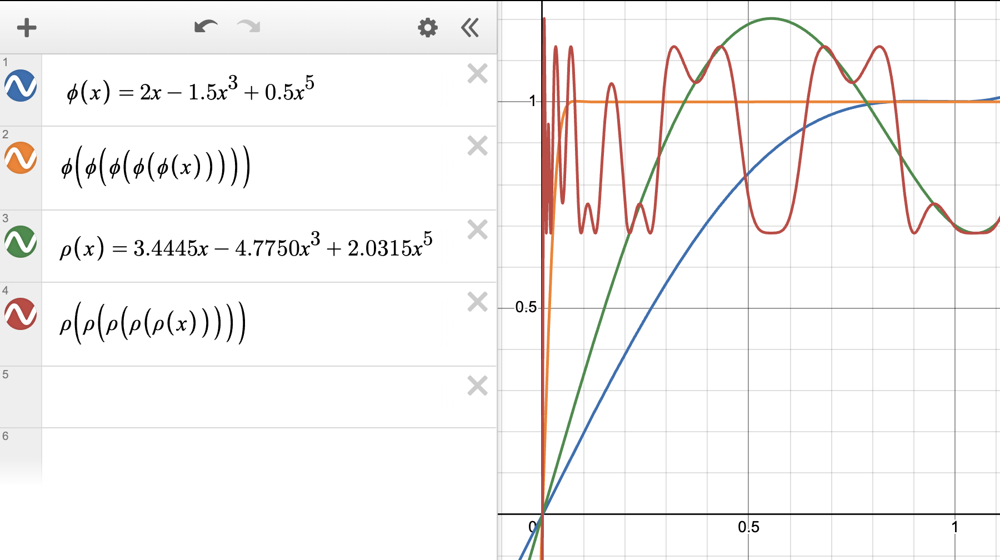

- An overview of gradient descent optimization algorithms

## Gradient Descent Variant

### SGD
随机梯度下降 Stochastic Gradient Descent，一次迭代使用单个样本或小批量(mini-batch)样本

$$
\begin{aligned}
    g_t =& \nabla_{\theta_{t-1}} J\left(\theta_{t-1}; x^{(i:i+n)}; y^{(i:i+n)}\right) \\
    \theta_t  =& \theta_{t-1} -\eta g_t    
\end{aligned}
$$

> $1 \le n \lt \text{batch_size}$

### BGD
批量梯度下降 Batch Gradient Descent, 一次迭代使用批量中所有样本

$$
\begin{aligned}
    g_t =& \nabla_{\theta_{t-1}} J\left(\theta_{t-1}; x; y\right) = \nabla_{\theta}J(\theta) \\
    \theta_t  =& \theta_{t-1} -\eta g_t    
\end{aligned}
$$

## Gradient Descent Optimization


### Momentum
动量法 Momentum 模拟物体运动时的惯性，在梯度更新时一定程度上保留之前更新的方向

$$
\begin{aligned}
    v_t =& \gamma v_{t-1} + \eta g_t \\
    \theta_t =& \theta_{t-1} - v_t
\end{aligned}
$$

#### NAG
Nesterov Accelerated Gradient，结合动量更新提前提前"跳跃"到一个前瞻位置，再在该位置计算梯度并修正，在凸优化问题中实现了更快的收敛速度

$$
\begin{aligned}
    v_t =& \gamma v_{t-1} + \eta \nabla_{\theta_{t-1}} J(\theta_{t-1} -\gamma v_{t-1}) \\
    \theta_t =& \theta_{t-1} - v_t
\end{aligned}
$$

### Adagrad
动态调整学习率 $\eta$


$$
\begin{aligned}
    G_{t} =& \sqrt{\sum_{i=0}^{t}{(g_i)^2}} \\
    \theta_{t} =& \theta_{t-1}-\frac{\eta}{\sqrt{G_{t} + \epsilon}} \odot g_t\\
\end{aligned}
$$
#### Adadelta
$\Delta \theta$ 表示模型参数更新量，即 $\Delta\theta_t = \theta_t^\text{tmp} - \theta_{t-1}$

$$
\begin{aligned}
    \mathbb{E}\left[ g^2 \right]_t =& \gamma \mathbb{E}\left[ g^2 \right]_{t-1} + (1 - \gamma) g^2_t \\
    \mathbb{E}\left[ \Delta \theta^2 \right]_t =& \gamma \mathbb{E}\left[ \Delta \theta^2 \right]_{t-1} + (1-\gamma) \Delta\theta^2_t \\
    \theta_{t} =& \theta_{t-1}-\frac{\sqrt{\mathbb{E}\left[ \Delta \theta^2 \right]_{t-1} + \epsilon}}{\sqrt{\mathbb{E}\left[ g^2 \right]_t + \epsilon}}\odot g_t\\
\end{aligned}
$$


#### RMSprop

$$
\begin{aligned}
    \mathbb{E}\left[ g^2 \right]_t =& \gamma \mathbb{E}\left[ g^2 \right]_{t-1} + (1 - \gamma) g^2_t \\
    \theta_{t} =& \theta_{t-1}-\frac{\eta}{\sqrt{\mathbb{E}\left[ g^2 \right]_t + \epsilon}}\odot g_t\\
\end{aligned}
$$

### Adam
Adaptive Moment Estimation，动态调整学习率 $\eta$ 和 梯度

$$
\begin{aligned}
    m_t =& \beta_1 m_{t-1} + (1-\beta_1) g_t\\
    v_t =& \beta_2 v_{t-1} + (1-\beta_2) g_t^2\\
    \hat{m}_t =& \frac{m_t}{1-\beta_1^{t}} \\
    \hat{v}_t =& \frac{v_t}{1-\beta_2^{t}} \\
    \theta_{t} =& \theta_{t-1} -\frac{\eta}{\sqrt{\hat{v}_t} + \epsilon}\odot \hat{m}_t
\end{aligned}
$$

> $\hat{m}_t, \hat{v}_t$ 为初始阶段对 $m_t, v_t$ 的偏差纠正项，分母部分 $\lim\limits_{t \rightarrow \infty} \beta^t = 0$

#### AdaMax
使用无穷范数 $L_{\infty}$ 替代 $L_2$ 范数计算$v_t$ ，并取消了分母的偏差纠正项

$$
\begin{aligned}
    m_t =& \beta_1 m_{t-1} + (1-\beta_1) g_t \\
    v_t =& \max \left(\beta_2 v_{t-1}, \vert g_t \vert \right)\\
    \hat{m}_t =& \frac{m_t}{1-\beta_1^{t}} \\
    \theta_{t} =& \theta_{t-1} -\frac{\eta}{v_t}\odot \hat{m}_t
\end{aligned}
$$


#### Nadam
Nesterov-accelerated Adaptive Moment Estimation，与Adam对梯度部分使用偏差纠正项不同，Nadam对梯度额外应用了动量的思想

$$
\begin{aligned}
    m_t =& \beta_1 m_{t-1} + (1-\beta_1) g_t\\
    v_t =& \beta_2 v_{t-1} + (1-\beta_2) g_t^2\\
    \hat{v}_t =& \frac{v_t}{1-\beta_2^{t}} \\
    \hat{m}_t^{'} =& \beta_1 m_{t} + \frac{1- \beta_1}{1-\beta^t_1}g_t\\
    \theta_{t} =& \theta_{t-1} -\frac{\eta}{\sqrt{\hat{v}_t} + \epsilon}\odot \hat{m}_t^{'}
\end{aligned}
$$

#### AdamW
在Adam的基础上，加入了与学习率 $\eta$ 解耦的权重衰减项

$$
\begin{aligned}
    m_t =& \beta_1 m_{t-1} + (1-\beta_1) g_t\\
    v_t =& \beta_2 v_{t-1} + (1-\beta_2) g_t^2\\
    \hat{m}_t =& \frac{m_t}{1-\beta_1^{t}} \\
    \hat{v}_t =& \frac{v_t}{1-\beta_2^{t}} \\
    \theta_{t} =& \theta_{t-1} -\eta(\frac{\hat{m}_t}{{\sqrt{\hat{v}_t} + \epsilon}} + \lambda \theta_{t-1})
\end{aligned}
$$


### Muon: [Blog](https://kellerjordan.github.io/posts/muon/), [Github](https://github.com/KellerJordan/Muon)
**M**oment**U**m **O**rthogonalized by **N**ewton-Schulz 是一个二维参数神经网络（e.g., shape $[n, m]$）优化器，通过对待更新的动量梯度正交化，以提升模型预训练期间的性能和效果表现

$$
\begin{aligned}
    m_t =& \mu m_{t-1} + g_t \\
    o_t =& \text{Newton-Schulz} (m_t) \\
    \theta_t =& \theta_{t-1} - \eta_t o_t
\end{aligned}
$$

!!! info ""
    - 实际上需要对 $m_t$ （梯度矩阵条件数$\text{high_number} \gg 1$，数值敏感性过高） 归一化，即$m_t/\Vert m_t \Vert_\text{F}$ 使矩阵奇异值被缩放至$[-1, 1]$范围内，确保 Newton-Schulz 迭代过程中的数值稳定
    - 由于只能对矩阵进行正交化，因此Embedding和Norm等非矩阵参数层的优化需使用其它优化器，如AdamW

1. **梯度正交化Orthogonalization**，基于Shampoo Optimizer方案，去除左右矩阵的动量累加项，SVD分解梯度矩阵 $G_t = USV^T$，得到目标优化方案：$\theta_t = \theta_{t-1} - \eta UV^T$

    <div class="one-image-container">
        
    </div>

    !!! info ""
        - 直观理解，强制梯度矩阵正交化能够减少梯度分量方向冗余的同时有效地增加了其它稀有方向的更新（奇异值较小的方向对学习仍很重要），减少了优化冲突，提升优化效率
        - 实验发现对 $m_t$ 进行NS迭代前额外应用动量累计 $m_t = \mu m_{t-1} + g_t$ 效果更优

2. **Newton-Schulz** iteration 不存在以下问题并能够仅在bf16精度下快速实现矩阵正交化
    - [ ] SVD将矩阵正交化速度太慢
    - [ ] Coupled Newton至少需要基于fp32的精度来防止数值不稳定现象发生，GPU效率过低

    $$
    \begin{aligned}
        G^{'} &= aG + b(GG^T)G + c(GG^T)^2G \\
        &= \left(aI + b\left(GG^T\right) + c \left(GG^T\right)^2 \right) G \\
        &= \left(aI + bUS^2U^T + c US^4U^T \right) USV^T \\
        &= U(aS + bS^3 + cS^5) V^T
    \end{aligned}
    $$

    > $\varphi(x) = ax + bx^3 + cx^5 \approx 1$，迭代结果才能近似 $UV^T$

3. **迭代细节**

    <div class="one-image-container">
        
    </div>

    !!! info ""
        - 实验发现使用3阶或7阶多项式进行NS迭代使对时间开销无明显提升，因此选定5阶多项式进行NS迭代
        - 迭代次数 $T=5$ 得到的近似结果准确率能够保证
        - 在$x\in [0, 1]$范围内，$\varphi^T(x) \in [1-\epsilon, 1+\epsilon] = [0.7, 1.3]$
        - $\varphi^{'}(0)=a$ 用于控制小奇异值方向分量，要求值尽可能大梯度越陡
        - `#!python (a, b, c)=(3.4445, -4.7750, 2.0315)`

4. **算法分析**，对于权重矩阵（shape $[n, m], n\ge m$），浮点数运算情况如下
    - ^^Newton-Schulz^^ 为$2*(2nm^2 + m^3)*T$，最差$m==n$情况下为 $6Tnm^2$
    - ^^Forward + Backward^^ 为 $2*(nm + 2nm) = 6nm$，Batch额外计算开销为 $Tm/B$，在大`batch_size`情况下额外计算开销占比更小

    ```python
    def zeropower_via_newtonschulz5(G, steps: int):
        """
        Newton-Schulz iteration to compute the zeroth power / orthogonalization of G. We opt to use a 5-time iteration whose 
        coefficients are selected to maximize the slope at zero. For the purpose of minimizing steps, 
        it turns out to be empirically effective to keep increasing the slope at zero even beyond the point where the iteration no longer converges all the way to one everywhere on the interval. This iteration therefore does not produce UV^T but rather something like US'V^T where S' is diagonal with S_{ii}' ~ Uniform(0.5, 1.5), which turns out not to hurt model performance at all relative to UV^T, where USV^T = G is the SVD.
        """
        assert G.ndim >= 2 # batched Muon implementation by @scottjmaddox, and put into practice in the record by @YouJiacheng
        a, b, c = (3.4445, -4.7750,  2.0315)
        X = G.bfloat16()
        # 奇异值分解前调整小维度在后
        if G.size(-2) > G.size(-1):
            X = X.mT

        # Ensure spectral norm is at most 1
        X = X / (X.norm(dim=(-2, -1), keepdim=True) + 1e-7)
        # Perform the NS iterations
        for _ in range(steps):
            A = X @ X.mT
            B = b * A + c * A @ A # quintic computation strategy adapted from suggestion by @jxbz, @leloykun, and @YouJiacheng
            X = a * X + B @ X
        
        if G.size(-2) > G.size(-1):
            X = X.mT
        return X
    ```

#### [MuonW](muonw.md)


