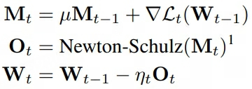
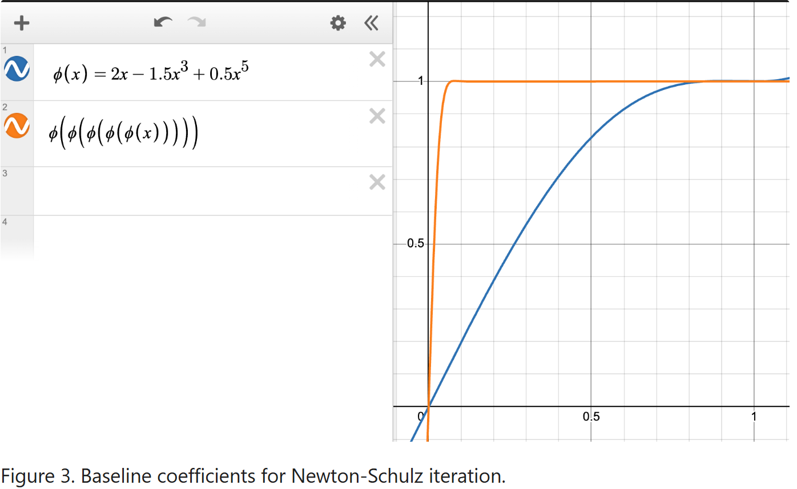
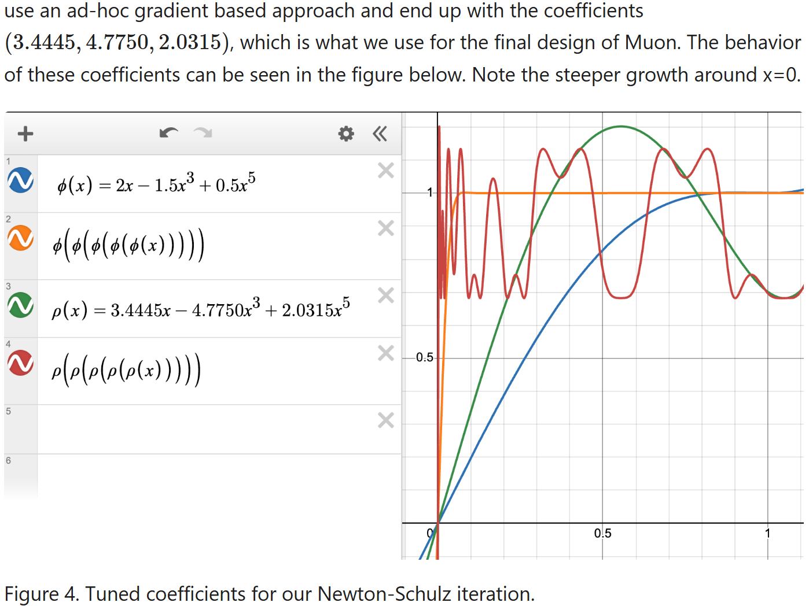
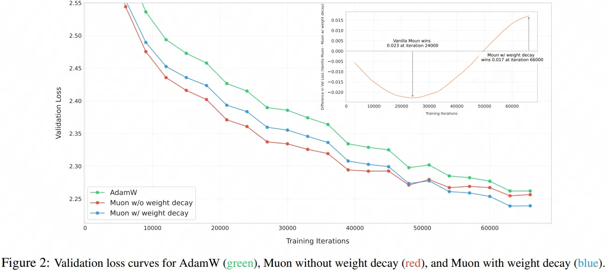
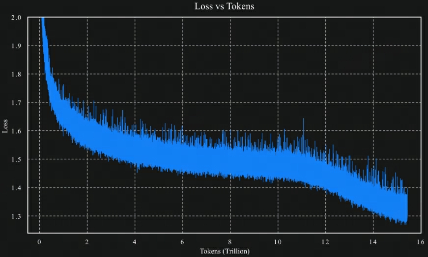

- An overview of gradient descent optimization algorithms

## Gradient Descent Variant

### SGD
随机梯度下降 Stochastic Gradient Descent，一次迭代使用单个样本或小批量(mini-batch)样本

$$
\begin{aligned}
    g_t =& \nabla_{\theta_{t-1}} J\left(\theta_{t-1}; x^{(i:i+n)}; y^{(i:i+n)}\right) \\
    \theta_t  =& \theta_{t-1} -\eta g_t    
\end{aligned}
$$

> $1 \le n \lt \text{batch_size}$

### BGD
批量梯度下降 Batch Gradient Descent, 一次迭代使用批量中所有样本

$$
\begin{aligned}
    g_t =& \nabla_{\theta_{t-1}} J\left(\theta_{t-1}; x; y\right) = \nabla_{\theta}J(\theta) \\
    \theta_t  =& \theta_{t-1} -\eta g_t    
\end{aligned}
$$

## Gradient Descent Optimization


### Momentum
动量法 Momentum 模拟物体运动时的惯性，在梯度更新时一定程度上保留之前更新的方向

$$
\begin{aligned}
    v_t =& \gamma v_{t-1} + \eta g_t \\
    \theta_t =& \theta_{t-1} - v_t
\end{aligned}
$$

#### NAG
Nesterov Accelerated Gradient，结合动量更新提前提前"跳跃"到一个前瞻位置，再在该位置计算梯度并修正，在凸优化问题中实现了更快的收敛速度

$$
\begin{aligned}
    v_t =& \gamma v_{t-1} + \eta \nabla_{\theta_{t-1}} J(\theta_{t-1} -\gamma v_{t-1}) \\
    \theta_t =& \theta_{t-1} - v_t
\end{aligned}
$$

### Adagrad
动态调整学习率 $\eta$


$$
\begin{aligned}
    G_{t} =& \sqrt{\sum_{i=0}^{t}{(g_i)^2}} \\
    \theta_{t} =& \theta_{t-1}-\frac{\eta}{\sqrt{G_{t} + \epsilon}} \odot g_t\\
\end{aligned}
$$
#### Adadelta
$\Delta \theta$ 表示模型参数更新量，即 $\Delta\theta_t = \theta_t^\text{tmp} - \theta_{t-1}$

$$
\begin{aligned}
    \mathbb{E}\left[ g^2 \right]_t =& \gamma \mathbb{E}\left[ g^2 \right]_{t-1} + (1 - \gamma) g^2_t \\
    \mathbb{E}\left[ \Delta \theta^2 \right]_t =& \gamma \mathbb{E}\left[ \Delta \theta^2 \right]_{t-1} + (1-\gamma) \Delta\theta^2_t \\
    \theta_{t} =& \theta_{t-1}-\frac{\sqrt{\mathbb{E}\left[ \Delta \theta^2 \right]_{t-1} + \epsilon}}{\sqrt{\mathbb{E}\left[ g^2 \right]_t + \epsilon}}\odot g_t\\
\end{aligned}
$$


#### RMSprop

$$
\begin{aligned}
    \mathbb{E}\left[ g^2 \right]_t =& \gamma \mathbb{E}\left[ g^2 \right]_{t-1} + (1 - \gamma) g^2_t \\
    \theta_{t} =& \theta_{t-1}-\frac{\eta}{\sqrt{\mathbb{E}\left[ g^2 \right]_t + \epsilon}}\odot g_t\\
\end{aligned}
$$

### Adam
Adaptive Moment Estimation，动态调整学习率 $\eta$ 和 梯度

$$
\begin{aligned}
    m_t =& \beta_1 m_{t-1} + (1-\beta_1) g_t\\
    v_t =& \beta_2 v_{t-1} + (1-\beta_2) g_t^2\\
    \hat{m}_t =& \frac{m_t}{1-\beta_1^{t}} \\
    \hat{v}_t =& \frac{v_t}{1-\beta_2^{t}} \\
    \theta_{t} =& \theta_{t-1} -\frac{\eta}{\sqrt{\hat{v}_t} + \epsilon}\odot \hat{m}_t
\end{aligned}
$$

> $\hat{m}_t, \hat{v}_t$ 为初始阶段对 $m_t, v_t$ 的偏差纠正项，分母部分 $\lim\limits_{t \rightarrow \infty} \beta^t = 0$

#### AdaMax
使用无穷范数 $L_{\infty}$ 替代 $L_2$ 范数计算$v_t$ ，并取消了分母的偏差纠正项

$$
\begin{aligned}
    m_t =& \beta_1 m_{t-1} + (1-\beta_1) g_t \\
    v_t =& \max \left(\beta_2 v_{t-1}, \vert g_t \vert \right)\\
    \hat{m}_t =& \frac{m_t}{1-\beta_1^{t}} \\
    \theta_{t} =& \theta_{t-1} -\frac{\eta}{v_t}\odot \hat{m}_t
\end{aligned}
$$


#### Nadam
Nesterov-accelerated Adaptive Moment Estimation，与Adam对梯度部分使用偏差纠正项不同，Nadam对梯度额外应用了动量的思想

$$
\begin{aligned}
    m_t =& \beta_1 m_{t-1} + (1-\beta_1) g_t\\
    v_t =& \beta_2 v_{t-1} + (1-\beta_2) g_t^2\\
    \hat{v}_t =& \frac{v_t}{1-\beta_2^{t}} \\
    \hat{m}_t^{'} =& \beta_1 m_{t} + \frac{1- \beta_1}{1-\beta^t_1}g_t\\
    \theta_{t} =& \theta_{t-1} -\frac{\eta}{\sqrt{\hat{v}_t} + \epsilon}\odot \hat{m}_t^{'}
\end{aligned}
$$

#### AdamW
在Adam的基础上，加入了与学习率 $\eta$ 解耦的权重衰减项

$$
\begin{aligned}
    m_t =& \beta_1 m_{t-1} + (1-\beta_1) g_t\\
    v_t =& \beta_2 v_{t-1} + (1-\beta_2) g_t^2\\
    \hat{m}_t =& \frac{m_t}{1-\beta_1^{t}} \\
    \hat{v}_t =& \frac{v_t}{1-\beta_2^{t}} \\
    \theta_{t} =& \theta_{t-1} -\eta(\frac{\hat{m}_t}{{\sqrt{\hat{v}_t} + \epsilon}} + \lambda \theta_{t-1})
\end{aligned}
$$


### Muon: [Blog](https://kellerjordan.github.io/posts/muon/), [Github](https://github.com/KellerJordan/Muon)
**M**oment**U**m **O**rthogonalized by **N**ewton-Schulz


- remove preconditioner accumulation, 即 $L_t = L_{t-1} + G_tG_t^T$ 和 $R_t = R_{t-1} + G_tG_t^T$，去除了前部分累加项，解释为关闭动量的状态（由shampoo发现梯度的正交化有效，因此提出了Muon Optimizer）
- $\text{Ortho}(g) = \arg \min_O \{\Vert o-g\Vert_F, o^To=I \text{ or } oo^T=I$\}对梯度进行正交化处理Orthogonalization，强制梯度方向彼此正交，减少冲突（避免不同梯度分量在相同方向上的冗余更新），使参数更新更一致。一般g需要进行归一化处理，即$/\Vert g \Vert_F$
- Intuitively, orthogonalization can ensure that the update matrices are isomorphic, preventing the weight from learning along a few dominant directions
- 
- And for an empirically-flavored motivation, we observe that based on manual inspection, the updates produced by both SGD-momentum and Adam for the 2D parameters in transformer-based neural networks typically have very high condition number. That is, they are almost low-rank matrices, with the updates for all neurons being dominated by just a few directions. We speculate that orthogonalization effectively increases the scale of other “rare directions” which have small magnitude in the update but are nevertheless important for learning.

- [ ] SVD is far too slow 
- [ ] Coupled Newton iteration must be run in at least float32 precision to avoid numerical instability, which makes it slow on modern GPUs.
- [x] Newton-Schulz (NS) iteration can be stably run in bfloat16，

    $$
        \begin{aligned}
            G^{'} &= aG + b(GG^T)G + c(GG^T)^2G \\
            &= \left(aI + b\left(GG^T\right) + c \left(GG^T\right)^2 \right) G \\
            &= \left(aI + bUS^2U^T + c US^4U^T \right) USV^T \\
            &= U(aS + bS^3 + cS^5) V^T
        \end{aligned}
    $$

    > $G = USV^T$



- 最高5次项$\varphi(x) = ax+bx^3+cx^5$，通过对$\varphi$的结果进行N次（一般取5）代入迭代得到 $U\varphi^N(x)V^T$
- a 越大越好，即 $\varphi^{'}(0)=a$，用于控制（归一化后）小奇异值分量收敛速度
- $\varphi^N(x) \rightarrow 1$，即值域处于$[1-\epsilon, 1+\epsilon]$（以此只保留$UV^T$而不要奇异值项），$\epsilon$ 一般取0.3

- In our experiments, when using Muon with these coefficients to train transformer language models and small convolutional networks, it suffices to run the NS iteration for only 5 steps.
- We also considered using third-order and seventh-order polynomials for the NS iteration, but found that these could not improve the wallclock overhead any further.
```python
def zeropower_via_newtonschulz5(G, steps: int):
    """
    Newton-Schulz iteration to compute the zeroth power / orthogonalization of G. We opt to use a 5-time iteration whose 
    coefficients are selected to maximize the slope at zero. For the purpose of minimizing steps, 
    it turns out to be empirically effective to keep increasing the slope at zero even beyond the point where the iteration no longer converges all the way to one everywhere on the interval. This iteration therefore does not produce UV^T but rather something like US'V^T where S' is diagonal with S_{ii}' ~ Uniform(0.5, 1.5), which turns out not to hurt model performance at all relative to UV^T, where USV^T = G is the SVD.
    """
    assert G.ndim >= 2 # batched Muon implementation by @scottjmaddox, and put into practice in the record by @YouJiacheng
    a, b, c = (3.4445, -4.7750,  2.0315)
    X = G.bfloat16()
    # 奇异值分解，选择数量少的那维
    if G.size(-2) > G.size(-1):
        X = X.mT

    # Ensure spectral norm is at most 1
    X = X / (X.norm(dim=(-2, -1), keepdim=True) + 1e-7)
    # Perform the NS iterations
    for _ in range(steps):
        A = X @ X.mT
        B = b * A + c * A @ A # quintic computation strategy adapted from suggestion by @jxbz, @leloykun, and @YouJiacheng
        X = a * X + B @ X
    
    if G.size(-2) > G.size(-1):
        X = X.mT
    return X
```
- 单层muon FLOPS add+mulply=$2*(2m^2n + m^3)$，最差m==n情况下$6m^2n$，extra FLOPs required by Muon compared to SGD $6Tm^2n$
- 对于n*m的线性层，forward + backward = $2*(m*n + 2*m*n) = 6mn$，每个token的额外开销为 $Tm/B$
- We find that using momentum is necessary for the best empirical performance.
- In particular, when training transformers, AdamW should be used for the embedding and final classifier head layers in order to attain the best performance
- The main evidence for it being better than AdamW comes from its success in the competitive task “NanoGPT speedrunning.” In particular, switching from AdamW to Muon set a new NanoGPT training speed record on 10/15/24, where Muon improved the training speed by 35%. Muon has persisted as the optimizer of choice through all 12 of the new NanoGPT speedrunning records since then, which have been set by 7 different researchers.

- [x] Muon is Scalable for LLM Training
- While Muon performs significantly better than AdamW on a small scale as shown by K. Jordan, we found the performance gains diminish when we scale up to train a larger model with more tokens, ==both the weight and the layer output’s RMS keep growing to a large scale, exceeding the high-precision range of bf16, which might hurt the model’s performance==
- like adamw, + weight decay.
- 

- [x] [Kimi-K2 Tech Blog: Muon](https://moonshotai.github.io/Kimi-K2/)
- ==training instability caused by exploding attention logits==, an issue that occurs more frequently with Muon but less with AdamW in our experiments. **
- Existing solutions such as logit soft-capping and query-key normalization were found inadequate. **MuonClip**, qk-clip technique + rescale

    $$
    \begin{aligned}
        q_i =& \eta^\alpha W_q x_i \\
        k_i =& \eta^{1-\alpha} W_k x_i \\
        (\eta^\alpha q_i)^T(\eta^{1-\alpha} k_j) =& \eta q_i^Tk_j \\
        \eta =& \min \left( \frac{t}{\max_{i, j} \left(q_i^Tk_j\right)}, 1\right)
    \end{aligned}
    $$

    > 设置attention logits上限为阈值 $t$

- Kimi K2 was pre-trained on 15.5T tokens using MuonClip without training spike, demonstrating MuonClip as a robust solution for stable, large-scale LLM training.

