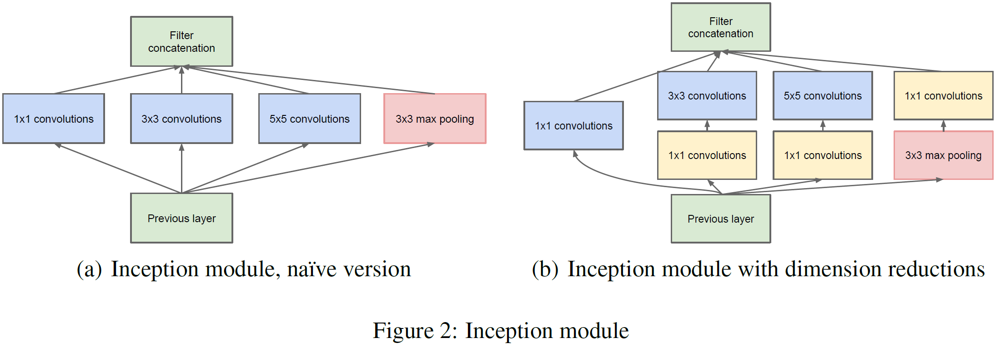

## Inception-1
> 论文：Going deeper with convolutions  
> Google & University of North Carolina & University of Michigan, 2014 Sep, CVPR 2015

### 主要内容
### Inception

1. Naive Version
2. Dimension Reduction Version
- based on the Hebbian principle and the intuition of multi-scale processing
- filter sizes 1x1, 3x3 and 5x5, however this decision was based more on convenience rather than necessity.
- higher layers, their spatial concentration is expected to decrease suggesting that the ratio of 3x3 and 5x5 convolutions should increase as we move to higher layers.
- 少通道进行压缩：1x1 convolutions are used to compute reductions before the expensive 3x3 and 5x5 convolutions.
- occasional max-pooling layers with stride 2 to halve the resolution of the grid.
- start using Inception modules only at higher layers while keeping the lower layers in traditional convolutional fashion
- Patch Size=kernel size
#### GoogLeNet

## Inception-2
## Inception-3
## Inception-4

## Xception