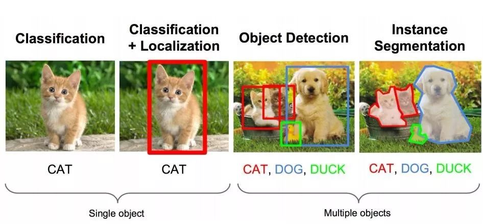

单张图片的像素表示为`(C, H, W)`，其中  

- `C` 为channel，高度z（⊥）
- `H` 为高度，纵轴y（↓）
- `W` 为宽度，横轴x（→）

## Detection 
### Detection
### Localization
### Segmentatoin
### Tracking

## Generation
### Style-Transfer
### Resolution
### Inpainting

## Multi-Modality