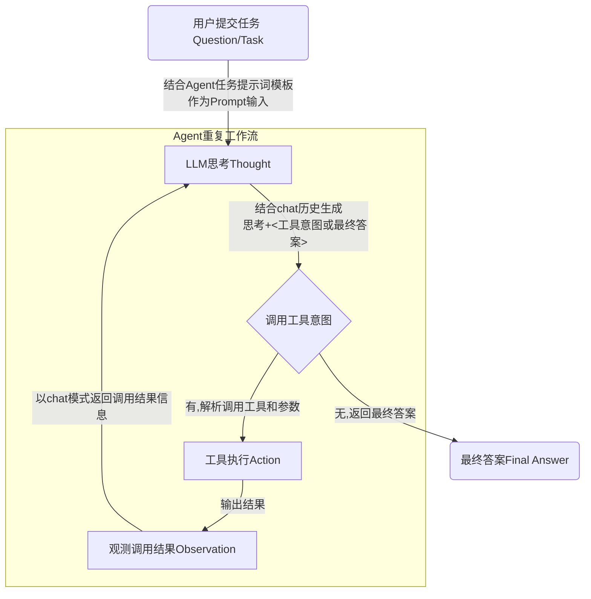
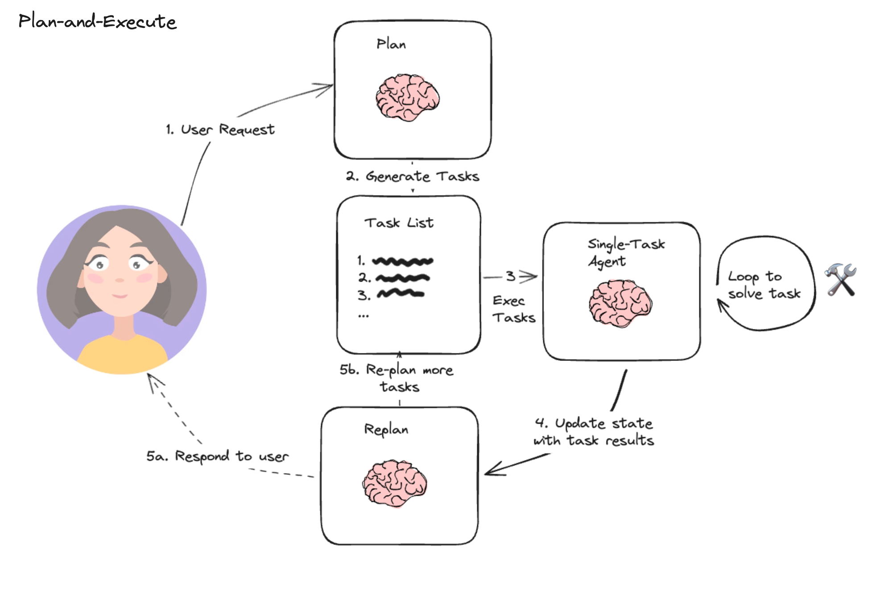
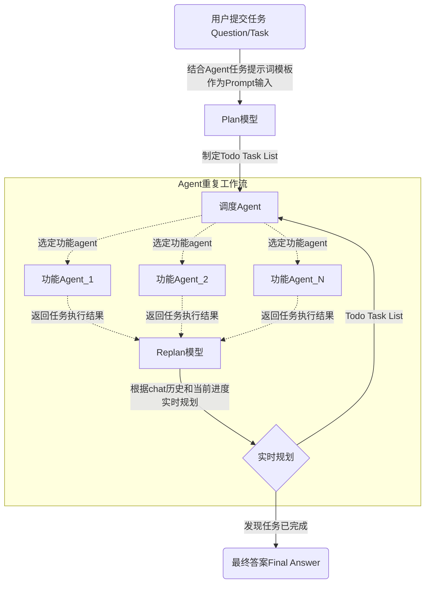
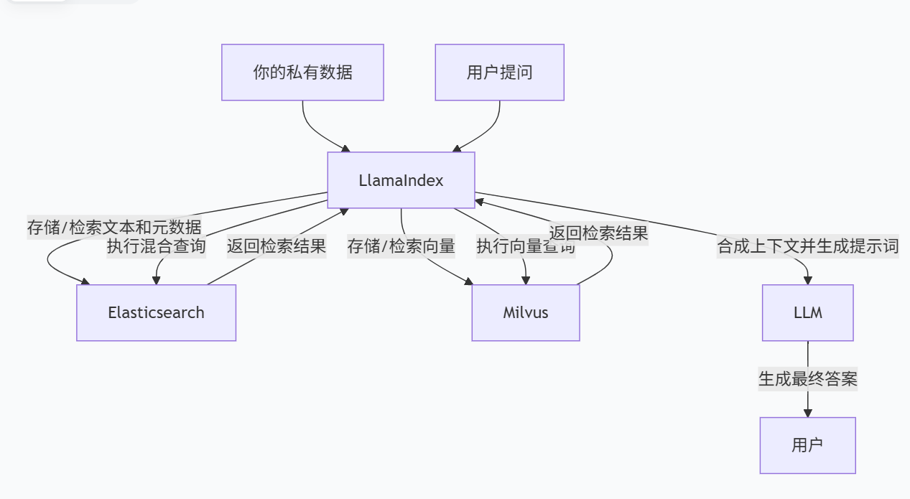

### ReAct Agent

#### 模式架构


- 思考（Thought）：大模型推理过程，==和模型的训练过程关系不大==，主要是系统提示词（规定模型扮演角色，运行规则以及提供各种环境信息等）导致，因此智能体框架中大模型切换是非常方便的(本质上是基于大模型的新使用方法)
- 行动（Action）：`tool_name, args = self.parse_action(action_content)` 解析工作意图并调用具体工具
    - 常见功能如 文件读写, 网络搜索, 代码执行 等 
- 观察（Observation）：观测工具执行结果,并以chat模式返回给大模型
- **Action + Observation** 结合使大模型不再是人为问答触发交互模式，而是进阶为智能体，可以感知和改变外界环境（如对代码修改，文件修改等），给具有"思考"的大模型安装了手脚

#### 测试示例
基于DeepSeek手动模拟稀土AI Agent (也可通过连接查看已实现结果[模拟实现流程](https://chat.deepseek.com/share/u6cordurswg712q706))

1. 复制part_1整体至[DeepSeek](https://chat.deepseek.com/) (可使用手机号注册登录) 对话框中, 开启对话
2. DeepSeek进行当前目录框架感知(一般只需要1次): 认为手动模拟感知, 使用后续内容继续对话 `<observation>检查成功，当前文件夹为空</observation>`
3. DeepSeek进行文件写入(根据实际对话中`<action>`, 一般需要回复3-4次): 认为手动模拟写入, 使用后续内容继续对话 `<observation>写入成功</observation>`
4. DeepSeek验证是否写入成功(一般只需要一次): 认为手动模拟感知, 使用后续内容继续对话 `<observation>检查成功，当前文件夹含有上述所有文件</observation>`
5. 完成任务,得到DeepSeek结果 `<final_answer>`

=== "part_1"
    ```python
    你需要解决一个问题。为此，你需要将问题分解为多个步骤。对于每个步骤，首先使用 <thought> 思考要做什么，然后使用可用工具之一决定一个 <action>。接着，你将根据你的行动从环境/工具中收到一个 <observation>。持续这个思考和行动的过程，直到你有足够的信息来提供 <final_answer>。

    所有步骤请严格使用以下 XML 标签格式输出：
    - <question> 用户问题
    - <thought> 思考
    - <action> 采取的工具操作
    - <observation> 工具或环境返回的结果
    - <final_answer> 最终答案

    ⸻

    例子 1:

    <question>埃菲尔铁塔有多高？</question>
    <thought>我需要找到埃菲尔铁塔的高度。可以使用搜索工具。</thought>
    <action>get_height("埃菲尔铁塔")</action>
    <observation>埃菲尔铁塔的高度约为330米（包含天线）。</observation>
    <thought>搜索结果显示了高度。我已经得到答案了。</thought>
    <final_answer>埃菲尔铁塔的高度约为330米。</final_answer>

    ⸻

    例子 2:

    <question>帮我找一个简单的番茄炒蛋食谱，并看看家里的冰箱里有没有西红柿。</question>
    <thought>这个任务分两步。第一步，找到番茄炒蛋的食谱。第二步，检查冰箱里是否有西红柿。我先用 find_recipe 工具找食谱。</thought>
    <action>find_recipe(dish="番茄炒蛋")</action>
    <observation>简单的番茄炒蛋食谱：将2个鸡蛋打散，2个番茄切块。热油，先炒鸡蛋，盛出。再热油，炒番茄至软烂，加入鸡蛋，放盐调味即可。</observation>
    <thought>好的，我已经有食谱了。食谱需要西红柿。现在我需要用 check_fridge 工具看看冰箱里有没有西红柿。</thought>
    <action>check_fridge(item="西红柿")</action>
    <observation>冰箱检查结果：有3个西红柿。</observation>
    <thought>我找到了食谱，并且确认了冰箱里有西红柿。可以回答问题了。</thought>
    <final_answer>简单的番茄炒蛋食谱是：鸡蛋打散，番茄切块。先炒鸡蛋，再炒番茄，混合后加盐调味。冰箱里有3个西红柿。</final_answer>

    ⸻

    请严格遵守：
    - <question>标签由用户提供，请不要擅自生成。
    - 你每次回答都必须包括两个标签，第一个是 <thought>，第二个是 <action> 或 <final_answer>
    - 输出 <action> 后立即停止生成，等待真实的 <observation>，擅自生成 <observation> 将导致错误
    - 如果 <action> 中的某个工具参数有多行的话，请使用 \n 来表示，如：<action>write_to_file("/tmp/test.txt", "a\nb\nc")</action>
    - 工具参数中的文件路径请使用绝对路径，不要只给出一个文件名。比如要写 write_to_file("/tmp/test.txt", "内容")，而不是 write_to_file("test.txt", "内容")

    ⸻

    本次任务可用工具：
    - read_file(file_path)：用于读取文件内容
    - write_to_file(filename, content)：将指定内容写入指定文件。成功时返回“写入成功”。
    - run_terminal_command(command)：用于执行终端命令

    ⸻

    环境信息：

    操作系统：macOS 15.5
    当前目录：/Users/xcluo/PycharmProjects/RareEarthAgent
    目标下文件列表：空

    <question>调研2025年赣州稀土进行市场情况并出具报告，结果分别放在不同的文件中</question>
    ```

=== "part_2"
    ```python
    <observation>检查成功，当前文件夹为空</observation>
    <observation>写入成功</observation>
    <observation>检查成功，当前文件夹含有上述所有文件</observation>
    ```

### Plan-and-Execute Agent
#### 模式架构
由langchain提出，先规划再执行



调度Agent: 基于当前状态和`Todo Task List`来个决定执行具体任务的功能Agent_n(功能Agent插拔十分便利,与调度Agent解耦)

- 本质上为`ReAct` 模式的拔高,将大模型输出的`<action>`元素替换为了`<agent>`元素


### 现有AI Agent调研情况
#### 开源Agent项目

| 智能体 | 主要特点 | 说明
| :--- | --- | --- |
| [OpenManus](https://github.com/openmanus-ai/OpenManus/blob/main/README_zh.md) | 开源ReAct型Agent | 具有Python执行, 网络搜索, 浏览器内核调用, 文件存储 功能, MetaGPT团队开发迭代的开源版Manus
| [languagemanus](https://github.com/Darwin-lfl/langmanus/blob/main/README_zh.md) | 简单的开源Agent<span style="color:red">框架</span> | 具有Python执行,浏览器内核调用 功能
| [langgraph](https://github.com/langchain-ai/langgraph)| 智能体<span style="color:red">框架</span> | 基于langchain,更倾向于单个智能体,生态更加完善健全  
| [CrewAI](https://github.com/crewAIInc/crewAI) | 开源的多智能体编排协作<span style="color:red">框架</span> |  核心依赖于LangChain, 通过制定任务和流程驱动多智能体协作(减少不必要聊天),可商用
| [AutoGen](https://github.com/microsoft/autogen) | 开源的多智能体编排协作<span style="color:red">框架</span> | 微软开发,多智能体自动对话与协作, 常用于解决复杂分工问题, 可商用
| [SuperAGI](https://github.com/TransformerOptimus/SuperAGI) | 开源的多智能体编排协作<span style="color:red">框架</span> | 提供全方位Agent管理能力的独立平台
| [Agno](https://github.com/agno-agi/agno) | 开源的多智能体编排协作<span style="color:red">框架</span> | 既可以构建单个智能体，也可以构建多智能体系统, 纯Python, 代码清晰、简洁
| [OWL](https://github.com/camel-ai/owl) | 开源的多智能体编排协作<span style="color:red">框架</span> | 由camel-ai开发维护
| [llama_index](https://github.com/run-llama/llama_index) | LLM 数据连接与检索<span style="color:red">框架</span> | 驱动大模型对既有数据进行检索增强, 适用于大量私有数据集场景, 可商用
| [cline](https://github.com/cline/cline) | 开源AI编程Agent | 个人免费，企业付费

> - 毕昇Agent的核心基础也是LangChain, 同时集成了 LangGraph 的能力

<!--  -->


#### OpenManus稀土领域示例
- Task:  帮我调研2025年赣州稀土进行市场情况出具报告，并提供可视化网页，最终文件存在当前目录下的rare_earth文件夹（若无改文件夹，创建后再保存）下   
- 录屏见视频附件, 生成结果可双击使用浏览器打开`rare_earth/赣州稀土市场分析报告_2025.html` 文件可视化运行查看

#### 业务适用场景分析


基于上述开源AI Agent项目调研情况, 并结合现有产品场景, 我们得出以下分析与总结:

1. 当前智能体平台的应用模式主要为多轮对话触发式，缺乏对外部环境的感知与迭代思考能力，难以有效处理复杂任务并生成可靠结果，导致用户体验不够友好。
2. 目前智能体平台已实现或聚合较多AI功能, 我么更希望有一个具备自主调度能力的AI Agent, 能够根据用户输入意图，自动调用相应功能（如知识库检索、数据分析、文本总结等），直接解决复杂任务并输出结果，而无需依赖用户通过多轮对话逐步驱动。
3. 故基于实际情况, 建议优先研发面向单一任务的智能体, 并在具备一定技术积累后，同步推进多智能体多任务系统的开发，从而提升现有产品的用户友好度与用户粘性。
4. 综合评估，可首先基于 LangGraph 框架(langchain内核)进行前期智能体研发；后续根据具体业务需求及产品效果，再考虑迁移至 CrewAI 或 AutoGen 等框架，以实现更复杂的多智能体调度能力。


