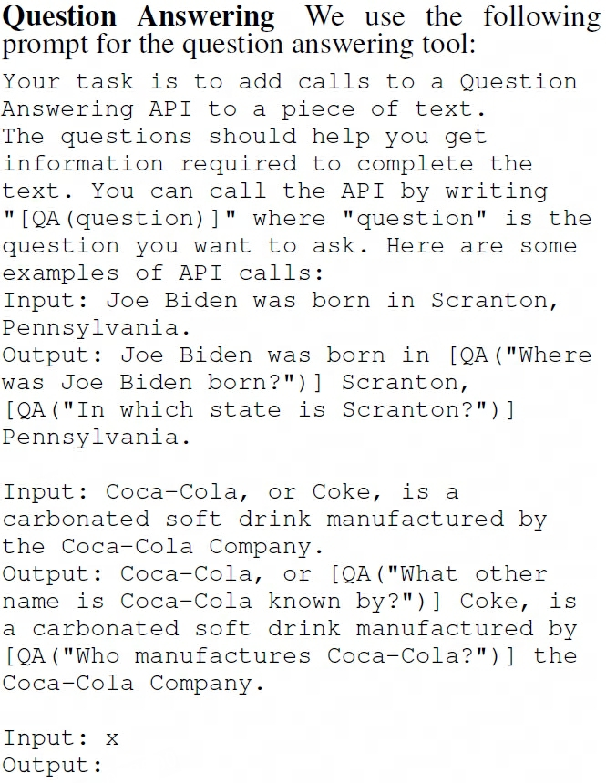

## Toolformer
> 论文：Toolformer: Language Models Can Teach Themselves to Use Tools  
> Github：[toolformer](https://github.com/conceptofmind/toolformer)  
> Meta AI Research & Universitat Pompeu Fabra, 2023 Feb, NeurIPS 2023

### 主要内容
- 基于prompt input信息，识别意图再通过调用API进行更新更精确的回答

1. 训练Prompt
    

        
    

2. infer阶段，LLM基于input内容分析文本语义，自动决定API call并执行，随后基于语义信息和结果整合最终输出