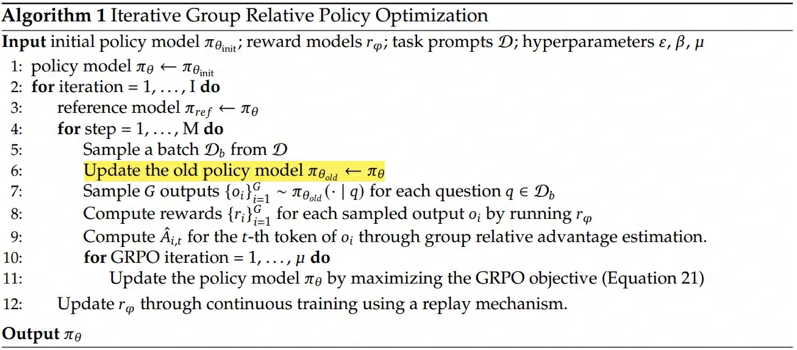

## DeepSeekMath
> 论文：DeepSeekMath: Pushing the Limits of Mathematical Reasoning in Open Language Models  
> Github：[DeepSeek-Math](https://github.com/deepseek-ai/DeepSeek-Math)  
> DeepSeek-AI & Tsinghua University & Peking University, 2024 Feb  

### 主要内容
- [x] 提出（PPO变种）GRPO强化学习方案提升模型对齐效果

#### GRPO

    

GRPO (Group Relative Policy Optimization)是PPO算法的一个变种，不再需要维护一个计算量需求巨大的价值模型输出baseline来计算样本优势，而是

    

1. 使用$\pi_{old}$对同一问题采样生成$G$个回答  
2. 根据RM输出对应的奖励分数  
3. 对奖励分数结果 $\mathbb{R}^{G}$ 进行norm操作得到样本优势结果$A_{i}$  

$$
\begin{aligned}
    \mathcal{J}_{GRPO}&(\theta) = \mathbb{E}\left[q \sim P(Q), \{o_i\}_{i=1}^G \sim \pi_{\theta_{\text{old}}} (O|q)\right] \\
    \frac{1}{G} &\sum_{i=1}^G  \left( \min \left( \frac{\pi_{\theta}(o_i|q)} {\pi_{\theta_{\text{old}}}(o_i|q)} A_i, \operatorname{clip} \left( \frac{\pi_{\theta}(o_i|q)}{\pi_{\theta_{\text{old}}}(o_i|q)}, 1 - \varepsilon, 1 + \varepsilon \right) A_i \right) - \beta \mathbb{D}_{KL} (\pi_{\theta} | \pi_{\text{ref}}) \right) \\
    &\mathbb{D}_{KL} (\pi_{\theta} | \pi_{\text{ref}}) = \frac{\pi_{\text{ref}}(o_i|q)}{\pi_{\theta}(o_i|q)} - \log \frac{\pi_{\text{ref}}(o_i|q)}{\pi_{\theta}(o_i|q)} - 1.
\end{aligned}
$$
