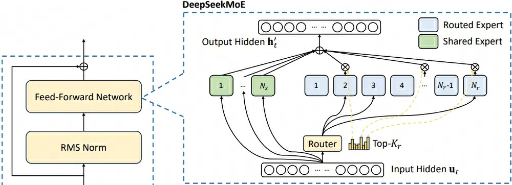

## DeepSeek-1
> 论文：DeepSeek LLM Scaling Open-Source Language Models with Longtermism  
> DeepSeek-AI, 2024 Jan

### 主要内容
#### Architecture
主体基于LLaMA模型框架，进行了部分改动：

    

- `Pre-RMSNorm`
- `8/3 d_model FFN + SwiGLU` (8/3 d_model的SwiGLU算力等价于半个FFN，以此总体还是`8*d_model\*d_model`)
- 67B: `GQA ← MHA`  

    > 相同参数量下，加深模型层数而不是拓宽$d_\text{ff}$更容易获得效果提升

#### Pre-Training

1. **Dataset**，包含2T 中英文tokens 
    

        
    

    - ^^去重deduplication^^：对Commom Crawl corpus的91个全网数据爬取存档([CC](https://data.commoncrawl.org/crawl-data/index.html) dump split by month)去重比对单个存档去重，去重结果更优  
    - ^^过滤filtering^^: 集合语法和语义等局部和全局视角对文档质量评估  
    - ^^混合remixing^^: 处理数据不平衡问题，重点增加代表性不足的领域样本
2. **Tokenizer**，Byte-level BPE
    - ^^Pre-tokenization^^ 类似于GPT-2，防止不同类别符号合并，如换行符、标点符号以及CJK符号  
    - ^^Split Number^^ 类似于LLaMA，将数值划分为单个数字序列
    - ^^Vocab^^: `100000 conventional + 15 special + used for future → 102400`

3. **Hyperparameter**
    - ^^AdamW^^：$\beta_1 = 0.9, \beta_2 = 0.95, \text{weight_decay}=0.1$
    - `gradient_clip=1.0`
    - ^^Multi-step LR scheduler^^
        - ~2000 steps，warmup升至max_lr
        - ~80% tokens，降至 0.316*max_lr
        - ~90% tokens，降至 0.1*max_lr
    

        
    

        !!! info ""
            1. multi-step LR和cos LR效果一致，但前者的阶段性结果便于保存复用，因此选择multi-step方案
            2. 调整各step的token占比可能获得些微提升，综合考虑选择 80% + 10% + 10% 方案

#### Scaling Laws
基于Attention机制的Transformer架构中，直接使用$C=6ND$ 计算算力有明显的近似估计误差，本文改为$C=MD$，$M$单位为 `FLOPs/token`，具体如下：

$$
\begin{aligned}
    6N_1 =& 72 n_\text{layer} d^2_\text{model} \\
    6N_2 =& 72 n_\text{layer} d^2_\text{model} + 6n_\text{vocab}d_\text{model}\\
    M =& 72 n_\text{layer}d^2_\text{model} + 12 n_\text{layer}d_\text{model} l_\text{seq}
\end{aligned}
$$

> - 左式 6倍 来源于 `multiply-add * (forward + 2*backward)`
> - 右式 72倍 来源于 `6*(W_q + W_k + W_v + W_o + 8*W_ffn)`
> - $N_2$ 包括Embedding参数，因此额外加上 `next_token_prediction` 层
> - $M$ 较$6N_1$新增attention机制算力 12倍 源于，`6 * (d*l_seq + d*l_seq)`

1. **Scaling Laws for BS/LR**，
    - 在小规模模型的grid search实验发现泛化误差在各种 `bs`和`lr`选择范围内保持稳定
    - 最优 `bs` 随着算力 $C$ 增大而增大，最优 `lr` 随着算力 $C$ 增大而减小
    - $\eta_\text{opt}=0.3118\cdot C^{-0.1250}, B_\text{opt} = 0.2920 \cdot C^{0.3271}$

    

        
    

    

        
    

1. **Estimating Optimal Model/Data Scaling(#token)**，基于最优超参$\eta_\text{opt}, B_\text{opt}$

    $$
    \begin{aligned}
        M_\text{opt}, D_\text{opt}(C) =& \mathop{\text{argmin}}\limits_{M, D \text{ s.t. } C=MD} L(N, D) \\
        M_\text{opt} =& M_\text{base} \cdot C^{a} \\
        D_\text{opt} =& D_\text{base} C^{b} \\
        1 \approx & M_\text{base} \cdot D_\text{base} \\
        1 = & a + b \\
    \end{aligned}
    $$

    > - $L(N, D)$ 计算公式源于 Chinchilla
   
    

        
    

    !!! info ""
        Fig. 4(a) 相同算力情况下，选定bits-per-byte on valid set最小值对应的$M$进行投影得到 Fig. 4(b)

    

        
    

3. **Scaling Laws with Different Data**，不同数据集会导致scaling laws参数改变
    - 数据质量越高，分配给模型的算力占比应越多（质量越高，应使用逻辑能力更清晰的更大模型），即相同数据规模下，高质量数据可以驱动更大模型的训练
    
    

        
    

#### Alignment
1. **Dataset**：1.5M 中英文数据：
    - ^^1.2M helpfulness^^
        - 31.2% 通用语言任务
        - 46.6% 数学问题，==数据质量低易导致SFT阶段重复输出问题==
        - 22.2% 编码练习
    - ^^300K harmlessness/safty^^，包含大量敏感话题数据
2. **SFT**：
    - ^^7B^^：`4 epochs, lr=1e-4`
    - ^^67B^^：`2 epochs(avoid overfit), lr=5e-6 with warmup and cos_lr_scheduler`

3. **DPO**，`1 epochs, lr=5e-6, bs=512`

## DeepSeekMath
> 论文：DeepSeekMath: Pushing the Limits of Mathematical Reasoning in Open Language Models  
> DeepSeek-AI & Tsinghua University & Peking University, 2024 Feb  

### 主要内容
- [x] 提出（PPO变种）GRPO强化学习方案提升模型对齐效果

#### GRPO

    

GRPO (Group Relative Policy Optimization)是PPO算法的一个变种，不再需要维护一个计算量需求巨大的价值模型输出baseline来计算样本优势，而是

    

1. 使用$\pi_{old}$对同一问题采样生成$G$个回答  
2. 根据RM输出对应的奖励分数  
3. 对奖励分数结果 $\mathbb{R}^{G}$ 进行norm操作得到样本优势结果$A_{i}$  

$$
\begin{aligned}
    \mathcal{J}_{GRPO}&(\theta) = \mathbb{E}\left[q \sim P(Q), \{o_i\}_{i=1}^G \sim \pi_{\theta_{\text{old}}} (O|q)\right] \\
    \frac{1}{G} &\sum_{i=1}^G  \left( \min \left( \frac{\pi_{\theta}(o_i|q)} {\pi_{\theta_{\text{old}}}(o_i|q)} A_i, \operatorname{clip} \left( \frac{\pi_{\theta}(o_i|q)}{\pi_{\theta_{\text{old}}}(o_i|q)}, 1 - \varepsilon, 1 + \varepsilon \right) A_i \right) - \beta \mathbb{D}_{KL} (\pi_{\theta} | \pi_{\text{ref}}) \right) \\
    &\mathbb{D}_{KL} (\pi_{\theta} | \pi_{\text{ref}}) = \frac{\pi_{\text{ref}}(o_i|q)}{\pi_{\theta}(o_i|q)} - \log \frac{\pi_{\text{ref}}(o_i|q)}{\pi_{\theta}(o_i|q)} - 1.
\end{aligned}
$$

## DeepSeek-Coder

## DeepSeek-2
> 论文：DeepSeek-V2: A Strong, Economical, and Efficient Mixture-of-Experts Language Model  
> DeepSeek-AI, 2024 May

- [x] MLA通过高效压缩K、V向量方式减少KV cache以提升训练和预测效率，并获得更好效果表现
- [x] 部署模型前，对模型量化、压缩后，generation throughput 超过 50K token/s，prompt throughput 超过 100K token/s

### 主要内容
#### MLA
MLA（**M**ulti-head **L**atent **A**ttention）对Q、K、V向量进行了压缩，并将RoPE位置编码与压缩后的Q、K、V向量解耦连接，较MHA得到获取更加效果表现的同时也极大地减少了KV cache

    

1. **QKV向量低秩压缩**，类似于LoRA $Wx=W^{U}W^{D}x$，其中 D(own) 和 U(pper)

    $$
    \begin{aligned}
        c_{t}^{KV} =& W^{DKV}h_t \\
        k_t^C =& W^{UK}c_t^{KV} \\
        v_t^C =& W^{UV}c_t^{KV} \\ 
        c_{t}^{Q} =& W^{DQ}h_t \\
        q_t^C =& W^{UQ}c_t^{Q} 
    \end{aligned}
    $$

    !!! info ""
        - $W^{DKV} \in \mathbb{R}^{d_c \times d}$，$W^{DQ}\in \mathbb{R}^{d_c^{'}\times d}$
        - $W^{UK},W^{UV}\in \mathbb{R}^{d_hn_h\times d_c}$，$W^{UQ}\in \mathbb{R}^{d_hn_h\times d_c^{'}}$， $d_c,d_c^{'} \ll d_hn_h$  
        - $c$ 为压缩后的向量，$C$ 为降维、升维操作后的结果标志  

2. **RoPE位置编码解耦合**，目的是cache压缩后的向量 $c^{KV}$，而对$k^C$应用RoPE操作过程如下
    
    $$
    \begin{aligned}
        \langle \text{RoPE}(q^C_t, m), \text{RoPE}(k^C_t, n) \rangle =& 
        \left(c_t^Q\right)^T\left(W^{UQ}\right)^Te^{-im\theta} e^{in\theta}W^{UK}c_t^{KV} \\
        = &  g(W^{UQ}c_t^Q, W^{UK}c_t^{KV}, n-m)
    \end{aligned}
    $$

    虽然能插入相对位置信息，但由于$W^{UQ}$与$W^{UK}$被旋转位置编码矩阵间隔无法融合，每次计算$\langle q, k \rangle$ 仍需计算$k^C=W^{UK}c^{KV}_t$，无法起到缓存 $c^{KV}$ 的目的。为提升kv cache效率，使用RoPE与压缩后的Q、K向量解耦的方式注入位置信息。

    $$
    \begin{aligned}
        q_t^R \in \mathbb{R}^{d_h^{R}n_h} =& \text{RoPE}(W^{QR}c_t^Q) \\
        k_t^R \in \mathbb{R}^{d_h^R} =& \text{RoPE}(W^{KR}h_t) \\
        q_{t, i} =& [q^C_{t, i}; q^R_{t, i}] \\
        k_{t, i} =& [k^C_{t, i}; k^R_{t}] \\
    \end{aligned}
    $$

    !!! info ""
        - 计算$k^R_t$时使用$h_t$而不是使用$c_t^{KV}$ 是一个直观上的选择，因为前者保留了更多语义信息
        - per-head拥有$q_{t,i}^R$，all-head共享一个$k_t^R$  
   
3. **Inference阶段Trick**，在预测应用阶段，MLA的per-head Attention过程计算如下

    $$
    \begin{aligned}
        o_{t} =& \sum_{j=1}^t \text{Softmax}_j \left(\frac{q^T_{t}k_{j}}{\sqrt{d_h + d_h^R}}\right)v_{j}^C \\
        = & \sum_{j=1}^t \text{Softmax}_j \left(\frac{[q^C_{t}; q^R_{t}]^T[k^C_{j}; k^R_{j}]}{\sqrt{d_h + d_h^R}}\right)v_{j}^C\\
        = & \sum_{j=1}^t \text{Softmax}_j \left(\frac{[W^{UQ}c^{Q}_t; \text{RoPE}(W^{QR}c^Q_t)]^T[W^{UK}c^{KV}_j; k^R_t)]}{\sqrt{d_h + d_h^R}}\right)W^{UV}c^{KV}_j\\
        u_t =& W^Oo_{t}
    \end{aligned}
    $$

    !!! info ""
        - 向量乘法前半部分可合并为 $W^{UQ}_{absorb} = (W^{UQ})^TW^{UK}$，无需重计算 $k^C_t$
        - 由于Attention分数矩阵元素为标量，输出部分可合并为 $W^O_{absorb}=W^{O}W^{UV}$，无需冲洗计算 $v^C_t$
        - 最终kv cache 结果为 $c^{KV}$ 与 $k^R$，空间复杂度为 $(d_c + d^R_h)l_\text{seq}$

4. **KV cache 空间复杂度对比**，MLA KV cache空间复杂度接近MQA
    
    

        
    

    > $d_c = 4d_h, d^R_h = \frac{d_h}{2}$

5. **Attention 效果对比**，较MHA仍有明显提升，整体效果最佳
    

        
    

    
#### DeepSeekMoE

DeepSeekMoE在传统MoE的基础上将专家网络细分为Routed Experts和Shared experts，用于解决MoE内知识混合(Knowledge Hybridity)和MoE间知识冗余(Knowledge Redundancy)问题

- ^^知识混合^^：MoE能力过于复杂聚合了不同类型的知识，领域专家性不够
- ^^知识冗余^^：不同MoE需要共同的基础知识，导致各MoE均收敛获取，造成参数冗余

!!! info ""
    - 为保持MoE领域性，将MoE数量变为原来的 $m$ 倍，同时为保证参数总量不变，每个MoE的$d_\text{ff}$ 变为原来的 $\frac{1}{m}$
    - 为保持与粒度拆分前激活部分对齐，MoE的激活数目也相应变为之前的 $m$ 倍
    - e.g. $N_r=16, K_r=2, m=4$，路由策略从$\begin{pmatrix} 2 \\ 16 \end{pmatrix}=120$ 剧增为 $\begin{pmatrix} 8 \\ 64 \end{pmatrix}=4426165368$，灵活性大大提升
    - 由于细分MoE后激活的MoE数量激增，在运行EP时通信延迟耗时非常严重，为减缓该问题，限制了token激活的MoE最多分布在 $M\ge 3$ 个设备上，即在分数总和最大的top-M个设备上选择top-K个MoE

    
    <figcaption>DeepSeekMoE</figcaption>

$$
\begin{aligned} 
\mathbf{h}_t' =& \mathbf{u}_t + \sum_{i=1}^{N_s} \text{FFN}_i^{(s)} (\mathbf{u}_t) + \sum_{i=1}^{N_r} g_{i,t} \text{FFN}_i^{(r)} (\mathbf{u}_t) \\
g_{i,t} = & 
\begin{cases} 
s_{i,t}, & s_{i,t} \in \text{Topk}(\{s_{j,t}|1 \leq j \leq N_r\}, K_r), \\
0, & \text{otherwise}
\end{cases} \\
s_{i,t} =& \text{Softmax}_i (\mathbf{u}_t^T e_i) \\
E \in \mathbb{R}^{N_r \times d} =& [e_1^T; e_2^T; \cdots; e_{N_r}^T]
\end{aligned}
$$

> top-K操作后的Routed Experts门限权重未归一化

为防止训练时MoE路由坍塌，采用了一系列辅助损失函数加以约束矫正，$T$ 表示序列长度：

1. **Expert-Level Balance Loss**，均衡各MoE被激活时的加权分数

    $$
    \begin{aligned}
        \mathcal{L}_{\text{ExpBal}} =& \alpha_1\sum_{i=1}^{N_r}f_iP_i \\
        f_i =& \frac{N_r}{K_rT}\sum_{t=1}^T \mathbb{1}\text{ (Token }t\text{ selects Expert }i\text{)} \\
        P_i =& \frac{1}{T}\sum_{t=1}^T s_{i, t}
    \end{aligned}
    $$

    > $f_i$ 表示 i-th MoE加权激活次数，处理序列时激活次数期望为 $T*\frac{K_r}{N_r}$，概率期望为倒数

2. **Device-Level Balance Loss**，均衡各设备上MoE被激活时的加权分数

    $$
    \begin{aligned}
        \mathcal{L}_{\text{DevBal}} =& \alpha_2\sum_{i=1}^{D}f_i^{'}P_i^{'} \\
        f_i^{'} =& \frac{1}{\vert \varepsilon_i \vert}\sum_{j \in \varepsilon_i} f_j \\
        P_i^{'} =& \sum_{j \in \varepsilon_i }P_j
    \end{aligned}
    $$

    > Routed MoE被分成$D$组$\{\varepsilon_1, \varepsilon_2, \dots, \varepsilon_D\}$，一组对应一个设备

3. **Communication Balance Loss**，均衡各设备间的通信开销

    $$
    \begin{aligned}
        \mathcal{L}_{\text{CommBal}} =& \alpha_3\sum_{i=1}^{D}f_i^{''}P_i^{'} \\
        f_i^{''} =& \frac{D}{MT}\sum_{t=1}^T \mathbb{1}\text{ (Token }t\text{ is sent to Device }i\text{)} \\
        P_i^{'} =& \sum_{j \in \varepsilon_i }P_j
    \end{aligned}
    $$

    > - $f_i^{''}$ 表示 -th 设备加权激活次数，处理序列时激活次数期望为 $T*\frac{M}{D}$，概率期望为倒数
    > - 与MoE类似，并行时限制最多激活$M \ge 3$ 个设备

即使应用了上述负载均衡策略，但依然无法保证严格的负载平衡，因此进一步提出了 `device-level token-dropping` 方案，具体步骤如下：

1. **计算各设备平均算力开销** 
2. **舍弃超出算力开销的低分token**：以设备为单位，按MoE激活权重分数降序排列，舍弃超出平均算力开销的剩余低分token激活

!!! info ""
    - 设计了方案确保约10%的训练序列不执行 `token-dropping` 策略
    - 测试时，可基于效率和一致性考量是否要执行 `token-dropping` 策略

#### Pre-Training
1. **Dataset Counstruction**，在[DeepSeek 67B](#pre-training)的基础上进一步增大数据量、提高数据质量，包含8.1T tokens，其中文token数比英文token数约多12%
    - ^^Enlarge Corpus^^
        1. 挖掘网络数据，优化清洗流程，还原大量误删除数据
        2. 整合了更多中文语料库
    - ^^Elevate Quality^^
        1. 优化filtering算法，去除大部分无意义数据，保留大部分高质量数据；
        2. 去除争议数据，减轻由特定文化领域数据引入的偏差（如价值观，主观偏见等）

2. **Tokenizer**：BBPE as [DeepSeek-1](#pre-training)
3. **Hyperparameter**
    - ^^AdamW^^：$\beta_1 = 0.9, \beta_2 = 0.95, \text{weight_decay}=0.1$
    - `gradient_clip=1.0`
    - ^^Multi-step LR Scheduler^^
        - ~2000 steps，linearly increase warmup从0升至`max_lr=2.4*1e-4`
        - ~60% tokens，降至 `0.316*max_lr`
        - ~90% tokens，降至 `0.316*0.316*max_lr≈0.1*max_lr`
    - ^^BS Scheduler^^：~225B tokens，从2304升至9216，随后保持
    - 总设备数和最大激活设备数 $D=8, M=3$
    - ^^Balance Factor^^：$\alpha_1=0.003, \alpha=0.05, \alpha_3=0.02$

#### Context Window Extension
在预训练LLM后，应用YaRN将文本窗口长度由4K拓展至128K，实际为对解耦合的位置编码 $q^{R}_t, k^{R}_t$ 应用YaRN，其中  

- $s=40, \alpha=1, \beta=32$，理论上最大拓展长度为160K  
- 长度缩放系数 $\sqrt{\frac{1}{t}} = 0.0707 \ln s + 1$  
- `train_steps=1000, seq_len=32K, batch_size=576`  
- [x] 虽然仅在 32K 的序列长度上YaRN训练进行`context_window`拓展，但在 128K 的上下文长度下进行评估时，该模型仍然表现出稳健的性能。

    

#### AI Infras
1. 将所有参数量化为FP8精度类型
2. 进一步对KV cache进行量化，压缩后平均大小为 6-bit
2. HAI-LLM framework
3. zero-bubble

#### SFT
1. 1.5M = 1.2M helpfulness + 0.3M safety

#### GRPO

模型架构：

1. DeepSeek-V2
2. DeepSeek-V2-Lite
3. DeepSeek-V2-Chat_SFT
4. DeepSeek-V2-Chat_RL

## DeepSeek-Coder-2

## DeepSeek-3
> 论文：DeepSeek-V3 Technical Report  
> DeepSeek-AI, 2024 Dec

### 主要内容
- MTP: 类似于skip-gram，t预测t+1, t+2, ..., t+k
1. R1中的reward model和v2中的不相同，实际上是一个rulee-based system
- low-precision training

#### MoE Load Balance Loss-free
#### MTP

    
    <!-- 
LoRA在Attention各部分权重上的消融实验效果
 -->
    <!-- <figcaption>DeepSeekMoE</figcaption> -->

MTP (Multi-Token Predictoin)，基于当前token一次性预测未来$D$个位置的token。如上图所示，通过上一时序的隐层信息与当前状态的token_embedding输入，预测下一时刻的token，即：

- $MTP_1$输入信息为$\text{cat}\big([t_1], \text{emb}(t_2)\big)$，预测$t_3$
- $MTP_2$输入信息为$\text{cat}\big([t_1, t_2], \text{emb}(t_3))$，预测$t_4$
- $MTP_k$输入信息为$\text{cat}\big([t_1, t_2, \dots, t_{k-1}], \text{emb}(t_k)\big)$，预测$t_{k+1}$

!!! info ""
    - $[t_1, \dots, t_k]$ 表示了整合了$[1, t]$ tokens的$MTP_{k-1}$输出（$MTP_0$为main model），本质上依然保留了时序链  
    - $\mathcal{L} = \mathcal{L}_{main} + \frac{\lambda}{D}\sum_{i=1}^{D}\mathcal{L}_{MTP}^k$
    - 在测试时可直接使用main model进行正常文本生成，也可基于提升文本生成效率考量，使用MTP网络快速生成邻近token
#### FP8 Training

## DeepSeek-R1
> 论文：DeepSeek-R1: Incentivizing Reasoning Capability in LLMs via Reinforcement Learning  
> DeepSeek-AI, 2025 Jan