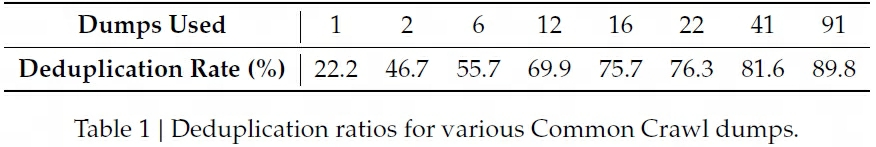

## DeepSeekMath
> 论文：DeepSeekMath: Pushing the Limits of Mathematical Reasoning in Open Language Models  
> DeepSeek-AI & Tsinghua University & Peking University, 2024 Feb  

### 主要内容
- [x] 提出（PPO变种）GRPO强化学习方案提升模型对齐效果

#### GRPO

    

GRPO (Group Relative Policy Optimization)是PPO算法的一个变种，不再需要维护一个计算量需求巨大的价值模型输出baseline来计算样本优势，而是

    

1. 使用$\pi_{old}$对同一问题采样生成$G$个回答  
2. 根据RM输出对应的奖励分数  
3. 对奖励分数结果 $\mathbb{R}^{G}$ 进行norm操作得到样本优势结果$A_{i}$  

$$
\begin{aligned}
    \mathcal{J}_{GRPO}&(\theta) = \mathbb{E}\left[q \sim P(Q), \{o_i\}_{i=1}^G \sim \pi_{\theta_{\text{old}}} (O|q)\right] \\
    \frac{1}{G} &\sum_{i=1}^G  \left( \min \left( \frac{\pi_{\theta}(o_i|q)} {\pi_{\theta_{\text{old}}}(o_i|q)} A_i, \operatorname{clip} \left( \frac{\pi_{\theta}(o_i|q)}{\pi_{\theta_{\text{old}}}(o_i|q)}, 1 - \varepsilon, 1 + \varepsilon \right) A_i \right) - \beta \mathbb{D}_{KL} (\pi_{\theta} | \pi_{\text{ref}}) \right) \\
    &\mathbb{D}_{KL} (\pi_{\theta} | \pi_{\text{ref}}) = \frac{\pi_{\text{ref}}(o_i|q)}{\pi_{\theta}(o_i|q)} - \log \frac{\pi_{\text{ref}}(o_i|q)}{\pi_{\theta}(o_i|q)} - 1.
\end{aligned}
$$

## DeepSeek-1
> 论文：DeepSeek LLM Scaling Open-Source Language Models with Longtermism  
> DeepSeek-AI, 2024 Jan

### 主要内容
#### Architecture
主体基于LLaMA模型框架，进行了部分改动：

    

- `Pre-RMSNorm`
- `8/3 d_model FFN + SwiGLU` (8/3 d_model的SwiGLU算力等价于半个FFN，以此总体还是`8*d_model\*d_model`)
- 67B: `GQA ← MHA`  

    > 相同参数量下，加深模型层数而不是拓宽$d_\text{ff}$更容易获得效果提升

#### Pre-Training

1. **Dataset**  
    

        
    

    - ^^去重deduplication^^：对Commom Crawl corpus的91个全网数据爬取存档([CC](https://data.commoncrawl.org/crawl-data/index.html) dump split by month)去重比对单个存档去重，去重结果更优  
    - ^^过滤filtering^^: 集合语法和语义等局部和全局视角对文档质量评估  
    - ^^混合remixing^^: 处理数据不平衡问题，重点增加代表性不足的领域样本
2. **Tokenizer**，Byte-level BPE
    - ^^Pre-tokenization^^ 类似于GPT-2，防止不同类别符号合并，如换行符、标点符号以及CJK符号  
    - ^^Split Number^^ 类似于LLaMA，将数值划分为单个数字序列
    - ^^Vocab^^: `100000 conventional + 15 special + used for future → 102400`

3. **Hyperparameter**
    - ^^AdamW^^：$\beta_1 = 0.9, \beta_2 = 0.95$
    - gradient_clip=1.0
    - ^^Multi-step LR scheduler^^
        - ~2000 steps，warmup升至max_lr
        - ~80% tokens，降至 0.316*max_lr
        - ~90% tokens，降至 0.1*max_lr
    

        
    

        !!! info ""
            1. multi-step LR和cos LR效果一致，但前者的阶段性结果便于保存复用，因此选择multi-step方案
            2. 调整各step的token占比可能获得些微提升，综合考虑选择 80% + 10% + 10% 方案

#### Scaling Laws
基于Attention机制的Transformer架构中，直接使用$C=6ND$ 估计算力不贴合实际，改为$C=MD$，$M$单位为 `FLOPs/token`，具体如下：

$$
\begin{aligned}
    6N_1 =& 72 n_\text{layer} d^2_\text{model} \\
    6N_2 =& 72 n_\text{layer} d^2_\text{model} + 6n_\text{vocab}d_\text{model}\\
    M =& 72 n_\text{layer}d^2_\text{model} + 12 n_\text{layer}d_\text{model} l_\text{seq}
\end{aligned}
$$

> - 左式 6倍 来源于 `multiply-add * (forward + 2*backward)`
> - 右式 72倍 来源于 `6*(W_q + W_k + W_v + W_o + 8*W_ffn)`
> - $N_2$ 包括Embedding参数，因此额外加上 `next_token_prediction` 层
> - $M$ 新增attention机制算力 12倍来（包括前、后向）源于，`6 * (d*l_seq + d*l_seq)`

- scaling laws  
- of batch size and learning rate, and found their trends with model size  
- of the data and model scale  
- scaling laws derived from different datasets show significant differences  
- choice of dataset remarkably affects the scaling behavior, indicating that caution should be exercised when generalizing scaling laws across datasets.  

- stages: 2 trillion tokens in Chinese and English for pre-training + 1 million instances for SFT + DPO

- IsoFLOP profile approach from Chinchilla
- our contributions and findings: 3项
- 嵌入层Embedding：映射操作，FLOPs/token=0
- 注意力层Self-Attention：1) QKC投影操作，$3*d_{model}^2$；2) 注意力权重矩阵，`n_head*d_head*l_seq=l_seq*d_model`；3) scaling和softmax，分母部分求和 $3*O(l_\text{seq})$；4) value加权，`l_seq*d_model`；5) O输出投影，$d_{model}^2$
- 前馈网络FFN：`d_model → d_ff → d_model, 计算量为2*d_model*d_ff`, 通常 FLOPs/token=$8*d_{model}^2$
- LN：均值和方差 $O(d_{model})$，除操作是bitwise operation，FLOPs/token=$2*d_{model}$
- 残差连接：加法操作是bitwise operation，FLOPs/token=0

- $\eta_\text{opt}=0.3118\cdot C^{-0.1250}, B_\text{opt} = 0.2920 \cdot C^{0.3271}$
- https://152334h.github.io/blog/deepseek-1/
- optimal Model：$N_\text{opt} \propto C^{a}$
- optimal Data Scaling (#token)：$D_\text{opt} \propto C^{b}$
- bits-per-byte on the validation set

- safety evaluation

## DeepSeek-2
> 论文：DeepSeek-V2: A Strong, Economical, and Efficient Mixture-of-Experts Language Model  
> DeepSeek-AI 2024 May

- [x] MLA通过高效压缩K、V向量方式减少KV cache以提升训练和预测效率，并获得更好效果表现
- [x] 部署模型前，对模型量化、压缩后，generation throughput 超过 50K token/s，prompt throughput 超过 100K token/s

### 主要内容
#### MLA

    
    <!-- 
LoRA在Attention各部分权重上的消融实验效果
 -->
    <!-- <figcaption>这是图片的标题或描述。</figcaption> -->

MLA（**M**ulti-head **L**atent **A**ttention）与MHA机制类似，区别在于对Q、K、V向量进行了压缩，且将位置编码RoPE与压缩后的Q、K、V向量解耦

1. QKV向量低秩压缩，类似于LoRA中$Wx=W^{U}W^{D}x$
    - KV向量低秩联合压缩

        $$
        \begin{aligned}
            c_{t}^{KV} =& W^{DKV}h_t \\
            k_t^C =& W^{UK}c_t^{KV} \\
            v_t^C =& W^{UV}c_t^{KV} 
        \end{aligned}
        $$

    - Q向量低秩压缩

        $$
        \begin{aligned}
            c_{t}^{Q} =& W^{DQ}h_t \\
            q_t^C =& W^{UQ}c_t^{Q} 
        \end{aligned}
        $$

    > 上标$D$表示降维，$U$表示升维  
    > $W^{UK},W^{UV}\in \mathbb{R}^{d_hn_h\times d_c}$，$W^{UQ}\in \mathbb{R}^{d_hn_h\times d_c^{'}}$ 且 $d_c,d_c^{'} \ll d_hn_h$  
    > $c$ 表示降维压缩后的缓存向量，$C$表示向量经降维、升维操作后的结果标志  

2. 位置编码RoPE解耦合，由于目的是cache压缩后的向量 $c$，如下对$c$升维后应用RoPE，
    
    $$
    \begin{aligned}
        \langle \text{RoPE}(W^{UQ}c^Q_t, m), \text{RoPE}(W^{UK}c^{K}_t, n) \rangle =& \big(c_t^Q\big)^T\big(W^{UQ}\big)^Te^{-im\theta} e^{in\theta}W^{UK}c_t^K \\
        = &  g(c_t^Q, c_t^K, n-m)
    \end{aligned}
    $$

    虽然依然能获取相对位置信息，但由于$W^{UQ}$与$W^{UK}$被旋转位置编码矩阵间隔，无法融合，因此每次计算$\langle q, k \rangle$会重新计算$k=W^{UK}c^K_t$，极大地阻碍了预测时的效率。为使MLA能兼容RoPE并提升效率，提出了对压缩后的Q、K、V向量解耦的方式额外注入位置信息。

    $$
    \begin{aligned}
        q_t^R \in \mathbb{R}^{d_h^{R}n_h} =& \text{RoPE}(W^{QR}c_t^Q) \\
        k_t^R \in \mathbb{R}^{d_h^R} =& \text{RoPE}(W^{KR}h_t) \\
        q_{t, i} =& [q^C_{t, i}; q^R_{t, i}] \\
        k_{t, i} =& [k^C_{t, i}; k^R_{t}] \\
    \end{aligned}
    $$

    > - 计算$k^R_t$时使用$h_t$而不是使用$c_t^{KV}$只是一个直观上的选择，且由于不需要升维，选择前者效果更加合理  
    > - 每个head各自拥有一个$q_{t,i}^R$，所有head共享一个$k_t^R$  
    > - 目标是缓存**需要升维的低维压缩结果**$c^{KV}_t$，所以进行解耦并额外缓存**无需升维的低维位置编码**$k^{R}_t$
   
3. put all together，最终MLA的Attention计算过程为

    $$
    \begin{aligned}
        o_{t} =& \sum_{j=1}^t \text{Softmax}_j \bigg(\frac{q^T_{t}k_{j}}{\sqrt{d_h + d_h^R}}\bigg)v_{j}^C \\
        = & \sum_{j=1}^t \text{Softmax}_j \bigg(\frac{[q^C_{t}; q^R_{t}][k^C_{j}; k^R_{j}]^T}{\sqrt{d_h + d_h^R}}\bigg)v_{j}^C\\
        = & \sum_{j=1}^t \text{Softmax}_j \bigg(\frac{[W^{UQ}c^{Q}_t; \text{RoPE}(W^{QR}c^Q_t)][W^{UK}c^{KV}_j; k^R_t)]^T}{\sqrt{d_h + d_h^R}}\bigg)W^{UV}c^{KV}_j\\
        u_t =& W^Oo_{t}
    \end{aligned}
    $$

    > 在预测时，可进一步缩减向量计算 $W^{UQ}_{absorb} = (W^{UQ})^TW^{UK}$以及$W^O_{absorb}=W^{O}W^{UV}$

4. KV cache对比，KV cache接近MQA，效果最强
    

        
        <!-- 
LoRA在Attention各部分权重上的消融实验效果
 -->
        <!-- <figcaption>DeepSeekMoE</figcaption> -->
    

5. 效果对比，较MHA效果有明显提升，效果最强
    

        
        <!-- 
LoRA在Attention各部分权重上的消融实验效果
 -->
        <!-- <figcaption>DeepSeekMoE</figcaption> -->
    

#### DeepSeekMoE

    
    <!-- 
LoRA在Attention各部分权重上的消融实验效果
 -->
    <figcaption>DeepSeekMoE</figcaption>

DeepSeekMoe在传统MoE的基础上将专家网络分为routed experts和shared experts，前者实现对输入token的专业化处理，后者用于减轻路由专家网络间的知识冗余。

$$
\begin{aligned} 
\mathbf{h}_t' =& \mathbf{u}_t + \sum_{i=1}^{N_s} \text{FFN}_i^{(s)} (\mathbf{u}_t) + \sum_{i=1}^{N_r} g_{i,t} \text{FFN}_i^{(r)} (\mathbf{u}_t) \\
g_{i,t} = & 
\begin{cases} 
s_{i,t}, & s_{i,t} \in \text{Topk}(\{s_{j,t}|1 \leq j \leq N_r\}, K_r), \\
0, & \text{otherwise}
\end{cases} \\
s_{i,t} =& \text{Softmax}_i (\mathbf{u}_t^T e_i).
\end{aligned}
$$

> topK操作后的路由专家网络权重$g_{i, t}$未softmax，在[v3](#deepseek-v3)中进行了topK后softmax

由于模型训练的时候采用了并行技术，为防止专家网络激活路由坍塌，采用了以下辅助损失函数：

1. Expert-Level负载均衡，即在处理某一序列时，均衡各专家网络被激活的加权分数总和

    $$
    \begin{aligned}
        \mathcal{L}_{\text{ExpBal}} =& \alpha_1\sum_{i=1}^{N_r}f_iP_i \\
        f_i =& \frac{N_r}{K_rT}\sum_{t=1}^T \mathbb{1}\text{ (Token }t\text{ selects Expert }i\text{)} \\
        P_i =& \frac{1}{T}\sum_{t=1}^T s_{i, t}
    \end{aligned}
    $$

2. Device-Level负载均衡，即在处理某一序列时，均衡各机器上各专家网络被激活的加权分数总和

    $$
    \begin{aligned}
        \mathcal{L}_{\text{DevBal}} =& \alpha_2\sum_{i=1}^{D}f_i^{'}P_i^{'} \\
        f_i^{'} =& \frac{1}{\vert \varepsilon_i \vert}\sum_{j \in \varepsilon_i} f_j \\
        P_i^{'} =& \sum_{j \in \varepsilon_i }P_j
    \end{aligned}
    $$

    > 路由网络被分成$D$组$\{\varepsilon_1, \varepsilon_2, \dots, \varepsilon_D\}$

3. Communicating负载均衡，即在处理某一序列时，均衡各专家网络组被激活的加权分数总和

    $$
    \begin{aligned}
        \mathcal{L}_{\text{CommBal}} =& \alpha_3\sum_{i=1}^{D}f_i^{''}P_i^{''} \\
        f_i^{''} =& \frac{D}{MT}\sum_{t=1}^T \mathbb{1}\text{ (Token }t\text{ selects Expert }i\text{)} \\
        P_i^{''} =& \sum_{j \in \varepsilon_i }P_j
    \end{aligned}
    $$

    > 与MoE类似，并行时最多激活$M$组专家网络

虽然DeepSeek模型采用了负载均衡策略，但依然会存在部分专家网络计算开销高于平均水平，因此需要对超负载的网络执行token-dropping 策略。

1. 训练时从device-level执行token舍弃策略，即在超出计算负载的机器上，按所有网络激活权重分数从小到大舍弃token直到机器计算量处于负载范围内。  

    > 此外，还设计方案确保至少10%的训练数据不执行token舍弃策略

2. 测试时，可基于效率和一致性考量是否要执行token舍弃策略

#### Inference Speedup
1. 将所有参数量化为FP8精度类型
2. 进一步对KV cache进行量化，压缩后平均大小为 6-bit

训练：

1. full pre-trained on 8.1T tokens(DeepSeek 67B corpus + Chinese Data + higher quality data)  
2. 1.5M conventional sessions with various domains such math, code, writing, reasoning, safety, and more to SFT DeepSeek-v2 chat  
3. follow DeepSeekMath to employ Group Relative policy Optimization(GRPO) to align model with RLHF

模型架构：

1. DeepSeek-V2
2. DeepSeek-V2-Lite
3. DeepSeek-V2-Chat_SFT
4. DeepSeek-V2-Chat_RL

策略：

2. Token-Dropping Strategy: In this way, we can flexibly decide whether to drop tokens during inference according to the efficiency requirements, and always ensure consistency between training and inference.  
3. R1中的reward model和v2中的不相同，实际上是一个rulee-based system

3. HAI-LLM framework

数据处理：
1. Data Construction
2. [BBPE](https://zhuanlan.zhihu.com/p/3329211354?utm_psn=1857473827581349889)（Byte-level Byte-Pair Encoding）

- MTP: 类似于skip-gram，t预测t+1, t+2, ..., t+k

- low-precision training

## DeepSeek-3

### 主要内容
- 共享专家与专业专家数量都乘以了m倍，为保持参数量不变，intermediate hidden state dim也需要1/m

#### MoE Load Balance Loss-free
#### MTP

    
    <!-- 
LoRA在Attention各部分权重上的消融实验效果
 -->
    <!-- <figcaption>DeepSeekMoE</figcaption> -->

MTP (Multi-Token Predictoin)，基于当前token一次性预测未来$D$个位置的token。如上图所示，通过上一时序的隐层信息与当前状态的token_embedding输入，预测下一时刻的token，即：

- $MTP_1$输入信息为$\text{cat}\big([t_1], \text{emb}(t_2)\big)$，预测$t_3$
- $MTP_2$输入信息为$\text{cat}\big([t_1, t_2], \text{emb}(t_3))$，预测$t_4$
- $MTP_k$输入信息为$\text{cat}\big([t_1, t_2, \dots, t_{k-1}], \text{emb}(t_k)\big)$，预测$t_{k+1}$

!!! info ""
    - $[t_1, \dots, t_k]$ 表示了整合了$[1, t]$ tokens的$MTP_{k-1}$输出（$MTP_0$为main model），本质上依然保留了时序链  
    - $\mathcal{L} = \mathcal{L}_{main} + \frac{\lambda}{D}\sum_{i=1}^{D}\mathcal{L}_{MTP}^k$
    - 在测试时可直接使用main model进行正常文本生成，也可基于提升文本生成效率考量，使用MTP网络快速生成邻近token
#### FP8 Training