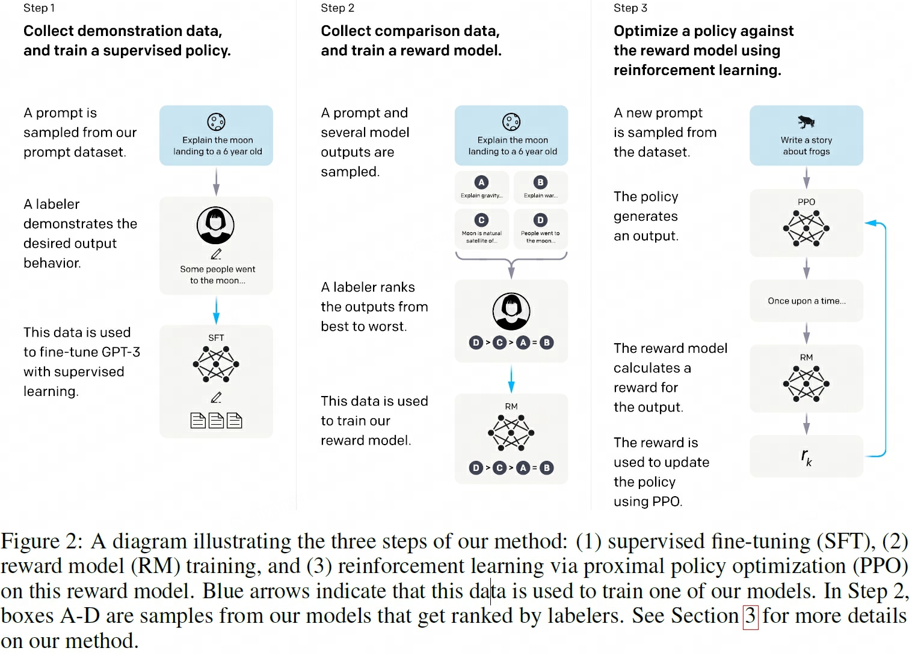
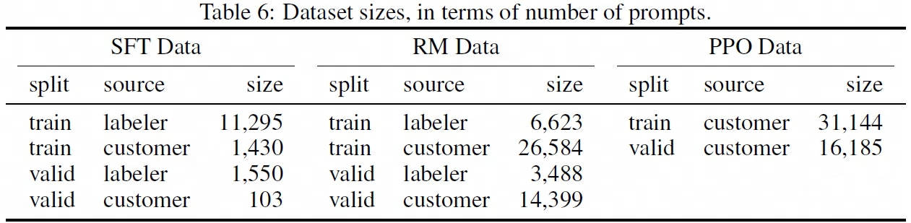

## GPT_v1

## GPT_V2

## InstructGPT
> 论文：Training language models to follow instructions with human feedback  
> OpenAI, 2022 Mar, NeurIPS 2022

### 主要内容
- 语言模型（human feedback）对齐，鼓励显示意图与（staying truthful, not being biased, toxic or harmful等）隐式意图
#### RLHF步骤

1. 通过优质标注数据（prompt + demonstration） SFT 语言模型  
    
    - screening test(such as personally identifiable information) to select prompt  
    - get prompts submitted to the OpenAI API  
    - some labeler-written prompts weren’t often submitted to the regular GPT-3 models on the API.
        - Plain: 标注者自己随意想个任务，要求保证任务的多样性
        - Few-shot: 给出一个指令，要求标注者写出一些query/response pair作为prompt
        - User-based: 基于OpenAI API的用户用例设计相应的prompt
    - SFT dataset contains about 13k training prompts (from the API and labeler-written),
  
2. 收集数据（prompt + K demonstrations sampled by model outputs）并rank，训练 RM模型  
    
    - collect a dataset of human-labeled comparisons between outputs from our models on a larger set of API prompts.  
    - use the output of the RM as a scalar reward
    - RM dataset has 33k training prompts (from the API and labeler-written)
  
3. 基于强化学习进一步优化对齐语言模型

    - PPO dataset has 31k **training prompts (only from the API).**
    - A.2.1 Illustrative user prompts from InstructGPT distribution

#### Dataset
- We heuristically deduplicate prompts by checking for prompts that share a long common prefix, and we limit the number of prompts to 200 per user ID.
- create our train, validation, and test splits based on user ID, validation and test sets contain no data from users whose data is in the training set

#### Model Details
1. SFT
2. Reward Model Training: train on reward model training set

    - 对lr和schedule不敏感：lr降低50%的结果也相似
    - 对#epoch敏感，大epoch容易过拟合
    - 奖励模型pair-rank-loss，每个prompt有K个completions，每次通过两两对比学习来进行比较训练，因此有$C(K, 2)$个组合数
    - bs = M * C(K, 2)

3. initialization models for RLHF
4. RLHF Training

#### Prompt Data Details

2. API used prompts
3. Dataset sizes
4. Data diversity
#### Human Data Collection Details

## GPT_v3

## ChatGPT
