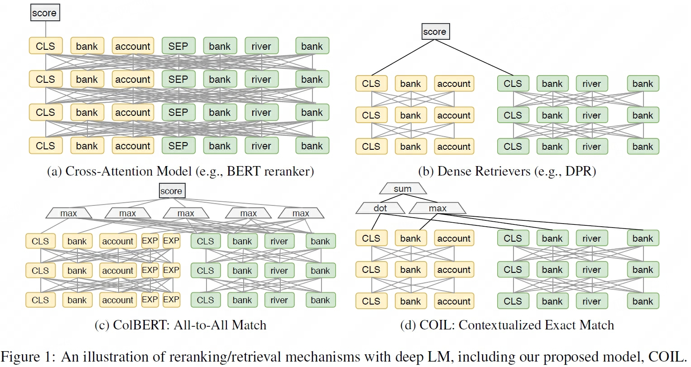
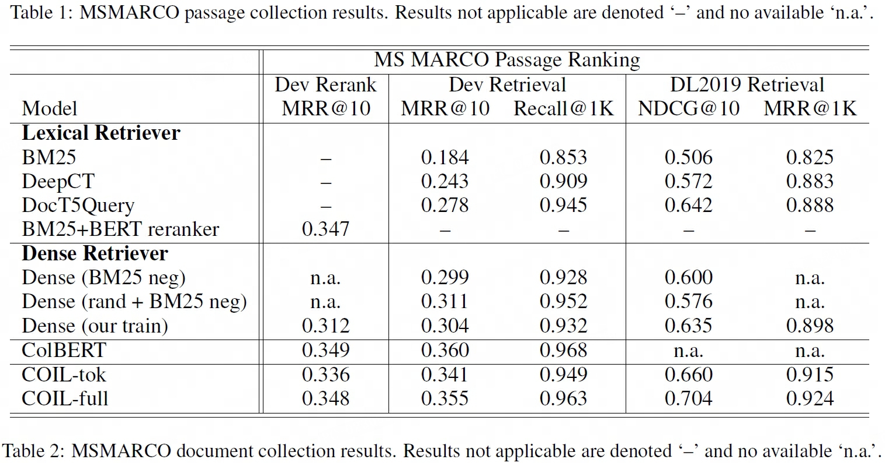
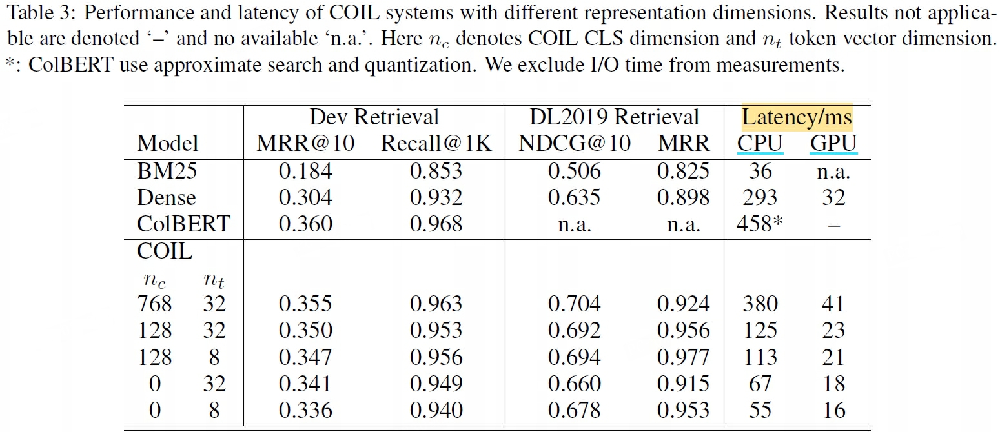

## COIL
> 论文：COIL: Revisit Exact Lexical Match in Information Retrieval with **CO**ntextualized **I**nverted **L**ist  
> Github：[COIL](https://github.com/luyug/COIL)  
> Carnegie Mellon University 2021 Apr, ACL 2021

### 主要内容

    
    <!-- 
LoRA在Attention各部分权重上的消融实验效果
 -->
    <!-- <figcaption>这是图片的标题或描述。</figcaption> -->

#### 基于语义的相关性匹配
1. **词法精确匹配**：分别计算问题查询与文档中各toekn的分数，统计问题查询与文档共有token的最大分数和

    $$
    \begin{aligned}
        v^{(q)}_i =& W_{tok}h_i^{(q)} + b_{tok} \\
        v^{(d)}_j =& W_{tok}h_j^{(d)} + b_{tok} \\
        s_{tok}(q, d) =& \sum_{q_i \in q \cap d} \max_{d_j = q_i} {v^{(q)}_{i}}^Tv_j^{(d)}
    \end{aligned}
    $$

    > $W_{tok}$ 为一个低维投影矩阵 $n_t \ll hidden\_dim$

2. **句法层级语义匹配**：进一步考虑不同词汇的语义相关性

    $$
    \begin{aligned}
        v^{(q)}_{cls} =& W_{cls}q_\text{[CLS]} + b_{cls} \\
        v^{(d)}_{cls} =& W_{cls}d_\text{[CLS]} + b_{cls} \\
        s_{cls}(q, d) =& {v^{(q)}_{cls}}^Tv^{(d)}_{cls}
    \end{aligned}
    $$

    > $W_{cls}$ 为一个低维投影矩阵 $n_c \le hidden\_dim$

3. put all together

    $$
    s_{full}(q, d) = s_{tok}(q, d) + s_{cls}(q, d)
    $$

#### 倒排检索
1. 词法精确匹配
    - 从文档库中以token为键存储对应token，以列表形式的值存取对应的所有向量表示

2. 句法层级语义匹配
    - 常规向量数据库存储形式

#### 性能、效果表现
1. `ColBERT ⟷ COIL-full`，效果表现接近全量词法匹配的[ColBERT](colbert.md)，在CPU和GPU上的检索效率有明显提升  
    

        
        <!-- 
LoRA在Attention各部分权重上的消融实验效果
 -->
        <!-- <figcaption>这是图片的标题或描述。</figcaption> -->
    

2. `n_c, n_t` 的消融实验表明在信息检索任务中提升向量维度收益较低，综合性能与效果表现低维表示是更好的选择
    

        
        <!-- 
LoRA在Attention各部分权重上的消融实验效果
 -->
        <!-- <figcaption>这是图片的标题或描述。</figcaption> -->
    
