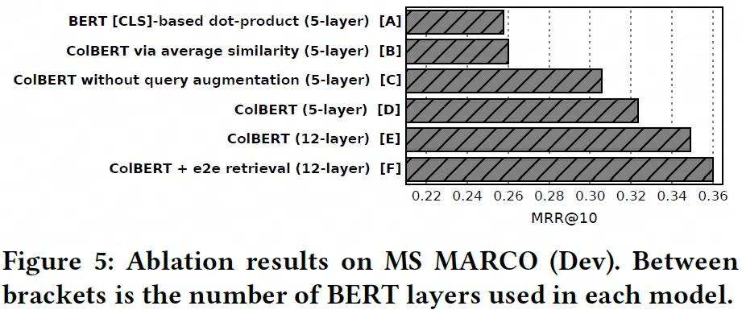

## ColBERT
- 论文：ColBERT: Efficient and Effective Passage Search via **Co**ntextualized **l**ate Interaction over **BERT**  
- Stanford University 2020 Apr, SIGIR 2020

### 主要内容

    
    <!-- 
LoRA在Attention各部分权重上的消融实验效果
 -->
    <!-- <figcaption>这是图片的标题或描述。</figcaption> -->

#### Encoder
1. 孪生网络，query 和 document 网络共享参数

2. Query Encoder: `E_q = Normalize(CNN(BERT([CLS][Q]q_1...q_l[MASK]...[MASK])))`
    - 以 `[CLS][Q]` 开头
    - 统一PAD `[MASK]` token 至 `seq_len = N_q` （可理解为query expansion，消融实验现实该PAD方式有增益）
    - 向量矩阵映射为低维向量 $m \ll hidden\_dim$
    - L2 Normlization
    

3. Document Encoder: `E_d = Filter(Normalize(CNN(BERT([CLS][D]d_1...d_n))))`
    - 以 `[CLS][D]` 开头
    - 无需PAD `[MASK]` token
    - 映射为低维向量 $m \ll hidden\_dim$
    - 向量矩阵L2 Normlization
    - 过滤掉标点符号向量表示

    !!! info ""
        - $E_d$ 可离线预计算，加速在线检索  
        - 离线编码时，为快速编码速率（尽可能减少pad_to_max token数），使用基于文档长度的分桶方法进行编码，`BucketIterator` 库

#### Late Interaction
query-doc的语义向量交互计算延迟到最后，MaxSim

$$
S_{q, d} = \sum_{i=1}^{\vert q \vert} \max_{j = 1}^{\vert d \vert} E_{q_{i}}^TE_{d_j}
$$

> 保留词级别匹配的细粒度语义，防止长文本序列压缩为单个向量，丢失细粒度语义  

#### Prefilter Pruning
使用预过滤器排除掉大部分不相关文档 $K \ll N$，即将检索分为两阶段

1. **近似匹配**
    - *方法一*：基于BM25预过滤
    - *方法二*：使用问题查询的 $N_q$ 向量表示计算与 $N$ 个文本向量表示进行相似度，分别返回 top-k 个文档，最终结果为 $K = \text{unique}(N_q \times k)$ 个相关文档

2. **重排序rerank**：基于MaxSim 对第一阶段命中的文档重排序

#### 消融实验

1. 效果表现  
    - `D ⟷ A, B`：MaxSim效果优于其他方案，查询文档检索任务中更注重个别关键字  
    - `D ⟷ C`：Query Encoder的PAD `[MASK]` to $N_q$ 方案具有查询拓展的增益效用  
    

        
        <!-- 
LoRA在Attention各部分权重上的消融实验效果
 -->
        <!-- <figcaption>这是图片的标题或描述。</figcaption> -->
    

2. 效率表现  
    - `length-based bucketing`：基于文档长度分桶的方法能有效减少 `pad_to_max` token数
    

        
        <!-- 
LoRA在Attention各部分权重上的消融实验效果
 -->
        <!-- <figcaption>这是图片的标题或描述。</figcaption> -->
    

