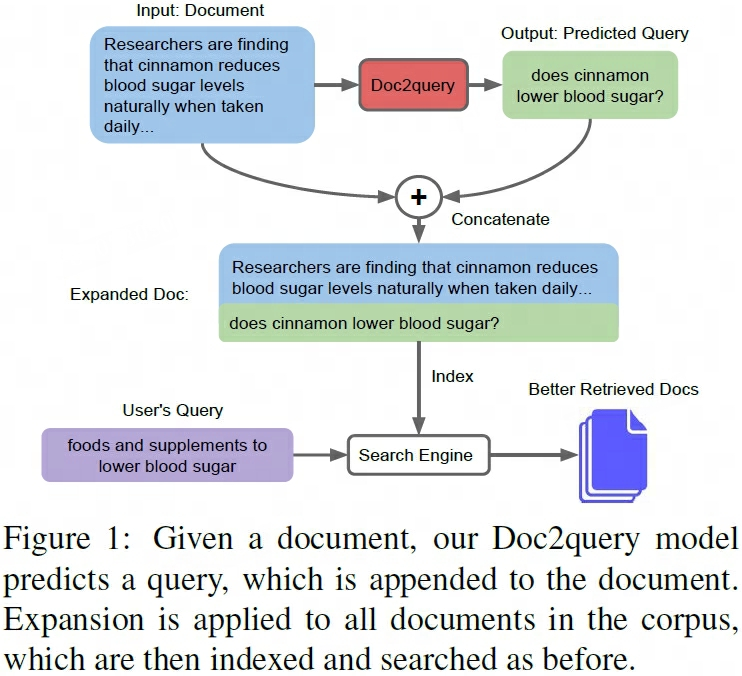

## Doc2query
> 论文：Document Expansion by Query Prediction  
> Github：[dl4ir-doc2query](https://github.com/nyu-dl/dl4ir-doc2query)  
> New York University & University of Waterloo & FAIR & Canadian Institute for Advanced Research 2019 Apr, CoRR 2019  

- [x] 第一个使用神经网络进行document expansion的工作

### 主要内容

    
    <!-- 
LoRA在Attention各部分权重上的消融实验效果
 -->
    <!-- <figcaption>这是图片的标题或描述。</figcaption> -->

基于文本对<doc, query>SFT生成模型，预测时输入doc输出top-k伪问题查询 $q^{'}$

$$
d = \text{concat}(d, q^{'}_1, q^{'}_2, \dots, d^{'}_k)
$$

## DocT5Query
> 论文：From doc2query to docTTTTTquery  
 
使用T5预训练模型进行SFT