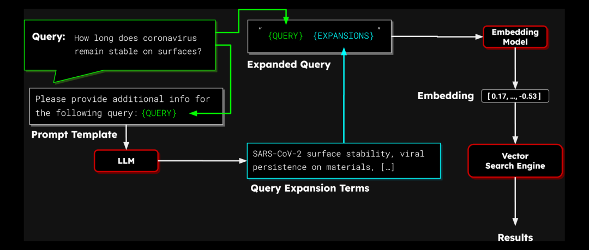
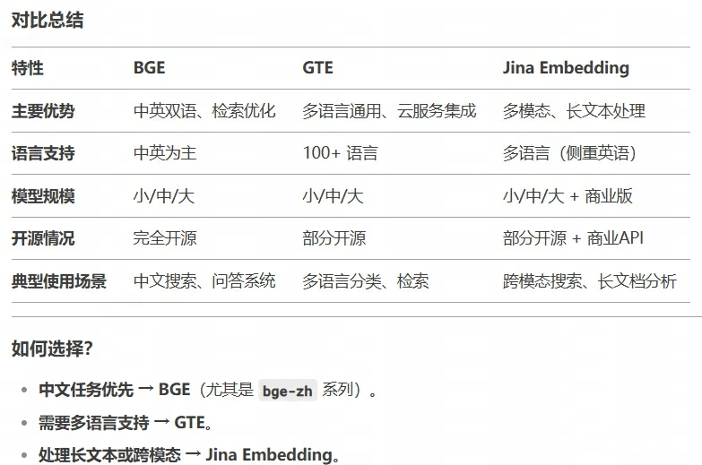
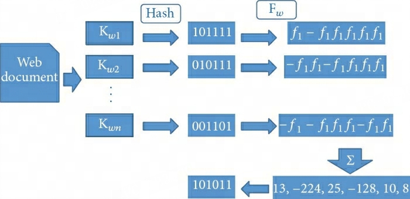
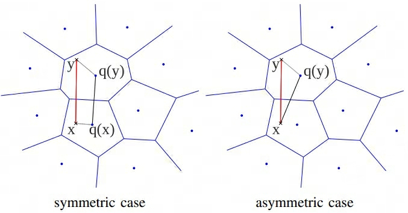

- Lucene搜索引擎
- FAISS: Facebook AI Similarity Search
- Anserini IR toolkit
- Anserini，Elasticsearch
- Pyserini






### Basic Retrieval
#### 相似度衡量
1. **Lexical Match**：主要基于词汇统计的 [BM25](../../../../Metrics/correlation_metrics.md#bm25) 衡量  相关性，基于关键词进行匹配
2. **Semantic Match**：主要基于向量表示的 L2 distance, MSE或consine similarity衡量相关性，基于语义相关进行匹配

#### 损失函数
1. **对比学习InfoNCE**：目标为检索出最相关的，因此通过对比学习思想获取相对选择倾向

### Retrieval Augmentation
#### Query expansion
对输入的问题查询进行拓展

1. 基于统计结果最大似然的 PRF（Pseudo-Relevance Feedback）伪相关反馈拓展
    - [RM](rm.md)（Relevance Model）v1~v4

2. 基于语义的词级别稀疏拓展
    - [SLPADE](splade.md)，此外还保留了[Term-Level Interaction](#term-level-interaction)

3. 使用模型生成拓展
    - [query2doc](query2doc.md)

#### Document Expansion
对被检索的文档进行内容拓展

1. 使用模型生成
    - [doc2query](doc2query.md#doc2query)、[docT5query](doc2query.md#doct5query)


#### Term Interaction
稀疏词级别相关性交互

1. 词项动态加权  
    - [DeepCT](deepct.md)
#### Dense Representation Interaction
连续语义级别相关性交互

1. 多流语义表示后交互
    - [ColBERT](colbert.md)
    - [COIL](coil.md)
    - PROMPTAGATOR

#### InfoNCE优化
1. 增加负样本
    - in batch negatives，同batch内负样本  
    - hard negative，增加高分难区分负样本（如高BM25负样本、相关模型高分负样本）  

2. 负样本去噪

### 数据库向量去重
#### MinHash
MinHash 是一种用于检测近重复文本的[LSH](#lsh)技术，核心目标为高效估计[$J(A, B)$](./../../../../Metrics/correlation_metrics.html#jaccard-similarity)，具体实现如下：

- 直觉选取的原理

1. **特征提取**：将文档表示为词去重（或非去重）集合（如n-gram）
2. **构建哈希函数族**：设计 $n$ 个独立的哈希函数 $h_1, h_2, \dots, h_n$
3. **[生成MinHash签名](https://blog.csdn.net/qq_41357569/article/details/118614164#32__33)**：对于 ^^每个集合A^^ ，计算其MinHash向量 $s^A = [s_1, s_2, \dots, s_n]$，其中 $s^A_i = \min_{x \in A} h_i(x)$ ，其中$x \in A$ 表示只考虑集合A包含的特征
    
    > 直觉：保留最小哈希值，对应集合该哈希值相同的概率等于Jaccard Similarity

4. **相似度估计**：$\hat{J}(A, B) = \frac{1}{n} \sum_{i=1}^n \mathbb{I}(s^A_i = s^B_i)$
#### SimHash
SimHash 是一种用于检测近重复文本的[LSH](#lsh)技术，由 Google 提出，核心思想是将高维向量映射到低维二值哈希码，保持相似向量的哈希码汉明距离小，具体实现如下：

<div class="one-image-container">
    
    <!-- <p>LoRA在Attention各部分权重上的消融实验效果</p> -->
    <figcaption>SimHash计算示意图</figcaption>
</div>

1. **特征提取**：将文档表示为词序列
2. **权重分配**：对每个特征（词）分配权重，如TF-IDF
3. **生成哈希值**：对每个特征用哈希函数生成一个 $b$-bit 二进制编码值 $[v_1, v_2, \dots, v_b]$
4. **加权获取SimHash值**：加权获取各特征对应的权重和哈希值，随后合并所有加权结果并通过 `sign` 函数获取文档SimHash值
    
    $$
    \begin{aligned}
            f_{i} = & [w_i\text{sign}_1(v_1), w_i\text{sign}_1(v_2), \dots, w_i\text{sign}_1(v_b)]  \\
            \text{sign}_1(x) =& \begin{cases}
            1 & x\gt 0 \\
            -1 &  x \le 0
            \end{cases} \\
            F_d =& \sum_{i=1}^{D} f_i \\
            \text{SimHash}_d =& \text{sign}_2(F_d) \\
            \text{sign}_2(x) =& \begin{cases}
            1 & x\gt 0 \\
            0 &  x \le 0
            \end{cases} 
    \end{aligned}
    $$

5. **距离计算**：各文档SimHash值汉明码距离即为文档间距离

### ANN算法
查询向量$q\in \mathbb{R}^{d}$，文档向量集合$\mathcal{X} = \{d_1, d_2, \dots, d_N\}$，其中$d_i \in \mathbb{R}^D$，目标是找到$\text{Top-}k=\text{arg}\mathop{\text{ max }}\limits
_{x \in \mathcal{X}}^k q^T x$

- 暴力计算复杂度为$O(ND)$，当$N$很大时，代价极高

因此需要借助ANN（Approximate Nearese Neighbor search）近似最近邻算法的索引结构提升效率，常见的工具有

- FAISS: Facebook AI Similarity Search
- Anserini IR toolkit


#### IVF
Inverted File Index倒排文件索引的核心思想是分治，包括以下几个部分：

1. **离线聚类划分**：使用聚类算法（如K-means）将向量空间划分为多个聚类 $\{C_1, C_2, \dots, C_{K}\}$，并计算聚类中心 $\{c_1, c_2, \dots, c_K\}$；
2. **离线倒排建表**：对每个聚类簇 $C_i$ 存储其包含的所有向量的ID和原始（或压缩）向量，并使用倒排索引方式存储，即
    ```
    c_1 → [vector id 1, vector id 5, ...]
    c_2 → [vector id 3, vector id 8, ...]
    ...
    ```
3. **在线搜索**：搜索时，只需在距离查询向量最近的少数聚类中遍历候选向量，避免全局计算
      1. 粗粒度搜索，计算查询向量$q$与所有聚类中心$c_i$的距离，选择最近的 `nprobe` 个聚类
      2. 精粒度搜索，在选中的 `nprobe` 个聚类的倒排列表中，遍历所有候选向量，计算与 $q$ 的距离并返回对应的 top-k 个向量

> - 搜索复杂度 $O(K + \frac{N}{K}\cdot nprobe)$
> - 聚类数 `K` 值越大，搜索精度越高，但聚类时间增加，经验值 $K=\sqrt{N}$  
> - 粗粒度搜索聚类数 `nprobe` 越大，搜索方位越广，精度越高，但计算量增加，典型值 $nprob \in [1, 100]$
#### HNSW
Hierarchical Navigable Small World graphs，分层可导航小世界图，也称作分层IVF，即对聚类簇再次聚类划分，进一步加速粗搜索


#### FLAT

#### Tree-based
#### Graph-based
NSG（Navigating Spreading-out Graph）

### ANN优化策略
#### Quantization
1. **PQ**（Product Quantization）乘积量化通过**子空间量化**和**查表法**提升搜索效率，主要包含以下核心思想：
    1. ^^划分子空间^^：将 $D$ 维向量分为 $m$ 个 $\frac{D}{m}$ 维子空间，因此可以得到$m$ 个embedding table子空间矩阵 $d^{(i)} \in \mathbb{R}^{N \times \frac{D}{m}}$
    2. ^^子空间聚类^^：使用K-means聚类方法对每个子空间矩阵进行聚类得到$K$ （一般为$2^{b}$） 个 $\frac{D}{m}$ 维向量的聚类中心 $C^{(1)} = \{c^{(i)}_1, c^{(i)}_2, \dots, c^{(i)}_K\} \in \mathbb{R}^{K\times \frac{D}{m}}$，聚类损失函数为最小化各子空间向量到最近邻聚类中心距离之和
        
        $$
        \mathcal{L} = \sum_{n=1}^{N} \min_{k=1}^{K} \Vert d^{(i)}_{n} - c^{(i)}_{k} \Vert^2
        $$
    
    3. ^^生成码本^^：$C^{(i)}$ 即为i-th 子空间码本codebook
    4. ^^量化向量^^：将每个原始的子向量$d^{i}_{n}$ 量化映射为 $C^{(i)}$ 中最近的聚类中心 $\text{ID}^{(i)}_n$，即（0~K-1）
    5. ^^[(查表法)距离计算](#distance-computation)^^：对于查询向量$q$，同样进行上述划分子空间 $\{q^{(1)}, q^{(2)}, \dots, q^{(m)} \}$并分别计算各子空间内到 $K$个聚类中心的距离，随后通过查 look table 得到 $m$ 子空间内距离总和即为查询与文档的最终距离

        
    > - 子空间数 $m$ 越大，量化粒度更精细，但计算开销越大
    > - 聚类中心数 $K=2^{b}$ 越多，量化误差更小，但码本位数 $b$ 会进而膨胀

2. **SQ**（Scalar Quantization）标量量化，即直接将向量每个维度独立地从高精度（均匀分桶）映射为低精度表示，以减少内存占用  
3. **LSQ**（Learned Scalar Quantization）学习型标量量化，通过训练学习每个维度的可学习量化间隔并将各维度向量独立地从高精度（非均匀分桶）映射为低精度表示，以减少内存占用  
    1. ^^前向传播^^：将向量量化为低精度表示；  
    2. ^^反向传播^^：优化更新量化间隔和模型参数
### 距离计算优化
#### Distance Computation
<div class="one-image-container">
    
    <!-- <p>LoRA在Attention各部分权重上的消融实验效果</p> -->
    <figcaption>SDC与ADC计算示意图（红线为真实距离，黑实线为计算距离）</figcaption>
</div>

1. **SDC**（Symmetric Distance Computation）对称距离计算，查询向量$q$ 和 数据库向量 $d$ 均被量化，距离通过两者的量化结果计算，计算流程如下：
    1. ^^双向量化^^：$q = \text{quant}(q)$，$d = \text{quant}(d)$，e.g. 使用PQ量化
    2. ^^距离计算^^：基于量化结果计算向量间距离

        $$
        \begin{aligned}
            Dis^{(i)}[k_1][k_2] =& \Vert c^{(i)}_{k_1} - c^{(i)}_{k_2} \Vert^2 \\
            SDC(q, d_n) \approx&  \sum_{i=1}^{m} Dis^{(i)}[\text{ID}(q^{(i)})][\text{ID}(d^{(i)}_n)]
        \end{aligned}
        $$

    > - 搜索时计算复杂度优化为 $O(m\cdot K^2 + N\cdot m)$
    > - 牺牲精度换取极致效率，可预先计算$Dis$

2. **ADC**（Asymmetric Distance Computation）非对称距离计算，仅数据库向量 $d$ 被量化，查询向量 $q$ 保持原始精度，距离通过 $q$ 与量化中心的距离计算，计算流程如下：  
    1. ^^单向量化^^：$d = \text{quant}(d)$，e.g. 使用PQ量化
    2. ^^距离计算^^：基于量化结果计算向量间距离

        $$
        \begin{aligned}
            Dis^{(i)}[k] =& \Vert q^{(i)} - c^{(i)}_{k} \Vert^2\ \ (k=1, 2, \dots K) \\
            ADC(q, d_n) \approx & \sum_{i=1}^{m} Dis^{(i)}[\text{ID}^{(i)}(d^{(i)}_n)]
        \end{aligned}
        $$

    > - 搜索时计算复杂度优化为 $O(m \cdot K\cdot \frac{D}{m} + N\cdot m) = O(K\cdot D+ N\cdot m)$
    > - 平衡精度与效率，需实时计算$Dis$

#### LSH
Locality-Sensitive Hashing局部敏感哈希，即假定A、B具有一定相似性，在hash之后，仍能保持这种相似性。核心思想是通过哈希函数将高维空间中距离相近的向量以高概率映射到相同的哈希桶中，从而将搜索范围减少到少数候选集，显著降低计算复杂度。核心思想如下：

1. **设计哈希函数**：对于任意两个向量 $d_1$ 和 $d_2$ 以及距离$dis(\cdot, \cdot)$，存在概率函数 $P$ 使得

    $$
    P\big(h(d_1) = h(d_2)\big) = f\big(dis(d_1, d_2)\big)
    $$

    > 其中 $f$ 为单调递减函数，即距离小的分到相同桶的概率大，距离大的分到相同概率小

2. **多哈希表与放大技术**：单一哈希函数可能漏检或误检相似项，因此LSH可通过以下方案优化效果
    - ^^多哈希函数 k-bit hash^^，使用 $k$ 个独立哈希函数 $h(x) = [h_1(x), \dots, h_k(x)]$，只有复合哈希函数所有哈希值相同（或有一定的相似度）才能视为候选  
        
        > 增大 $k$ 减少误检率

    - ^^多哈希表 L表^^，构建 $L$ 个独立的哈希表，每个表使用不同的哈希函数族，搜素时合并所有表的候选集  
        
        > 通过增大 $L$ 提高找到近邻的概率

3. **搜索流程**：离线构建哈希表，在线查询时哈希查询向量 $h(q)$ 并从对应哈希桶候选项中搜索

#### BQ
Batch Querying批量查询
#### Learned Indexes