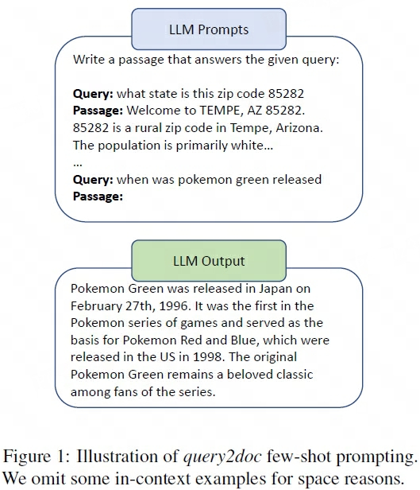

## Query2Doc
> 论文：Query2doc: Query Expansion with Large Language Models  
> MSR 2023 Mar, CoRR 2023  

### 主要内容

    
    <!-- 
LoRA在Attention各部分权重上的消融实验效果
 -->
    <!-- <figcaption>这是图片的标题或描述。</figcaption> -->

直接向LLM输入查询并输出伪文档 $d^{'}$ 对问题查询进行拓展

#### Qeury Expansion
1. Sparse Retrival Expansion

    $$
    q = \text{concat}(\{q\}\times n, d^{'})
    $$

2. Dense Retrical Expansion

    $$
    q = \text{concat}(q, \text{[SEP]}, d^{'})
    $$
