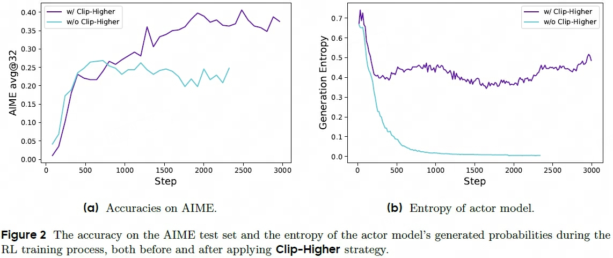
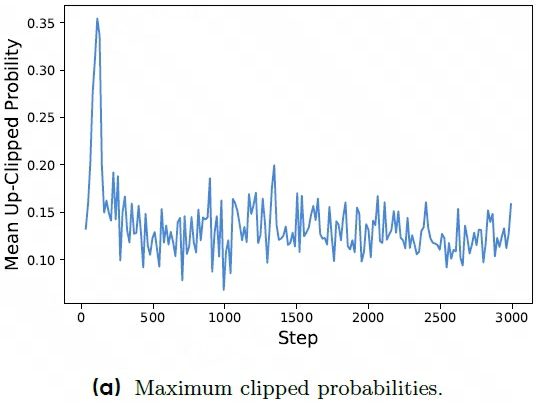
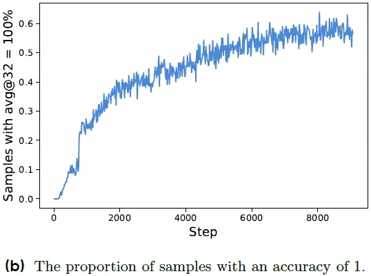
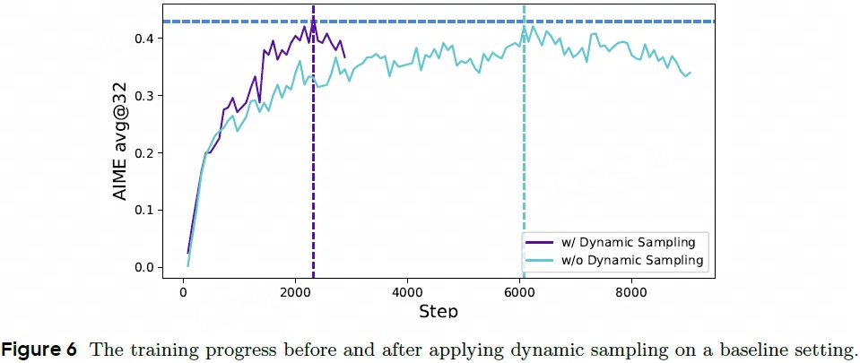
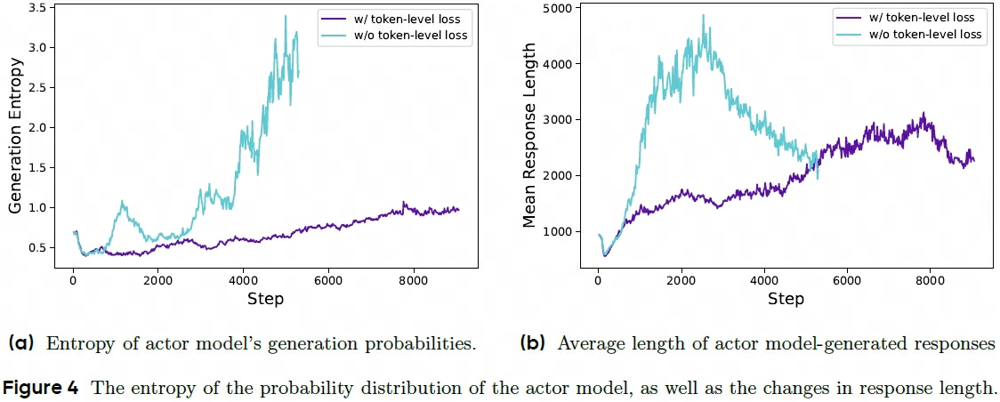
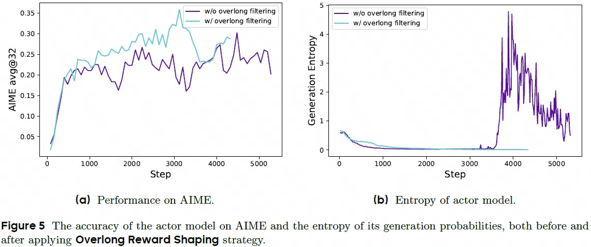
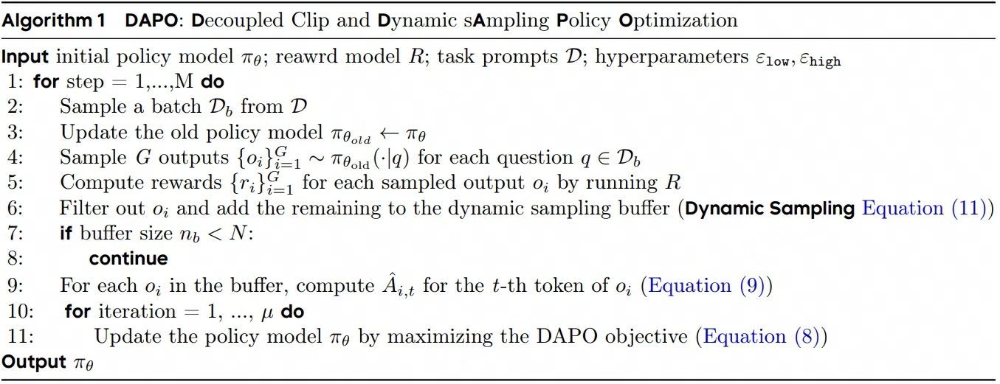
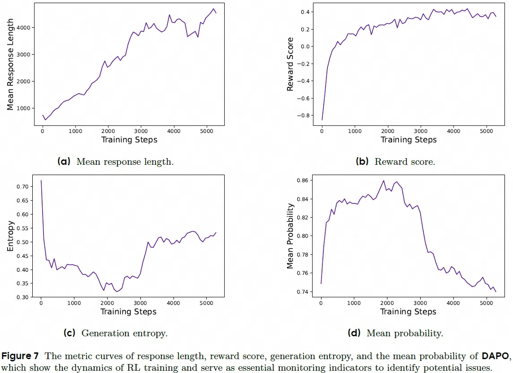
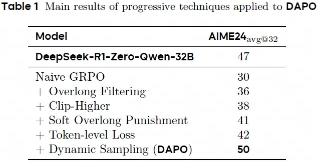

## DAPO

> 论文：DAPO: An Open-Source LLM Reinforcement Learning System at Scale  
> Project Page：[dapo-sia.github.io](https://dapo-sia.github.io/)  
> DAPO：Decoupled clip **D**ynamic s**A**mpling **P**olicy **O**ptimization  
> ByteDance Seed & Tsinghua University & The University of Hong Kong, 2025 Mar

### 主要内容
- https://mp.weixin.qq.com/s?__biz=MzI4MDYzNzg4Mw==&mid=2247571337&idx=2&sn=ca7ed117c5f5534bc4299ca5f166f9f0&chksm=ea4791a30d92493bfc6f54ff44bcc1d4c6f5185b73dc1f94d804baeac25f909978fd2facb516&scene=27
- Qwen2.5-32B as the pretrained model for RL
- GRPO baseline suffers from several key issues such as 1) entropy collapse; 2) reward noise; 3) training instability
- DAPO introduces 4 key techniques to make RL shine in long-CoT RL schenario
    1. clip-higher
    2. dynamic sampling
    3. token-level policy gradient loss
    4. overlong reward shaping

#### PPO in LLM 

$$
\begin{aligned}
    \mathcal{L}_\text{PPO} =& \mathbb{E}_{(q, a) \sim D, o\le t \sim \pi_{\theta_\text{old}}(\cdot \vert q)} \bigg[ \min \Big( r_t(\theta)\hat{A}_t, \text{clip}\big(r_t(\theta), 1-\epsilon, 1+\epsilon \big)\hat{A_t}\Big) \bigg] \\
    r_t(\theta) =& \frac{\pi_{\theta}(o_t\vert q, o_{\lt t})}{\pi_{\theta_\text{old}}(o_t\vert q, o_{\lt t})}
\end{aligned}
$$

> $(q, a)$ 为question-answer pair  
> $o$ 表示reference model的output

#### GRPO in LLM

$$
\begin{aligned}
    \mathcal{L}_\text{GRPO} = &\mathbb{E}_{(q, a) \sim D, \{o_i\}_{i=1}^{G} \sim \pi_{\theta_\text{old}}(\cdot \vert q)} \\
     & \bigg[ \frac{1}{G} \sum_{i=1}^{G}\frac{1}{\vert o_i \vert} \sum_{t=1}^{\vert o_i \vert} \bigg( \min \Big(  r_{i, t}(\theta)\hat{A}_{i,t},  \text{clip}\big(  r_{i, t}(\theta), 1-\epsilon, 1+\epsilon \big)\hat{A_{i, t}}\Big) -\beta D_\text{KL}(\pi_{\theta} \Vert \pi_\text{old}) \bigg)\bigg] \\
    \hat{A}_{i, t} =& \frac{r_i - \text{avg}(\{r_j\}_{j=1}^G)}{\text{std}(\{r_j\}_{j=1}^G)} \\
    r_{i, t}(\theta) =& \frac{\pi_{\theta}(o_{i, t}\vert q, o_{i, \lt t})}{\pi_{\theta_\text{old}}(o_{i, t}\vert q, o_{i, \lt t})}
\end{aligned}
$$

- remove KL divergence: In the RLHF scenario, the goal of RL is to align the model behavior without diverging too far from the initial model. However, during training the long-CoT reasoning model, the model distribution can diverge significantly from the initial model, thus this restriction is not necessary. Therefore, we will exclude the KL term from our proposed algorithm.
  
#### Rule-based Reward Modeling
- reward model usually suffers from the reward hacking problem [24-29]
- we directly use final accuracy of a verifiable task as the outcome reward as below

    $$
    r(\hat{y}, y) = \begin{cases}
        1, & \text{is_equivalent}(\hat{y}, y) \\
        -1, & \text{otherwise}
    \end{cases}
    $$

    > $y$ ground-truth answer, $\hat{y}$ is the predicted answer  

#### Clip-Higher
PPO和GRPO会引发熵塌缩entropy collapse现象，表现为熵值下降过快（快速到达目标状态，直接结束学习过程），导致group sampled responses的结果过于雷同，policy model有限探索阻碍LLM的拓展（get stuck in a narrow range of outputs）

- low fixed clipping range prevents policy model from making large updates, which is good for stability but not for diversity exploration
- upper clipping threshold indeed restricts the probability increase of low-probability tokens, thereby potentially constraining the diversity of the system.
1. 假定$\epsilon=0.2$有 $\pi_{\theta_\text{old}}(o_i\vert q)$ 分别为0.01和0.9，对应PPO-clip的最大优化概率 $\pi_{\theta}(o_i\vert q)$ 为0.012和1.08，表现为对低概率token的发掘难度增加，从而限制policy model的多样性
2. 因此采用Decouple Clip, 其中low $\epsilon_\text{low}$ for maintaining stability, high $\epsilon_\text{high}$ for exploration

- maximum probability of clipped tokens is approximately $\pi_{\theta}(o_i \vert q) < 0.2$，表现为低概率的token预被探索时提前被clip，适当放大$1+\epsilon$ 可提高探索范围
- 此时保持$\epsilon_\text{low}=0.2, \epsilon_\text{high}=0.28$ 

- $\text{clip}\big(  r_{i, t}(\theta), 1-\epsilon_\text{low}, 1+\epsilon_\text{high} \big)$
#### Dynamic Sampling
- Existing RL algorithm suffers from the gradient-decreasing problem when some prompts have accuracy equal to 1. 当reference model对于某个prompt的 $G$ 个outputs的reward值都相等时，此时优势值为0，梯度为0，policy model无效更新，降低有效采样效率

 

- number of samples with accuracy equal to 1 continues to increase, 无效采样率会随着训练的进行不断积累提升
- 过采样over-sample + filter out prompts outputs accuracy 等于1或0的部分（until fulfill each batch）

- $\text{s.t.  } 0 \lt \Big\vert \{o_i \vert \text{is_equivalent}(a, o_i)\} \Big\vert \lt G$
- dynamic sampling the experiment achieves the same performance faster as shown in Figure 6.
- When applying Dynamic Sampling, although more data needs to be sampled due to the filtering out of zero-gradient data, the overall training time is not significantly affected.

#### Token-Level Policy Gradient Loss
- GRPO algorithm employs a sample-level loss calculation, each sample is assigned an equal weight in the final loss computation 
- 对于long output，单纯avg sample loss后每个token的loss贡献会很小，导致：1) 阻止policy model学习高质量long output的推理；2) 过长的output通常会出现低质量的patterns（如乱码和重复repeat单词）。因此avg token loss无法有效惩罚long output的不佳pattern、奖励long output的理想pattern，导致熵和响应长度不健康地增加
- 优化：avg sample loss → avg token loss
- longer sequences can have more influence on the overall gradient update compared to shorter sequences.
- from the perspective of individual tokens, if a particular generation pattern can lead to an increase or decrease in reward, it will be equally prompted or suppressed, regardless of the length of the response in which it appears.

- $\frac{1}{ \sum_{i=1}^{G} \vert o_i \vert} \sum_{i=1}^G\sum_{t=1}^{\vert o_i \vert}$
#### Overlong Reward Shaping
- improper reward shaping for **truncated samples** can introduce reward noise and significantly disrupt the training process.
- a punitive reward to truncated samples may introduce noise into the training process which can potentially confuse the model regarding the validity of its reasoning process
- Overlong Filtering strategy which **masks the loss of truncated samples** (corresponding_loss * 0), significantly stabilizes training and enhances performance

- Soft Overlong Punishment, the penalty is added to the original rule-based correctness reward

    $$
    r_\text{length}(y) = \begin{cases}
        0 & \vert y \vert \le L_\text{max} - L_\text{cache} \\
        \frac{(L_\text{max} - L_\text{cache}) - \vert y \vert }{L_\text{cache}} & L_\text{max} - L_\text{cache} \lt \vert y \vert \le L_\text{max} \\
        -1 & \vert y \vert \gt L_\text{max} 
    \end{cases}
    $$

    > $L_\text{max} = 20480, L_\text{cache} = 4096$

#### DAPO

$$
\begin{aligned}
    \mathcal{L}_\text{GRPO} =& \mathbb{E}_{(q, a) \sim D, \{o_i\}_{i=1}^{G} \sim \pi_{\theta_\text{old}}(\cdot \vert q)} \\
    & \bigg[ \frac{1}{ \sum_{i=1}^{G} \vert o_i \vert} \sum_{i=1}^G\sum_{t=1}^{\vert o_i \vert}  \min \Big(  r_{i, t}(\theta)\hat{A}_{i,t},  \text{clip}\big(  r_{i, t}(\theta), 1-\epsilon_\text{low}, 1+\epsilon_\text{high} \big)\hat{A_{i, t}}\Big)\bigg] \\
    \text{s.t.  } & 0 \lt \Big\vert \{o_i \vert \text{is_equivalent}(a, o_i)\} \Big\vert \lt G \\
    \hat{A}_{i, t} =& \frac{r_i - \text{avg}(\{r_j\}_{j=1}^G)}{\text{std}(\{r_j\}_{j=1}^G)} \\
    r_{i, t}(\theta) =& \frac{\pi_{\theta}(o_{i, t}\vert q, o_{i, \lt t})}{\pi_{\theta_\text{old}}(o_{i, t}\vert q, o_{i, \lt t})}
\end{aligned}
$$

#### Monitoring Indicators

monitoring of key intermediate results during experimentation is essential for swiftly identifying the sources of discrepancies and, ultimately, for refining the system.

1. The Length of Generated Responses is a metric closely related to training stability and performance, The increase in length provides the model with a larger space for exploration, allowing more complex reasoning behaviors to be sampled and gradually reinforced through training  
2. The Dynamics of Reward, final reward on the training set often exhibits little correlation with the accuracy on the validation set  
3. The Entropy of the Actor Model and Generation Probability are related to the model’s exploration capability. Intuitively, the model’s entropy needs to be maintained within an appropriate range. An excessively low entropy indicates that the probability distribution is overly sharp, leading to a loss of exploration capability
4. Generation Probability is exactly the opposite to the entropy

#### Abaltion Study

- For token-level loss, although it brings less performance improvement, we find it enhances training stability and makes the length increase more healthily.

#### Case Study
- During the RL training process, we observe an interesting phenomenon: the reasoning patterns of the actor model evolve dynamically over time. Specifically, the RL algorithm not only reinforces existing reasoning patterns that facilitate correct problem-solving but also gradually gives rise to entirely new modes of reasoning that were initially absent. 即前期利用 + 后期探索
- in the early stages of model training, there was virtually no occurrence of checking and reflecting on previous reasoning steps
- as training progresses, the model exhibits distinct behaviors of reflection and backtracking