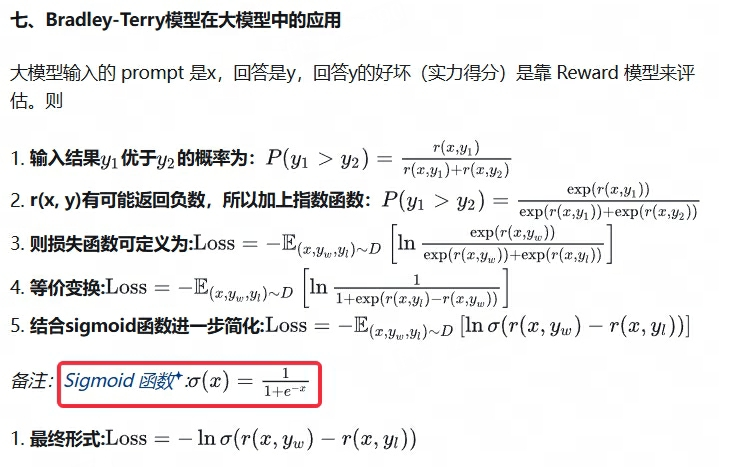
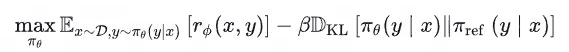
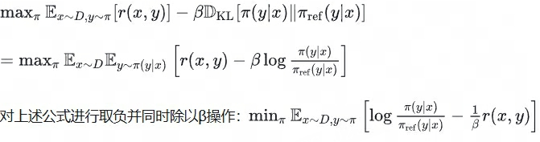
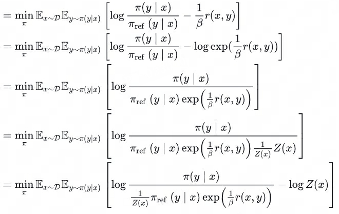
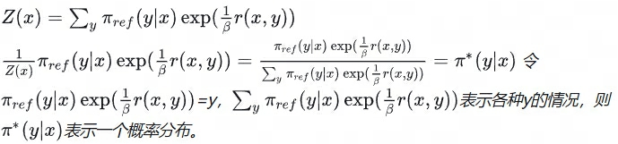
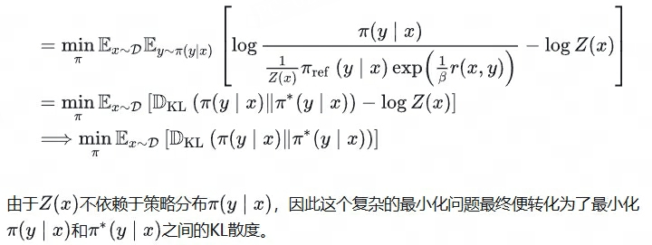
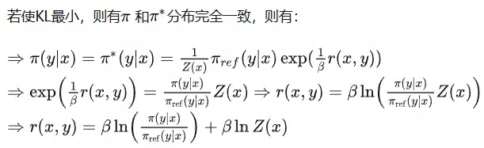
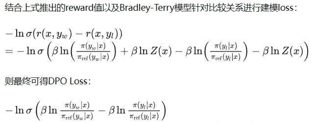

## DPO
> 论文：**D**irect **P**reference **O**ptimization: Your Language Model is Secretly a Reward Model  
>  
> Stanford University 2023 May, ICONIP 2023  

----------
- Bradley-Terry偏好模型，pair-loss，类似于负采样

    $$
    P(y_1 \gt y_2 \vert x) = \frac{\exp(r(x,y_1))}{\exp(r(x, y_1)) + \exp(r(x, y_2))}
    $$

- 策略与奖励的隐式关系，通过KL约束策略优化问题

    $$
    r(x, y) = \beta \log \frac{\pi(y\vert x)}{\pi_\text{ref}(y \vert x)} + c
    $$

    > $\beta$ 为温度系数

- loss function，最小化偏好数据的负对数似然

    $$
    \mathcal{L}_\text{DPO}(\pi_{\theta}) = -\mathbb{E}_{(x, y_w, y_l) \sim D} \bigg[ \log \sigma \Big(\beta \log \frac{\pi(y_w\vert x)}{\pi_\text{ref}(y_w \vert x)} - {\beta \log \frac{\pi(y_l\vert x)}{\pi_\text{ref}(y_l \vert x)} - {\pi(y_l\vert x)}} \Big) \bigg]
    $$

- https://zhuanlan.zhihu.com/p/681559204  
- https://zhuanlan.zhihu.com/p/642569664
- IPO（Identity Preference Optimization）
- KTO（Kahneman-Tversky Optimization）
- Reword Model 阶段 
- https://zhuanlan.zhihu.com/p/15578845927
- RL 阶段，最大化生成的答案能够获得的reward之和，同时为了确保和SFT表现相差不太远，添加了KL散度作为约束
- 
- 
- 
- 
- 
- 
- 