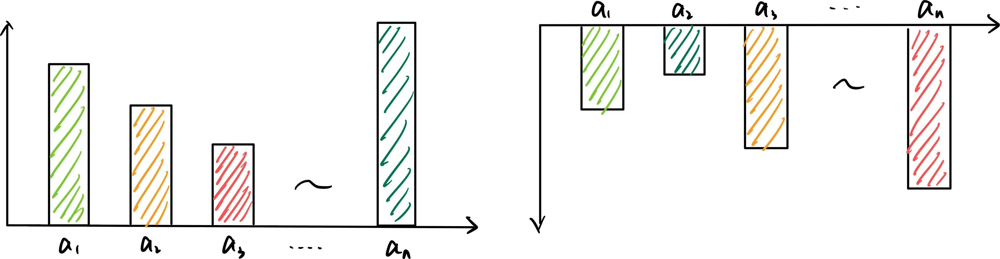
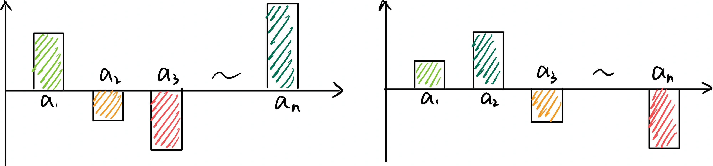

## 强化学习概念
### 相关组成模型
- **策略模型**：Actor Model、Policy Model、Active Model
- **奖励模型**：Reward Model（RM）
    - reward function: xmlcount_reward_func, soft_format_reward_func, strict_format_reward_func, int_reward_func, correctness_reward_func
    - pair-wise loss：比较对象的相对偏好来优化模型，如$\log \sigma(f(x_i) - f(x_j))$
    - point-wise loss：分类或回归问题
- **价值模型**：Value Model、Critic Model
- **参考模型**：Reference Model

### 相关概念
- **State**: 状态序列 $s= \{s_0, s_1, \cdots \}$  
- **Agent**：执行动作的用户主体  
- **Observation**：用户当前视角能观测到的状态 $s_t$
- **Action**：Agent的动作序列 $a = \{a_0, a_1, \cdots \}$，一般取值源于有限的动作空间 Action Space  
    
    > 如超级玛丽中的动作空间有 `{左, 右, 跳, 攻击, 静止}`  

- **Reward**：Agent在当前状态 $s_t$ 下执行动作 $a_t$ 后的奖励 $r_{t+1}(s_t, a_t)$  
- **Policy**：策略 $\pi(a_t \vert s_t)$，表示在当前状态下执行的动作  

    > 确定状态是 $s_{t+1}=f(s_t, a_t)$，概率状态 $s_{t+1}=P(s_{t+1}\vert s_t, a_t)$  

- **Trajectory**：轨迹，即状态动作序列 $\tau = \{s_0,a_0,s_1,a_1, \dots\}$
- **Return**: 回报，即从当前状态 $s_t$ 到轨迹结束的 Reward 总和 $R_t$

### 优势函数

    

        
        
动作价值函数示意

        <!-- <figcaption>这是图片的标题或描述。</figcaption> -->
    

    

        
        
优势函数示意

        <!-- <figcaption>这是图片的标题或描述。</figcaption> -->
    

在好的状态 $s_t$下，无论做什么动作 $a_t$ 都能得到正的回报；而在坏的状态 $s_t$ 下，无论做什么动作都会得到负的回报，这是不合适的。我们需要衡量执行当前动作 $a_t$ 相对于其他动作的优势，因此需要我们对回报减去一个基准值

- **Action-Value Function**，动作价值函数，在当前状态 $s_t$ 下，做出动作 $a_t$ 并遵循策略 $\pi$ 后的回报 $Q^{\pi}(s_t, a_t)$  
- **State-Value Function**，状态价值函数，在当前状态 $s_t$ 下，遵循策略 $\pi$ 后获得的期望回报 $V^{\pi}(s_t)$  
- **Advantage Function**，优势函数，在当前状态 $s_t$ 下，衡量动作 $a_t$ 相对于遵循策略 $\pi$ 的平均表现，即$A^{\pi}(s_t, a_t) = Q^{\pi}(s_t, a_t) - V^{\pi}(s_t)$

    !!! info ""
        - $A^{\pi}(s_t, a_t) \gt 0$ 表示动作 $a_t$ 比策略 $\pi$ 的平均选择更好  
        - 由于目标是最大化 $A^{\pi}(s_t, a_t)$，因此需要使用梯度上升方法进行参数更新

### 优化策略
核心区别在于数据可不可以重复利用，https://zhuanlan.zhihu.com/p/26603719923

1. On-Policy 同策略，即行为策略等于目标策略  
    - $E_{\tau \sim p_{\theta}(\tau) }[R(\tau)\nabla \log p_{\theta}(\tau)]$  
    - 边学习数据边更新状态，此时需要使用新状态下的数据，数据利用率低，

2. Off-Policy 异策略，即行为策略不等于目标策略  
    - $E_{\tau \sim p_{\theta}^{'}(\tau) }[\frac{p_\theta(\tau)}{p_{\theta}^{'}(\tau)}R(\tau)\nabla \log p_{\theta}(\tau)]$  
    - 观察他人学习，数据利用率高

- IS: importance sampling  
- $\frac{p_\theta(\tau)}{p_{\theta}^{'}(\tau)}$ 为重要性权重 importance weight

## RL算法

### 评估动作价值

1. [Q-Learning](q_learning.md)
2. DQN（Deep Q-Network）
### 评估状态价值
3. [Policy Gradient（PG）](pg.md)

### 评估优势函数
1. A2C（Advantage Actor-Critic）
1. A3C（Asynchronous Advantage Actor-Critic）：Asynchronous Methods for Deep Reinforcement Learning
2. TRPO（Trust Region Policy Optimization）
3. PPO（Proximal Policy Optimization）
4. ppo  
    - Generalized Advantage Estimation, GAE，多步采样方式结合，步数越多权重越小

    

        
        <!-- 
LoRA在Attention各部分权重上的消融实验效果
 -->
        <!-- <figcaption>这是图片的标题或描述。</figcaption> -->
    

5. SAC（Soft Actor-Critic）：Soft Actor-Critic: Off-Policy Maximum Entropy Deep Reinforcement Learning with a Stochastic Actor
6. dpo
7. grpo
    - [Approximating kl divergence](http://joschu.net/blog/kl-approx.html), seq-all-token prob
    - tokne-level 输出
8. DAPO

#### llm sft
- [ ] [大模型监督微调SFT](https://www.bilibili.com/video/BV1gmWDeLEMZ?spm_id_from=333.788.videopod.sections&vd_source=782e4c31fc5e63b7cb705fa371eeeb78)
    - chat template
    - completion only，只对输出结果计算loss，不计算通用chat template的loss（如通过completion mask进行标记）
    - NEFTune, noisy embeddings finetuning: 对输入embedding加了一点噪音，sqrt(seq_len * dim) 是为了归一化，防止由于每次input长度不同导致的欧式距离不同，可与attention权重分数类比

#### llm rl

- question，问题
- chosen，更好的回答
- rejected，相对不好的回答
- [grpo trainer](https://huggingface.co/docs/trl/main/en/grpo_trainer)