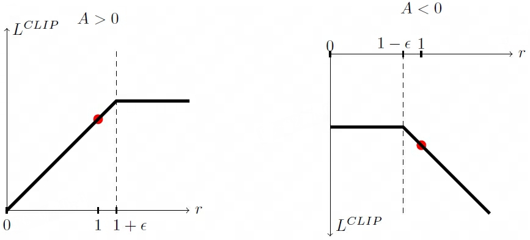
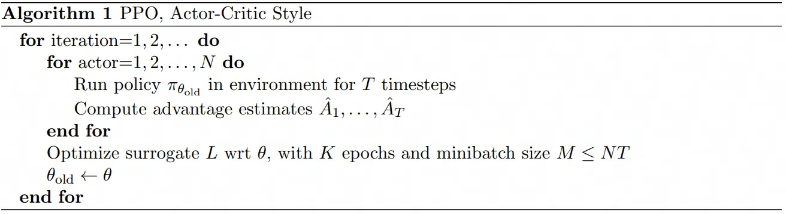
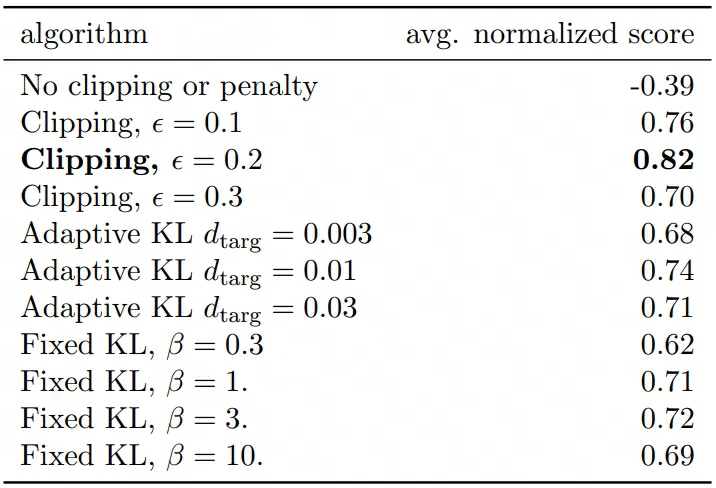

## PPO
> 论文：**P**roximal **P**olicy **O**ptimization Algorithms  
> OpenAI, 2017 Aug

### 主要内容

#### Truncated GAE
截断版GAE，考量了后续 $T$ 步的折扣优势

$$
\begin{aligned}
    \hat{A}_t =& \delta_t + (\gamma\lambda)\delta_{t+1} + \dots + (\gamma\lambda)^{T-t+1}\delta_{T-1} \\
    \delta_t =& r_t  + \gamma V(s_{t+1}) - V(s_t)
\end{aligned}
$$
  
#### Clipped Surrogate Objective

    

裁剪策略约束policy model更新幅度，防止与reference model差异过大、重要性采样效果不对齐。 

$$
L^{CLIP}(\theta) = \hat{\mathbb{E}}_t \Big[ \min\big(r_t(\theta) \hat{A}_t, \text{clip}(r_t(\theta), 1-\epsilon, 1+\epsilon)\hat{A}_t\big) \Big]
$$

> - 新旧策略概率比 $r_t(\theta)=\frac{\pi_{\theta}(a_t\vert s_t)}{\pi_{\theta_{old}}(a_t\vert s_t)}$  
> - $\epsilon$ 为裁剪参数，通常取0.1 ~ 0.3，强制 $r_t(\theta)\approx 1$，避免过大更新

#### Adaptive KL Penalty

$$
L^{KL}(\theta) = \beta \hat{\mathbb{E}}_t\Big[  \text{KL}[\pi_{\theta_\text{old}}(\cdot \vert s_t), \pi_{\theta}(\cdot \vert s_t)] \Big]
$$

其中 $\beta$ 为KL散度损失惩罚系数，当policy model与reference差异过大时，增大惩罚系数，反之减少惩罚系数（因此对 $\beta$ 的初始化不敏感）：

$$
\beta = \begin{cases} 
\frac{\beta}{2} & \text{if }d \lt d_\text{targ}/1.5 \\ 
\beta & \text{others} \\
\beta \times 2 & \text{if }d \gt d_\text{targ}\times 1.5
\end{cases}
$$

> - $d$ 为 $L^{KL}(\theta)$ 的后半部分  
> - 启发式地选择常数 1.5和2，且该方法对常数选择不敏感

#### PPO Algorithm

PPO **on-policy**算法（policy model训练依赖于当前policy生成的数据）  

    

- `line 2-5`：$N$个policy model并行采样 $NT$ 个样本并计算对应优势值$\hat{A}_t$  
- `line 6`：基于采样样本，使用$\text{batch_size}=M\le NT$，对policy model训练并更新 $K$ epochs  
- `line 7`：更新reference model

#### Ablation Study

    

- `Clipped Surrogate Objective` 和 `KL Penalty` 均对强化模型训练有提升，且前者提升效果更优  
- `Adaptative KL Penalty` 较 `Fixed KL Penalty` 对强化模型提升效果更优
