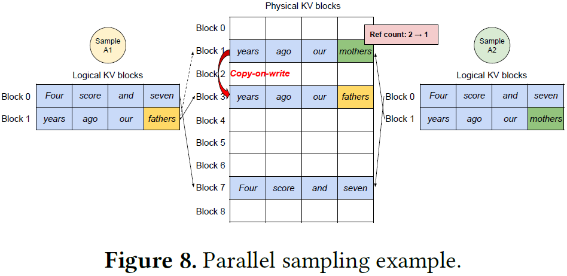
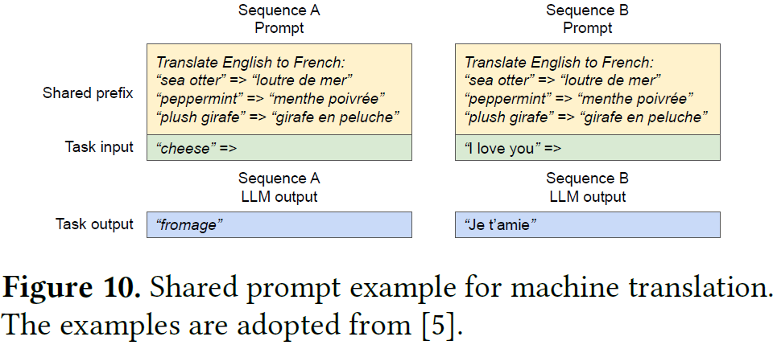

## vLLM
> 论文：Efficient Memory Management for Large Language Model Serving with PagedAttention  
> vLLM: **v**irtual **L**arge **L**anguage **M**odel inference engine  
> Github：[vllm](https://github.com/vllm-project/vllm)  
> UC Berkeley & Stanford University & Independent Researcher & UC San Diego 2023 Sep, SIGOPS 2023

### 主要内容
vLLM是一个开源的推理引擎，专**为LLM的推理和部署而设计**，核心特性包括高效的服务吞吐量、优化的内存管理和多种解码算法支持。

- [x] 解决内存碎片化问题
- [x] 实现并行采样或beam search生成的多个输出序列间部分KV缓存可能共享

https://blog.csdn.net/m0_59164520/article/details/141869967

    
    <!-- 
LoRA在Attention各部分权重上的消融实验效果
 -->

- only 20.4% - 38.2% of the KV cache memory is used to store the actual token states in the existing systems.
- existing LLM serving systems fall short of managing the KV cache memory efficiently. This is mainly because they store the KV cache of a request in contiguous memory space

#### PagedAttention

    
    <!-- 
LoRA在Attention各部分权重上的消融实验效果
 -->

将Key/Value以block为单位缓存至非连续存储空间内

- 每个block中固定存放 $B$ 个token对应的Key/Value向量，浮点数量为`2*N*L*d`
- i-th block的Key向量 $K_i = \left(k_{(i-1)B + 1}, \dots, k_{iB}\right)$、Value向量 $V_i = \left(v_{(i-1)B + 1}, \dots, v_{iB}\right)$

#### KV Cache Manager
- KV cache has unique characteristics: it dynamically grows and shrinks over time as the model generates new tokens, and its lifetime and length are not known a priori.

- PagedAttention divides the request’s KV cache into blocks, each of which can contain the attention keys and values of a fixed number of tokens, the blocks for the KV cache are not necessarily stored in contiguous space(受启发于OS中的虚拟内存)

    
    <!-- 
LoRA在Attention各部分权重上的消融实验效果
 -->

- When managed inefficiently, this memory can be significantly wasted by fragmentation and redundant duplication, limiting the batch size.

- Moreover, physical memory space needs not to be fully reserved in advance, enabling the OS to dynamically allocate physical pages as needed
- The last KV block’s unfilled positions are reserved for future generations
- The KV block manager also maintains block tables—the mapping between logical and physical KV blocks of each request. Each block table entry records the corresponding physical blocks of a logical block and the number of filled positions.
- Separating logical and physical KV blocks allows vLLM to dynamically grow the KV cache memory without reserving it for all positions in advance
- As all the blocks are filled from left to right and a new physical block is only allocated when all previous blocks are full, vLLM limits all the memory wastes for a request within one block, 最差(B-1)/B

    
    <!-- 
LoRA在Attention各部分权重上的消融实验效果
 -->

    
    <!-- 
LoRA在Attention各部分权重上的消融实验效果
 -->

核心思想是将KV cache组织为固定大小块(block)中类似虚拟内存中的"页"。关键技术特点如下：

1. **非连续存储**：允许将连续的K和V存储在不连续的物理内存中（通过维护block table映射），每个KV块包含固定数量token的KV向量  
2. **块式注意力计算**：注意力计算转换为对块的计算形式，PagedAttention内核能够分别识别和获取不同KV块进行计算  
3. **灵活的内存管理**：可将块视为页、token视为字节、请求视为进程，实现类似操作系统的内存管理

#### 内存共享
1. prompt部分KV cache共享  
2. 其余非相关部分独立存储

#### Muitiple Decoding Scenarios
1. Parallel sampling, one-prompt, multiple-response, share the same input prompt KV cache
    - prompt共享（下采样block为单位）
    - 对于non-full last block，在generation步骤中，当发现last prompt block reference count > 1时，复制last block内容至新physical block进行存储，并将last prompt block reference count -=1, 该方法叫做copy-on-write

    

        
        <!-- 
LoRA在Attention各部分权重上的消融实验效果
 -->
    

1. Beam search, not only share the initial prompt blocks but also other blocks across different candidates, and the sharing patterns dynamically change as the decoding process advances
    - 每一步从k*k个condidate中选择top-k个序列，对于current-block reference count=0，释放当前空间
    - 以block为单位共享，而不是以token为单位

    

        
        <!-- 
LoRA在Attention各部分权重上的消融实验效果
 -->
    

2. Shared prefix, description of the task including instructions and example inputs and outputs, also known as system prompt

    

        
        <!-- 
LoRA在Attention各部分权重上的消融实验效果
 -->
    

#### Scheduling and Preemption
- first-come-first-serve (FCFS) scheduling policy for all requests, ensuring fairness and preventing starvation
- block eviction policy: 
    - Since in our case we know that all blocks of a sequence are accessed together, we implement an all-or-nothing eviction policy, i.e., either evict all or none of the blocks of a sequence.
    - Furthermore, multiple sequences within one request (e.g., beam candidates in one beam search request) are gang-scheduled as a sequence group.
- evicted block recover policy: 
    - Swapping. GPU ⟷ CPU ⟷ Disk
    - Recomputation. drop + recompute(由于历史token已确定，比causal解码速度快得多，单次就完成重计算)
    
    

        
        <!-- 
LoRA在Attention各部分权重上的消融实验效果
 -->
    
