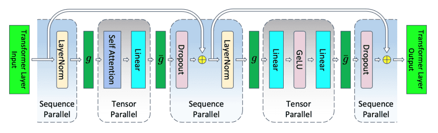

### MP
intra-layer model parallel

#### TP
- Distributed Tensor Model Parallelism
- more general distributed tensor computation

张量并行Tensor Parallel将大型张量操作（如矩阵乘法）拆分到多个计算设备上执行，使得单个设备只需处理张量的一个子集，从而解决大模型训练中的内存和计算瓶颈问题。

1. Row-wise Parallelism，`A=[A1; A2], AB=[A1B; A2B]`
2. Column-wise Parallelism，`B=[B1, B2], AB=[AB1, AB2]`
3. all parallelism, `A=[A1; A2], B=[B1, B2], AB=[A1B1, A1B2; A2B1, A2B2]`

#### SP

sequence parallel，将序列均分为k段分配至k个worker，每段长度为n/k，只沿着序列维度划分激活值，如LN和dropout

- 重叠切分（可选）：为保持局部上下文连续性，子序列间可重叠少量Tokens（如滑动窗口）。
- 负载均衡：若序列长度不均（如变长输入），需动态调度。

#### CP
context parallel，增强版sp，沿所有层的输入张量进行划分，包括输入和激活值
- [context parallelism](context_parallelism.md)
- attention 矩阵计算$QK^TV$：all_gather获取V
- attention softmax：all_reduce同步分母
- FFN独立计算
- LN：all_recue同步均值与方差

