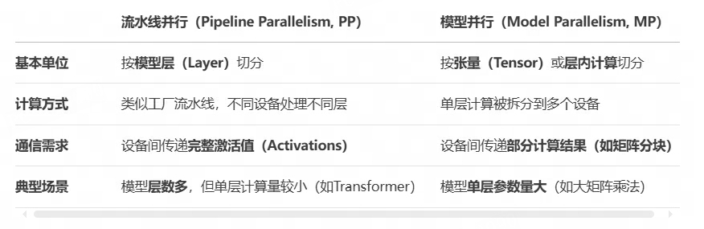
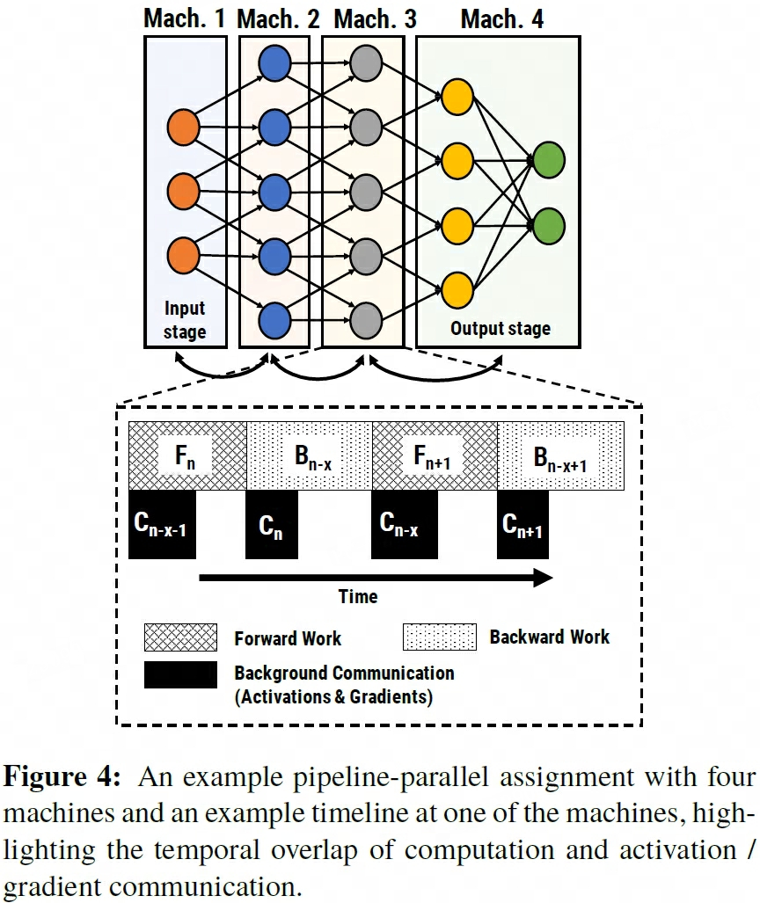
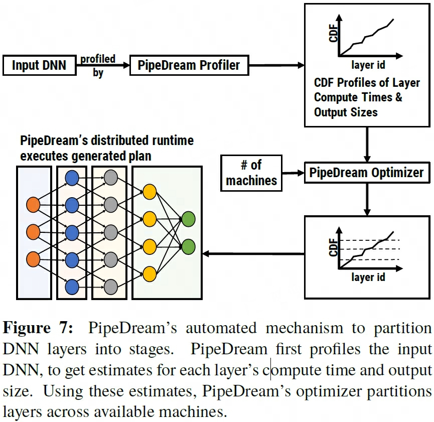

## PipeDream
> 论文：PipeDream: Fast and Efficient Pipeline Parallel DNN Training  
> MSR & Carnegie Mellon University & Stanford University, 2018 Jun

### 主要内容
- https://zhuanlan.zhihu.com/p/715442799
- https://www.cnblogs.com/rossiXYZ/p/15212165.html#%E6%BA%90%E7%A0%81%E8%A7%A3%E6%9E%90-%E6%B7%B1%E5%BA%A6%E5%AD%A6%E4%B9%A0%E6%B5%81%E6%B0%B4%E7%BA%BF%E5%B9%B6%E8%A1%8C%E4%B9%8Bpipedream1----profile%E9%98%B6%E6%AE%B5
- PipeDream aggressively pipelines minibatch processing, with different workers processing different inputs at any instant of time. This is accomplished by injecting multiple inputs into the worker with the first DNN layer, thereby keeping the pipeline full and ensuring concurrent processing on all workers  
- It also uses data parallelism for selected subsets of layers to balance computation load among workers.
- pipeline + MP + DP → PP
- PipeDream 通过运行简短的分析自动决定如何划分pipeline, using an algorithm that balances computation load among the different stages while minimizing communication
- PipeDream can use data parallelism for some stages—multiple workers can be assigned to a given stage, processing different minibatches in parallel.
- PipeDream在运行时会交织运行前向forward和后向backward
- 保证流水线时刻运行，不出现流水线停滞现象 while preventing excessive inprogress minibatches and ensuring model convergence
- Bulk Synchronous Parallel, BSP
- Stale Synchronous Parallel, SSP
- asynchronous parallel or ASP, reduces GPU idle time
- pipeline parallel将模型划分为多个部分，每部分叫做stage，每个stage对应一个gpu，其中输入部分是input stage，输出部分是output stage
- 传统的model-parallel DNN training results in severe under-utilization of GPU resources
- 
- 为使每一时刻没有gpu闲置，通过inject multiple minibatches into the pipeline one after the other来避免该问题
- 
- 由于通信时间为forward或backward的一小部分，又因为在pipeline中连续注入了多个minibatch，因此可以完美的避免通信等待
- 
- PipeDream对DNN模型pipeline动态划分：1）每个stage的计算量尽可能相等；2）使各stage间数据通信、传输的量越少越好，以避免通信失速；
- $T_l$：layer的forward和backward计算时间综合；$a_l$：layer输出的激活值或对应的gradient的size；$w_l$：layer的参数；$M$ 为stage数目
- 通信过程：1）发送GPU→CPU；2）通过网络传输到目标接收器；3）接收器CPU→GPU。一般为数据量/带宽
- 动态规划用于stage划分，$A(j, m)$ 表示前j层在m个设备上的最优解，最终选择$A(N, M)$ 作为最终划分结果
```
A[i][j] = min_{1≤k≤i} (A[k][j-1] + T(k+1→i))
```
- 传统流水线并行采用全转发后全反向的调度，导致大量计算资源闲置，1F1B策略交错进行前向传播和后向传播，显著减少流水线气泡，每个工作器(worker)交替执行一个mini-batch的前向和一个mini-batch的后向
