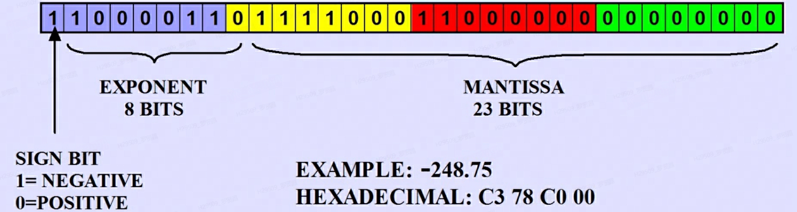

量化是将包含更多信息的表示离散化为包含较少信息表示的过程，通过减少模型参数和激活值的表示精度以达到降低模型存储空间和计算量的目的。

1. 模型存储空间会减少，算力要求降低，，但推理速度不一定更快；
2. 模型效果效果会略微下降；
### 量化流程
#### Float Point Format

<div class="one-image-container">
    
    <!-- <p>LoRA在Attention各部分权重上的消融实验效果</p> -->
</div>

- S(ign): 符号位部分; 
- E(xponent): 指数位部分，位数越多数值范围越大
- M(antissa): 也用Fraction表示，小数/尾数位部分，位数越多精度越高
- 浮点数转二进制格式可视化工具 [IEEE 754 Conventer](https://www.h-schmidt.net/FloatConverter/IEEE754.html)

    $$
    fp=(-1)^s*2^{e-bias}*(1 + m)
    $$

    > $bias = 2^{E-1} - 1$，因此指数部分值域为$[-2^{E-1}+1, 2^{E-1}]$  
    > $m = \sum_{n=1}^{M1} \text{bit}_n*2^{-n}$
    
#### Float Type

| Type      | S                          | E | M/F
| ----------- | ------------------------------------ | --- | ---|
| FP64 | 1 | 11 | 52 |
| FP32 | 1  | 8 | 23 |
| TF32 | 1 | 8 | 10 |
| BF16 | 1 | 8 | 7 |
| FP16 | 1 | 5 | 10 |
| FP8 E4M3 | 1 | 4 | 3 |
| FP8 E5M2 | 1 | 5 | 2 |
| FP4 | 1 | 2 | 1 | 

> - Nvidia专为Ampere架构设计的数据格式TF32，即TensorFloat 32，实际上只使用了19位
> - Google Brain提出的BF16，即BrainFloat 16
> - 华盛顿大学在QLoRA中提出的[NF4](../../LLM_Extend/LLM_SFT/qlora.md)，即NormalFloat 4，本质上为4-bit字节码，用于下标0-15对应的固定浮点数


#### Quantize & Dequantize
量化，将高精度数值类型转化为低精度数值类型，如`FP32 → FP16`；解量化，将量化后的低精度数值类型转化为高精度数值类型，如`FP16 → FP32`

1. Float2Float quantization，转型量化
高精度转化为低精度时需要在指数位调整偏移量、尾数位低位截断；低精度转化为高精度时则需要在指数位调整偏移量、尾数位低位进行补0操作，常用 `cast` 方法实现转换

2. block-wise k-bit (symmetric) quantization，对称线性量化  
将数据划分为多个块block（元素个数为$B$），然后在每个块内应用k-bit量化方案

    $$
    \begin{aligned}
    c(x_{up}, k)  =& \frac{2^{k-1} - 1}{\text{absmax}(x_{up})} \\
    q(x_{up}, k, c) =& round(x_{up}*c) \\
    deq(x_{low}, k, c) =& \frac{x_{low}}{c}
    \end{aligned}
    $$

    > 分块原因：减缓由部分极值导致量化缩放因子 $c$ 过小，导致量化结果过于集中，粒度模糊，损害整体量化效果的现象

1. asymmetric quantization，非对称线性量化  

    $$

    $$

2. [NF4 quantization](../../LLM_Extend/LLM_SFT/qlora.md)，分位量化  
先验地认为模型数据符合正态分布，并基于正态分布累计分布函数CDF求得16个固定浮点数作为最终量化值；此外，还设计了多重量化方案，即进一步对多个量化缩放因子进行浮点数量化

    $$
    \begin{aligned}
        c(x_{up}) =& \frac{1}{\text{absmax}(x_{up})} \\
        q(x_{up}, c) =& \text{find_nearest}(x_{up}*c) \\
        deq(x_{low}, c) = & \frac{x_{low}}{c}
    \end{aligned}
    $$


### 量化方案
#### AMP
混合精度训练[Mixed Precision Training](https://arxiv.org/pdf/1710.03740)

#### PTQ
Post Training Quantization，对训练后的模型进行量化处理，当量化为FP16时，无需校准；当量化为INT8时，一般需要使用少量代表性校准数据集，==不重新训练而是通过统计分析确定最优量化参数==，

- 权重参数直接量化，无需校准集，通常对称量化，也可非对称量化  
- 激活值需要通过校准集进行动态调整校正，可对称也可非对称  
- 混合精度量化，某些层高精度，某些层低精度

一般校准操作默认在层融合之前，用于校正激活值，校准步骤如下：

1. 准备校准数据集，数据规模一般为500~1000  
2. P模型推理，记录前向传播各层激活值activations  
3. 构建直方图**分别统计各层**激活值在不同数值区间的出现频率
    - 统计最小值和最大值，确定数值范围  
    - 将范围划分为若干个桶bin（如2048），统计各区间内激活值的出现频率  
4. 使用校准算法分析直方图  
    - 通过KL散度比较原始分布和量化后分布，寻找最小信息损失的截断阈值 (保留的最大FP32值，即`x=min(x, threshold), fp32_dist = hist[:threshold] / np.sum(hist[:threshold])`) 
    - 根据阈值计算每个量化后bin的宽度 `scale = threshold / INT8_max`，即`quant_bins = np.liespace(0, threshold, INT8_max)`  
    - 统计FP32激活值在上述量化桶的出现频数，并归一化频率`quant_dist /= np.sum(quant_dist)`  
    - 为避免log 0，`fp32_dist = np.clip(fp32_dist, 1e-10, 1), quant_dist=np.clip(quant_dist, 1e-10, 1)`
    - 计算KL distance
    - 选定range_width（对左右边界进行截断选择），然后进行 `bin_width = range_width / INT8_max` 分桶  
    - 计算归一化范围进行分桶 `(x - min(x)) / bin_width`
    - KL矫正算法：计算并选择最小量化前后KL散度对应的截断范围，适用于长尾分布、双峰分布等  
    - MinMax：直接取min/max值以**全量保存激活值动态范围**，因此对离群机值点十分敏感，适用于均匀分布情况  
    - MinMax改进，使用分位数截断缓解离群点影响，如$[P_{0.1\%}, P_{99.9\%}]$
    - 范围无需对称，因为可通过减去 `min_value` 进行平移处理

```python
import numpy as np
from scipy.stats import entropy

def compute_scale(activations, num_bins=2048):
    hist, bin_edges = np.histogram(activations, bins=num_bins)
    bin_width = bin_edges[1] - bin_edges[0]
    
    # 使用KL散度选择最优截断阈值
    def kl_divergence(threshold):
        # 将FP32分布截断到[0, threshold]并归一化，因为此处时ReLU激活函数示例
        fp32_dist = hist[:threshold] / np.sum(hist[:threshold])
        
        # 生成量化后的分布（INT8模拟）
        quant_bins = np.linspace(0, threshold, 256)
        quant_dist = np.zeros(256)
        for i in range(256):
            start = quant_bins[i]
            end = quant_bins[i+1] if i < 255 else threshold
            quant_dist[i] = np.sum(hist[(bin_edges >= start) & (bin_edges < end)])
        quant_dist /= np.sum(quant_dist)
        
        # 避免log(0)
        fp32_dist = np.clip(fp32_dist, 1e-10, 1)
        quant_dist = np.clip(quant_dist, 1e-10, 1)
        
        return entropy(fp32_dist, quant_dist)
    
    # 搜索最佳阈值
    best_threshold = np.argmin([kl_divergence(t) for t in range(100, num_bins)])
    scale = bin_edges[best_threshold] / 127.0  # INT8对称量化
    
    return scale
```

不同batch顺序会产生不同的校准尺度，因此建议使用large batch
    - https://docs.nvidia.com/deeplearning/tensorrt/archives/tensorrt-843/pdf/TensorRT-Developer-Guide.pdf
    - 常见校准算法如下


1. **Entropy Calibration**，选择对应量化前后分布最小KL散度的阈值来确定最优的量化参数

    $$
    D_{KL}(P\Vert Q) = \sum_{i} P(i)\log \frac{P(i)}{Q(i)}
    $$

    > $P$ 为原始模型，$Q$ 为量化后模型

2. **MinMax Calibration**，更适合NLP任务
3. **Legacy Calibration**，最小化量化前后的均方差


converter.representative_dataset

```python
converter.optimizations = [tf.lite.Optimize.DEFAULT]
# 动态范围量化，缺省状态

# 半精度量化 Float16 Quantization: 仅量化权重
converter.target_spec.supported_types = [tf.float16]

# 全整型量化 Full Integer Quantization: 权重和激活值都进行量化
converter.target_spec.supported_ops = [tf.lite.OpsSet.TFLITE_BUILTINS_INT8]
converter.inference_input_type = tf.uint8   # or tf.int8
converter.inference_output_type = tf.uint8  # or tf.int8

# int8权重float16激活
converter.target_spec.supported_ops = [tf.lite.OpsSet.EXPERIMENTAL_TFLITE_BUILTINS_ACTIVATIONS_INT16_WEIGHTS_INT8]
```
#### QAT
Quantization Aware Training

1. data free，不适用校准集，直接量化并输出，但一般会带来较大精度损失
2. calibration，基于校准集，通过输入少量的真实数据进行统计分析来矫正量化数据
3. finetune，基于训练微调的方案，将量化胡茬在训练时自动调整权重，可带来更好的精度提升，但需要额外修改模型训练代码，开发周期较长


- TensorFlow Lite Optimizing Converter(Toco) 转换器

量化分类：

1. 二值化
2. 线性量化
3. 对数量化
- SmoothQuant: Accurate and Efficient Post-Training Quantization for Large Language Models
