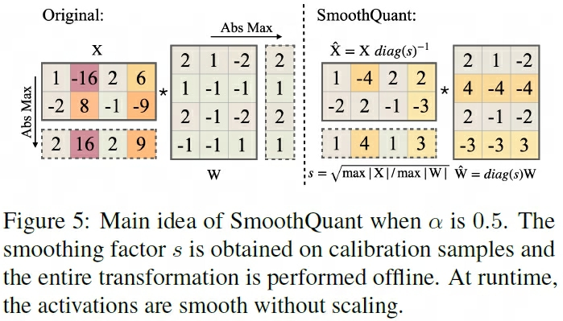
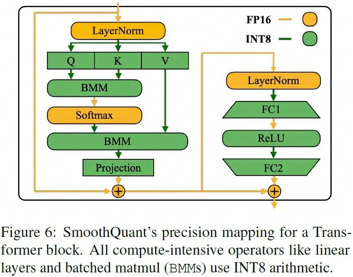

## SmoothQuant
> 论文：SmoothQuant: Accurate and Efficient Post-Training Quantization for Large Language Models  
> Github：[smoothquant](https://github.com/mit-han-lab/smoothquant)  
> Massachusetts Institute of Technology & Nvidia, 2022 Nov, ICML 2023

### 主要内容

- SmoothQuant, PTQ, 8W8A
- based the facts that weights are easy to quantize while activations are not, Outliers make activation quantization difficult
- SmoothQuant smooths the activation outliers by offline migrating the quantization difficulty from activations to weights with a mathematically equivalent transformation.
- SmoothQuant relies on a key observation: even if activations are much harder to quantize than weights due to the presence of outliers (Dettmers et al., 2022), different tokens exhibit similar variations across their channels.
- 
- Migrate the quantization difficulty from activations to weights, $Y = (X \text{diag}(s)^{-1})(\text{diag}(s)W) = \hat{X}\hat{W}$
- $s_j \in \mathbb{R}^{d} = \max(\vert X_j \vert ), X \in \mathbb{R}^{T\times d}$
- $s_j = \max(\vert X_j \vert)^\alpha / \max(\vert W_j \vert)^{1-\alpha}$，$\alpha$一般为0.5用于平均划分量化难度（activation异常值越明显，$\alpha$越大），其中X为横轴方向，W为纵轴方向（保证矩阵shape对齐）
- 
- We quantize the inputs and weights of compute-heavy operators like linear layers and BMM(Batch Matrix Multiplication) in attention layers with INT8, 
- while keeping the activation as FP16 for other lightweight element-wise operations like ReLU, Softmax, and Layer-Norm.
- 