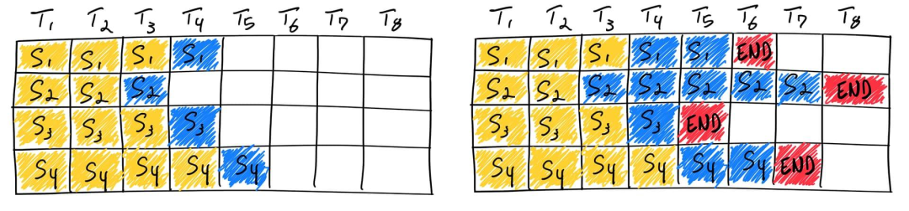
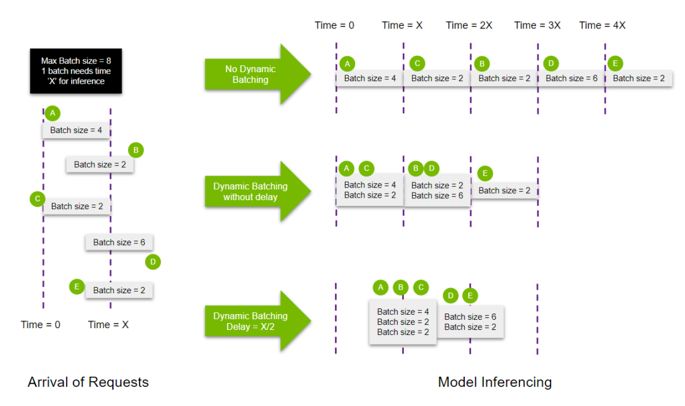
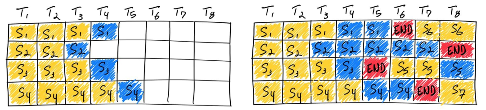

- https://mp.weixin.qq.com/s?__biz=MzU3Mzg5ODgxMg==&mid=2247489116&idx=1&sn=0f2771e71f2c3e020ab8e86684df0093&chksm=fd3bff0fca4c7619db3f3dc800df858150a12c7f192234625b871a4f15cfc699c5746846c5b8&token=1935281044&lang=zh_CN#rd
- left_pad: 使同批次内数据等长，且有效数据靠右，right_pad会导致prompt和生成的token间存在mask，增加复杂性
- 静态批处理（static batching）：输入通过left_pad将所有输入填充至相同长度进行生成，由于部分Prompt在批处理中较早“完成”，但需等待这一批次中Prompt最长的生成结束，因此GPU 未得到充分利用。batch_size保持不变
  - 
- 动态批处理（Dynamic batching）：将受到的服务组成批次进行处理（一般大批次的吞吐率较小批次的更高）
  - 
- 变长输入批处理（Ragged Batching）：dynamic shape + dynamic batching，如不同尺寸tensor padding至相同尺寸，`[1, 3, 768, 932]` 和 `[1, 3, 1024, 168]` 比如padding为 `[1, 3, 1024, 1024]`，NLP中表现为left_pad
- 连续批处理（Continuous/Inflight Batching）：不同于static batching，当一个输入的生成结束了，就将新的输入插进来，所以batch size是动态的。
    - 
    - 每个请求的KV Cache独立初始化。
    - 通过attention mask隔离不同请求的可见范围(具体为clear kv cache，然后访问新保存的kv cache内容)
    - 新请求的prompt一般不逐token生成（因prompt是已知序列，该方式过于低效），而是会采用一次性计算方案得到新请求prompt的kv cache，当计算完prompt 的kv cache后，可动态调度新请求（kv cache）进行next token prediction（具有kv cache策略的过程中只需要输入单个token，即current token）
- FasterTransformer
- Orca: A Distributed Serving System for Transformer-Based Generative Models