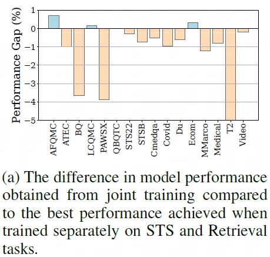
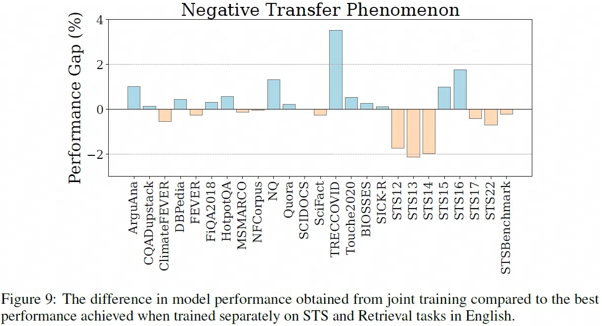
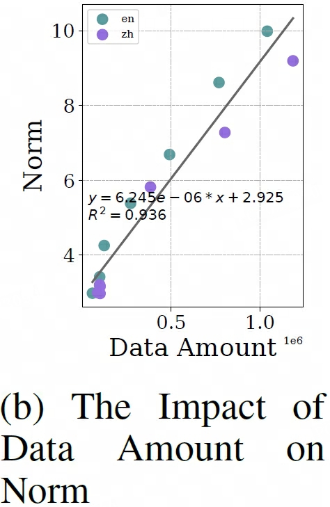
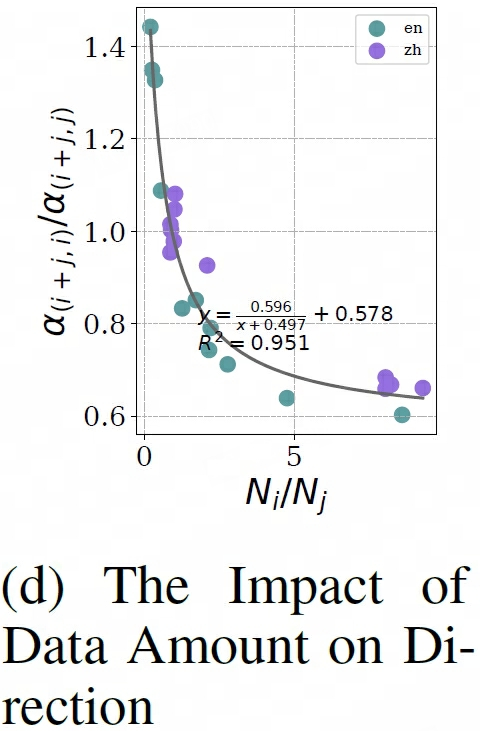
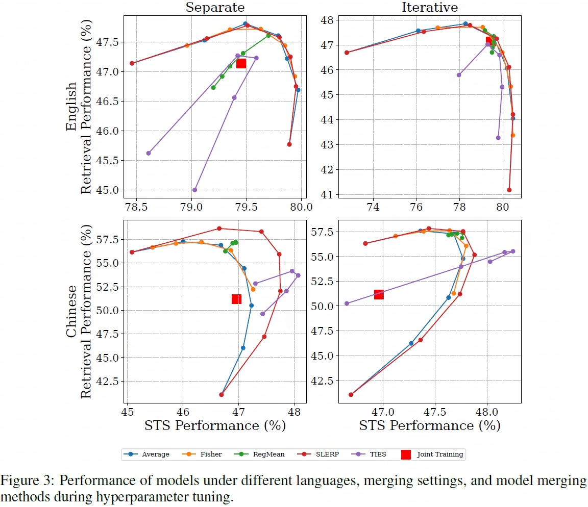
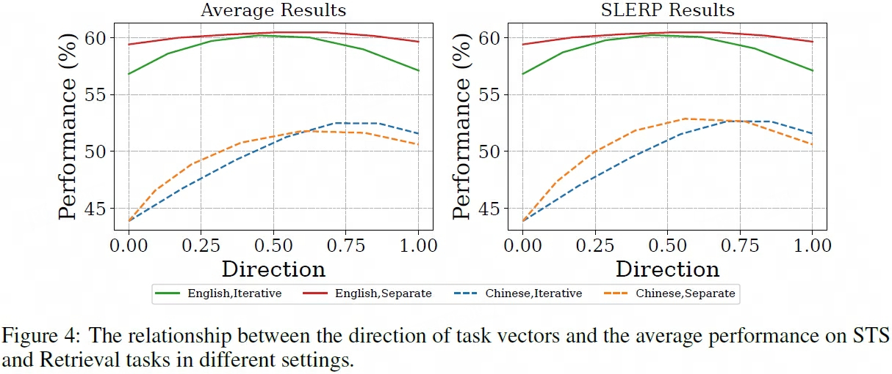
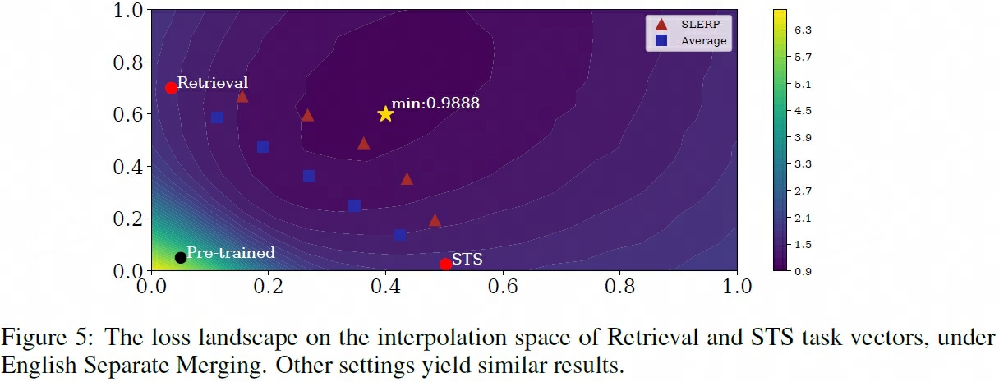
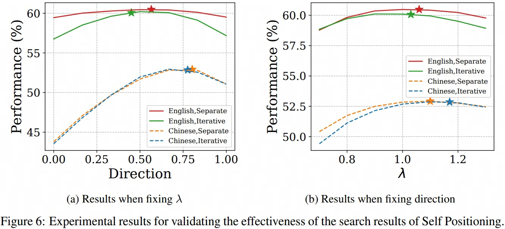
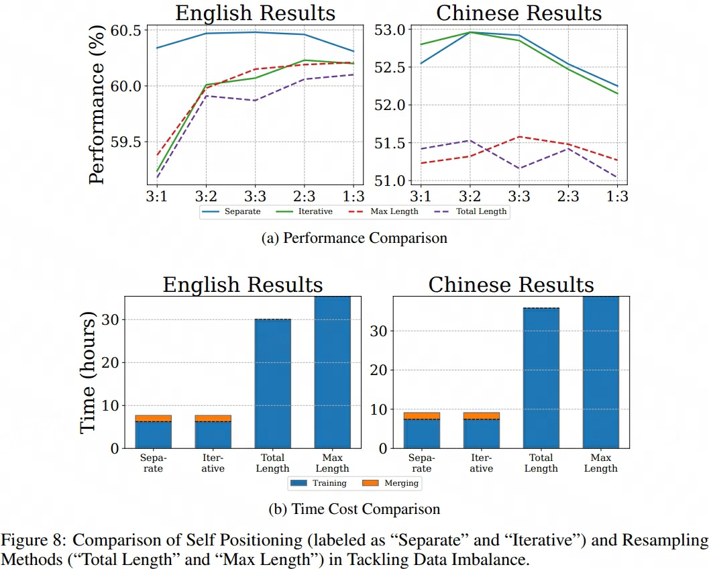

## Model Merging
> 论文：Improving General Text Embedding Model: Tackling Task Conflict and Data Imbalance through Model Merging  
> Beihang University, 2024 Oct

### 主要内容
- Self Positioning, which efficiently searches for optimal model combinations within the interpolation space of task vectors using stochastic gradient descent.
- Self Positioning to search for optimal merging positions within the interpolation space of task vectors. This technique uses stochastic gradient descent to find low-loss hyperparameter combinations for a specified target dataset.
- Task vectors assess the shift in model weights across tasks

- resampling methods
#### Task Conflict
- STS 用于匹配语义相关项，而Retrieval任务用于匹配话题相关项，内容任务目标不一致

- chinese performance

- english performance

#### Data Imbalance
- coefficient of determination $R^2 \in [0, 1]$，可决系数反映回归模式说明因变量变化可靠程度的一个统计指标，数值越接近1表示模型解释能力越强
- sizes of different datasets can vary by nearly a factor of 10. However, current methods do not account for this imbalance and instead, combine all datasets in their entirety for training.

- **Impact on Task Vector Norm**，in ablation study of: 1) individual dataset; 2) single-task datasets; 3) all training datasets combines. norm of task vectors $\Vert V_i \Vert$，amount of training data $N_i$
- reveal a clear linear relationship, indicating that the norm of the task vectors increases proportionally with the amount of training data

- **Impact on Task Vector Direction**, investigate the relationship between the amount of training data and the direction of the task vectors, fora  pair of training datasets $(D_i, D_j)$ with respective data sizes $N_i$ and $N_j$  
    1. train jointly on both datasets to get model $M_{i+j}$ and task vector $V_{i+j}$
    2. train separately on each dataset to  get models $M_i, M_j$ and task vectors $V_i, V_j$
    3. measure the angles $\alpha_{i+j, i}$ and $\alpha_{i+j, j}$
- joint training becomes more aligned with the task vector of the dataset that has a larger amount of training data.

#### Model Merging
- We propose that model merging can address these issues effectively because, 1) Independent Training to avoid gradient conflicts; 2) Adjustable Task Vectors to scale and weight the task vectors to help mitigate or eliminate the effects of data imbalance
- We evaluate five common model merging strategies in the context of general text embedding.
- Model merging has been applied to many machine learning subfields, such as continual learning to mitigate catastrophic forgetting of old tasks and multi-task/multi-domain learning to facilitate knowledge transfer

given $N$ datasets $\{D_i\}_{i=1}^N$ and $N$ models $\{M_i\}_{i=1}^{N}$ trained on them with corresponding model weights $\{\theta_i\}_{i=1}^{N}$ and task vectors $\{V_i\}_{i=1}^{N}$

1. Average Merging：$V_m = \sum_{i=1}^N w_i V_i / \sum_{i=1}^N w_i$，$\{w_i\}_{i=1}^N \in \mathbb{R}$ are hyperparameters  
2. SLERP（Spherical Linear intERPolation）Merging：获取两两任务间的任务向量$V_{i+j}$，为整合$N$ 个 $V_i$，计算$N-1$ 次 $V_{i+j}$即可
   
    $$
    V_{i+j} = \frac{\sin \big(\frac{a_j}{a_i + a_j}\big)\alpha_{(i,j)}V_i + \sin \big(\frac{a_i}{a_i + a_j}\big)\alpha_{(i,j)}V_j}{\sin \alpha_{(i, j)}} = \frac{\sin (1-\beta)\alpha_{(i,j)}V_i + \sin \beta \alpha_{(i,j)}V_j}{\sin \alpha_{(i, j)}}
    $$  

    > $a_i \in \mathbb{R}$ are hyperparameters

3. TIES Merging（TrIm, Elect Sign & Merging）：解决模型合并中的参数冲突（参数冲突：不同任务对同一参数的更新方向相反；幅度差异：不同任务对参数更新的重要性不同），通过以下策略显著提升合并模型的性能：

    - 修剪Trim：基于各 $V_i, i\ne 0$ 的绝对值进行分位数统计，保留各模型数值前 $p\%$ 的参数（先验认为相对更重要），其余置0，得到 $\tau_i^{'}$
    - 选举Elect：基于保留值统计参数正负性的共识（无共识则丢弃该相应参数的合并），仅保留与统计参数正负性一致的参数进行合并，得到 $\hat{\tau}_j$，$j$ 对应合并后模型的 j-th 位置
    - 缩放Rescale：对归并后的参数进行归一化 $V_{m} = \tilde{\tau} = \lambda \cdot \frac{\hat{\tau}}{\Vert \hat{\tau}\Vert}\cdot \Vert \tau_\text{avg} \Vert$，其中$\Vert \tau_\text{avg} \Vert = \frac{1}{N}\sum_{i=1}^N \tau_i^{'}$，先进行norm，再类似于dropout思路基于前一步进行放大还原

    > $\lambda \in \mathbb{R}$ is hyperparameter  

4. Fisher Merging：calculates merging coefficient $\hat{F}_{\theta_i} \in \mathbb{R}^{\Vert \theta_0 \Vert}$ based on Fisher information matrix （即inforNCE loss的梯度平方的期望，实际用蒙特卡洛方式估计实现），按照参数重要性（infoNCE梯度平方）加权参数

    $$
    \begin{aligned}
        \hat{F}_{\theta_i}=& \frac{1}{N_i} \sum_{j=1}^{N_i} \big( \nabla_{\theta_i} \mathcal{L}^\text{CL}(\theta_i; I_j) \big)^2 \\
        V_{m}^{(k)} =& \frac{\sum_{i=1}^N \lambda_i F_{\theta_i}^{(k)}V_i^{(k)}}{\sum_{i=1}^N \lambda_i F_{\theta_i}^{(k)}} = \frac{\sum_{i=1}^N \lambda_i F_{\theta_i}*V_i}{\sum_{i=1}^N \lambda_i F_{\theta_i}}
    \end{aligned}
    $$

    > $\mathcal{L}^\text{CL}$表示paired contrastive infoNCE loss  
    > $\Vert \theta_0 \Vert$表示模型参数个数，$\hat{F}_{\theta_i}\in \mathbb{R}^{\Vert \theta_0 \Vert}$的shape与$\theta_0$一致，同时$k=1, \cdots, \Vert \theta_0 \Vert$，表示各个参数对应的FIM值位置  
    > $\{\lambda_i \}_{i=1}^N \in \mathbb{R}$ are hyperparameters  

5. RegMean（Regression-based Mean） Merging：是一种基于线性回归的模型合并方法，专门解决神经网络模型合并中的参数匹配问题。它通过最小化输出差异来学习最优的合并权重，尤其适合合并同架构不同初始化的模型。

    $$
    W_m^k = \Big(\sum_{i=1}^N X_i^k(X_i^k)^T\Big)^{-1} \sum_{i=1}^N \Big(X_i^k(X_i^k)^T W_i^k\Big)
    $$

    > $\{W_i^{k}\}_{k=1}^K$

two model merging pipelines

1. Separate Merging: train N model $\{M_{i}\}_{i=1}^N$ with N dataset separately, and then merge $M_{m}^\text{sep}$, This approach enables the transformation of an existing backbone (e.g., a language model) into an embedding model
2. Iteratively Sequential Merging: iterative ly train model with sequence $(D_1, \cdots, D_N)$ to get sequence of models $(M_1, M_{(1, 2)}, \dots, M_{(1, 2, \dots, N)})$，and then merge $M_{m}^\text{iter}$, This method is particularly effective for enhancing the performance of existing embedding models on specific tasks.

#### key Factors in Model Merging
1. Directino of $V_m$，横轴为$\frac{a_j}{a_i + a_j}$
    

2. Norm of $V_m$
    
#### Self Positioning
- we propose a method to find a **near-optimal** $V_m$ within the interpolation space.
- hyperparameter search method based on a probe dataset which can be applied to any model merging method

**GOAL**: search for positions with low loss by CL SFT to update $\{{a}_i\}_{i=1}^{N}, {\lambda}$

$$
\begin{aligned}
    f^\text{SLERP}(V_i, V_j, a_i, a_j) =& \frac{\sin \big(\frac{a_j}{a_i + a_j}\big)\alpha_{(i,j)}V_i + \sin \big(\frac{a_i}{a_i + a_j}\big)\alpha_{(i,j)}V_j}{\sin \alpha_{(i, j)}} \\
\end{aligned} 
$$

1. Direction Control：SLERP merging iteratively

    $$
    V_{(1, \dots, N)} = f^\text{SLERP}(V_{(1, \dots, N-1)}, V_N, \frac{\sum_{i=1}^{N-1}a_i}{N-1}, a_N)
    $$

2. Norm Control：applying a scaling factor $\lambda$

    $$
    V_p = \lambda V_{(1, \dots, N)}
    $$

3. SFT by constractive learning

    $$
    \left( \{{a}_i\}_{i=1}^{N}, {\lambda} \right) = \arg \min_{(\{a_i\}_{i=1}^{N}, \lambda)} \left( \frac{1}{|D_t|} \sum_{I \in D_t} \mathcal{L}^{\text{CL}}(I; \theta_0 + V_p) + \mu \lambda \right)
    $$

    > - $\mu$ is a hyperparameter used to prevent overfitting in this optimization problem  
    > - $D_t$ is the target dataset, 1) Since the number of parameters to be optimized is small, the amount of data required for $D_t$ is much less than that required to train the model;（paper中为32000） 2) $D_t$ can be obtained either by sampling from the training dataset or by choosing to construct it from other data sources.

- self-posltioning的效果表现（vary $a_i$, vary $\lambda$）

- self-posltioning的效果表现（vary $\mu$）1) $\mu$的改动对合并模型的效果表现存在较大影响，单由公式可知对direction影响较小；2) 合并模型的最佳效果表现常在$\mu \lt 0.05$ 等较小值范围内

通过从 STS 和检索训练数据中按比例采样来解决数据不平衡问题，其中前者样本数为 $N_s$，后者为$N_r$，且$\frac{N_s}{N_r} \in \{\frac{3}{1}, \frac{3}{2}, \frac{3}{3}, \frac{2}{3}, \frac{1}{3} \}$
- Total Length：从所有数据集中重采样
- Max Length：保持最多样本的数据集不变进行重采样

#### Applications on Instructor
