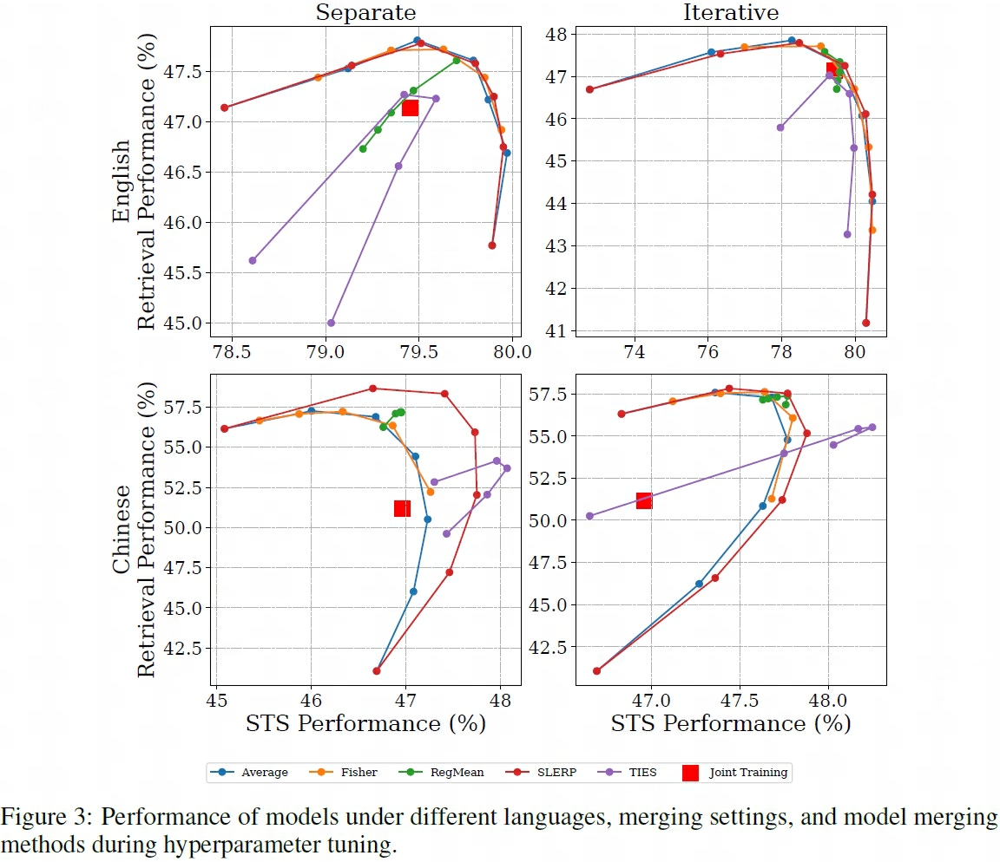
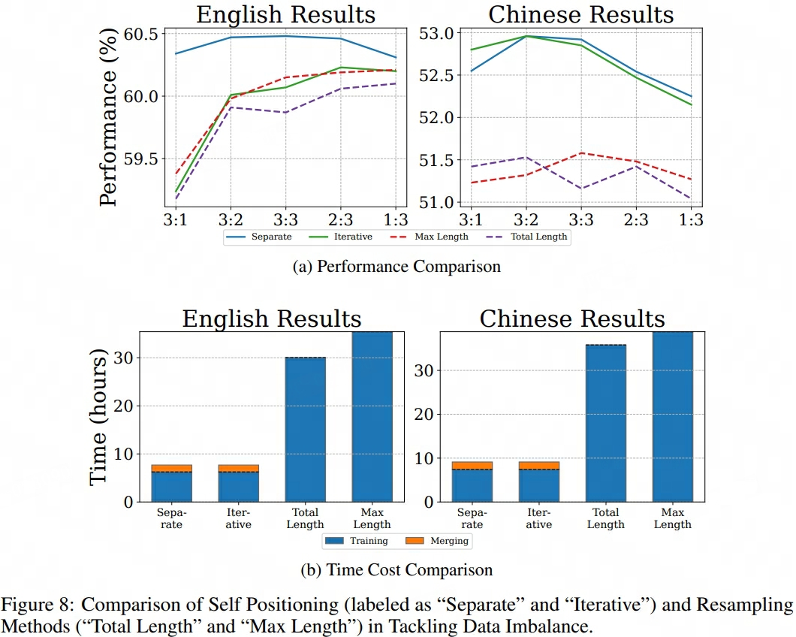

## Self-Positioning
> 论文：Improving General Text Embedding Model: Tackling Task Conflict and Data Imbalance through Model Merging  
> Beihang University, 2024 Oct

### 主要内容

#### Model Merging Strategies
给定数据集 $\{D_i\}_{i=1}^N$ 和相应的基于各数据集训练得到的模型 $\{M_i\}_{i=1}^{N}$，模型的参数用 $\{\theta_i\}_{i=1}^{N}$ 表示，对应的任务向量Task Vector为  $\{V_i\}_{i=1}^{N} = \{\theta_i - \theta_0\}_{i=1}^N$

1. **Average Merging**：加权合并各模型的Task Vector

    $$
    V_m = \frac{\sum_{i=1}^N a_i V_i}{\sum_{i=1}^N a_i}
    $$ 

    > - $\{a_i\}_{i=1}^N \in \mathbb{R}$ 为各任务向量权重超参  

2. **SLERP Merging**（**S**pherical **L**inear int**ERP**olation）：依次合并两任务向量，重复合并过程 $N-1$ 次得到 $V_{m}$

    $$
    V_{i+j} = \frac{\sin \left(\frac{a_j}{a_i + a_j}\right)\alpha_{(i,j)}V_i + \sin \left(\frac{a_i}{a_i + a_j}\right)\alpha_{(i,j)}V_j}{\sin \alpha_{(i, j)}}
    $$  

    > - $\{a_{i}\}_{i=1}^N$ 为各任务向量角度权重超参
    > - $\alpha_{(i, j)}$ 为 任务向量 $V_i$ 和 $V_j$ 的夹角

3. **TIES Merging**（**T**r**I**m, **E**lect **S**ign & Merging）：解决模型合并过程中的参数冲突并进行缩放处理，具体通过以下策略显著提升合并模型的效果表现：

    - ^^修剪Trim^^：基于各任务向量 $V_i$ 的绝对值进行分位数统计，先验认为绝对值越大参数相对更重要，因此保留各模型数值前 $p\%$ 或高于某阈值的参数，其余置0，得到 $\{V_i^{'}\}_{i=1}^N$
    - ^^选举Elect^^：基于 $\{V_i^{'}\}_{i=1}^N$ 统计多数参数的正负性，随后仅保留与统计参数正负性一致的参数进行合并，得到 $\hat{V}_m$ 
    - ^^缩放Rescale^^：对合并后的任务向量进行缩放 $V_{m} = \lambda \cdot \frac{\hat{V}_m}{\Vert \hat{V}_m\Vert}\cdot \Vert V\text{avg} \Vert$，其中$\Vert V_\text{avg} \Vert = \frac{1}{N}\sum_{i=1}^N V_i^{'}$，先进行Norm，再进行类似于dropout的放大还原操作

    > - $\lambda \in \mathbb{R}$ 为合并任务向量缩放超参

4. **Fisher Merging**：基于输入数据的InfoNCE loss计算 Fisher Information Matrix（即inforNCE loss的梯度平方的期望，实际用蒙特卡洛方式估计实现）作为合并系数，并先验认为矩阵元素值越大越重要，权重越高

    $$
    \begin{aligned}
        \hat{F}_{\theta_i}=& \frac{1}{N_i} \sum_{j=1}^{N_i} \big( \nabla_{\theta_i} \mathcal{L}^\text{CL}(\theta_i; I_j) \big)^2 \\
        V_m =& \frac{\sum_{i=1}^N \lambda_i \hat{F}_{\theta_i}*V_i}{\sum_{i=1}^N \lambda_i \hat{F}_{\theta_i}}
    \end{aligned}
    $$

    > - $\mathcal{L}^\text{CL}$表示 infoNCE loss，$I_j \in D_i$表示训练样本  
    > - $\hat{F}_{\theta_i}$的shape与$\{V_i\}_{i=1}^{N}$一致，为对比学习的梯度值平方矩阵  
    > - $\{\lambda_i \}_{i=1}^N \in \mathbb{R}$ 任务向量权重超参  

5. **RegMean Merging**（Regression-based Mean）：是一种合并线性回归模型的方法，专门解决神经网络模型合并中的参数匹配问题。它通过最小化输出差异（Square Error）来学习最优的合并权重：

    $$
    \min_{W_m} \sum_{i=1}^N \left\Vert W_m^TX_i - W_i^TX_i\right\Vert^2
    $$

    基于线性回归的最小二乘解封闭解（Closed-Form Solution）公式得最终合并权重矩阵

    $$
    \begin{aligned}
        W_m =& \left( \sum_{i=1}^N X_i^TX_i \right)^{-1} \sum_{i=1}^N\left( X_i^TX_iW_i\right)
    \end{aligned}
    $$

    > - $\{W_i\}_{i=1}^N$ 表示各线性层权重  
    > - $\{X_i\}_{i=1}^N$ 表示用于各线性层输入向量$\left< X_1 \in \mathbb{R}^{N_1 \times m}, y_1 \right>, \dots, \left<X_N \in \mathbb{R}^{N_N \times m}, y_N \right>$  
    > - scaling factor/ration for non-diagonal items/elements

!!! info
    - `Fisher Merging`, `RegMean Merging` 以及本文的 `Self-Positioning` 合并策略需要数据集进行矫正

#### Model Merging Pipelines
1. **Separate Merging**: 使用各数据集分别对模型进行训练得到 $\{M_{i}\}_{i=1}^N$, 随后合并模型得到 $M_{m}^\text{sep}$。
   > 可用该方法将现存的基线或SOTA模型合并作为 Embedding Model 使用  
2. **Iteratively (Sequential) Merging**: 基于数据集 $(D_1, \cdots, D_N)$ 序列迭代，依次获得模型 $(M_1, M_{(1, 2)}, \dots, M_{(1, 2, \dots, N)})$，随后合并模型得到 $M_{m}^\text{iter}$。  
   > 可用该方法增强现有Embedding Model在特定任务上的效果表现。

#### Joint Training Drawbacks
1. **Multi-Task Confict**：如STS任务目的为语义相似项匹配，而Retrival任务目的为匹配话题相关项，任务目标不一致，多任务联合训练会梯度优化方向可能会存在冲突，导致负向迁移效果，表现为多任务联合训练表现较单独任务微调效果存在损伤。
    

        
    

2. **Data Imbalance**：不同来源的各任务数据集样本数量差异过大（甚至有数量级的差异），可能会导致归纳偏差（向多训练数据任务），严重影响模型在不同任务上的效果表现。
    

        

            
        

        

            
        

    

    !!! info 
        - 训练数据量（1. 单个数据集；2. single-task所有数据集；3. multi-task所有数据集）越多，Task Vector Norm $\Vert V_i \Vert$ 越大  
        - 训练数据量（1. 数据集$D_i$；2. 数据集$D_j$；2. 数据集$D_i + D_j$）越多，Task Vector Direction $\alpha_{(i+j, i)}/\alpha_{(i+j, j)}$ 越小，表现为联合训练任务向量 $V_{i+j}$向数据量越多的数据集倾向越明显
        - 可决系数coefficient of determination $R^2 \in [0, 1]$ 反映了回归模式因变量变化可靠程度，数值越接近1表示模型解释能力越强

3. 多任务联合训练效果表现

    

        
    

    !!! info ""
        - 多任务联合训练对效果表现有一定的削减现象
        - 模型融合能够提升模型最终效果表现，且SLERP能够取得相对最佳的效果表现

#### Self-Positioning
使用`grid search`方式确定合并超参可使模型获得最佳效果表现，单当模型数量 $N$ 增加时`grid search`的时间复杂度会指数级增长，因此本文提出了一个近似最优的超参确定方法Self-Positioning获得合并模型 $V_m$。

该方法（以SLERP为例）通过 InfoNCE loss 来优化更新目标超参，主要成分如下：

1. **Task Vector Direction Control**：$\{{a}_i\}_{i=1}^{N}$
2. **Norm Control**：$\lambda$，$\mu$。后者为防止过拟合的超参

$$
\begin{aligned}
    \left( \{{a}_i\}_{i=1}^{N}, {\lambda} \right) =& \arg \min_{(\{a_i\}_{i=1}^{N}, \lambda)} \left( \frac{1}{|D_t|} \sum_{I \in D_t} \mathcal{L}^{\text{CL}}(I; \theta_0 + V_p) + \mu \lambda \right) \\
    V_p =& \lambda V_{(1, \dots, N)} \\ 
    V_{(1, \dots, N)} =& f^\text{SLERP}(V_{(1, \dots, N-1)}, V_N, \frac{\sum_{i=1}^{N-1}a_i}{N-1}, a_N) \\
    f^\text{SLERP}(V_i, V_j, a_i, a_j) =& \frac{\sin \left(\frac{a_j}{a_i + a_j}\right)\alpha_{(i,j)}V_i + \sin \left(\frac{a_i}{a_i + a_j}\right)\alpha_{(i,j)}V_j}{\sin \alpha_{(i, j)}} \\
\end{aligned}
$$

> - $D_t$ 为参数搜索数据集，规模远小于训练集，可直接从训练集中采样或从其它数据源获取

#### 性能效果表现

    

> Direction轴为$\frac{a_j}{a_i + a_j}$

    

!!! success ""
    1. Self-Positioning能够自动更新$\{{a}_i\}_{i=1}^{N}$ 和 $\lambda$ 确定近似最优合并模型超参  
    2. Self-Positioning的合并模型效果较其余合并策略效果表现更加

    

!!! info ""
    $\mu$的变化虽对Task Vector Directoin影响较小，但对Self-Positioning效果表现存在较大影响，建议取值 $\mu \lt 0.05$

    

>

> Figure 8(a)横轴为从STS任务和Retrival任务中采样的样本数量比例  

!!! success ""
    1. Self-Positioning较传统重采样方式处理样本不平衡问题时合并模型效果表现更好  
    2. Self-Positioning较传统重采样方式处理样本不平衡问题时合并模型效率更高  