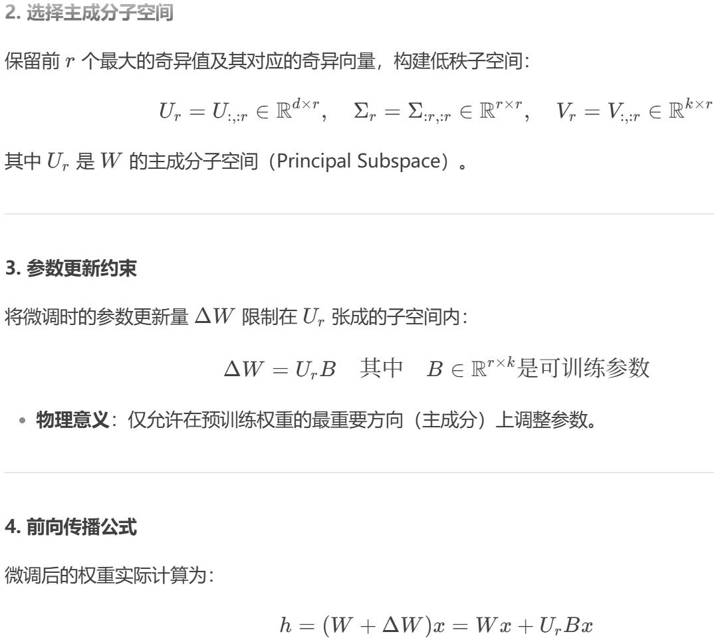

## PiSSA
> 论文：PiSSA: **P**r**i**ncipal **S**ingular values and **S**ingular vectors **A**daptation of large language models  
> Github：[PiSSA](https://github.com/GraphPKU/PiSSA)  
> Peking University, 2024 Apr

### 工作内容
1. 与LoRA相比，将$BA$替换为原来高阶矩阵$W$的主成分，方案效果整体超过LoRA

#### 细节实现

    

- nuclear norm，核范式，矩阵特征值得迹tr
