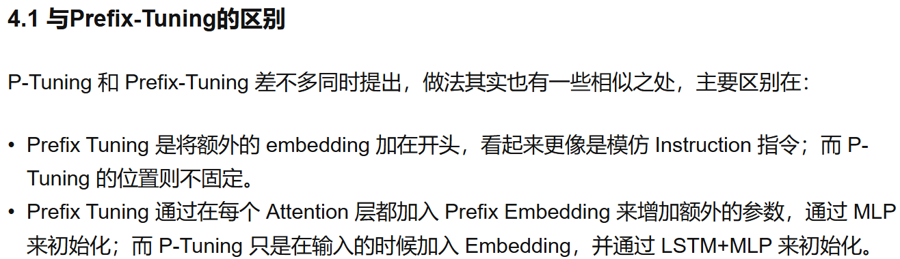

## P-tuning-1
> 论文：GPT Understands, Too  
>  Tsinghua University & Massachusetts Institute of Technology, 2021 Mar 

### 主要内容
- https://www.zhihu.com/tardis/bd/art/627642632?source_id=1001
- P-Tuning that employs trainable continuous prompt embeddings in concatenation with discrete prompts，连续的prompt是P，离散的prompt是x和y
- Results in Table 1 show that manual discrete prompts lead to unstable performance. For example, if we compare the last two prompts in the table, changing a single word in prompt causes a drastic decrease of 20 points in performance
- Let $[P_i]$ be the ith continuous prompt embedding. The prompt template for P-Tuning is as follows: $T = \{[P_{0:i}], x, [P_{i+1: j}], y, [P_{j+1: k}]\}$，需训练embeddings $\{P_i\}_{i=1}^k$
- 
- 3 Experiments
## P-tuning-2
> 论文：P-Tuning v2: Prompt Tuning Can Be Comparable to Fine-tuning Universally Across Scales and Tasks  
> Tsinghua University & BAAI & Shanghai Qi Zhi Institute, 2021 Oct, ACL 2022

### 主要内容
- prompt tuning can be comparable to fine-tuning when the model scales to over 10 billion parameters. However, for medium-sized models (from 100M to 1B) that are widely used, prompt tuning performs much worse than fine-tuning.
- prompt tuning: Lack of universality across scales, Lack of universality across tasks
- P-Tuning v2 is an implementation of prefix tuning optimized and adapted for NLU
- Reparameterization. Appendix B
- Prompt Length. Appendix B, simple classification tasks prefer shorter prompts (less than 20); hard sequence labeling tasks prefer longer ones (around 100).
- Multi-task Learning
- Classification Head, use [CLS] for prediction!
- 4 Experiments