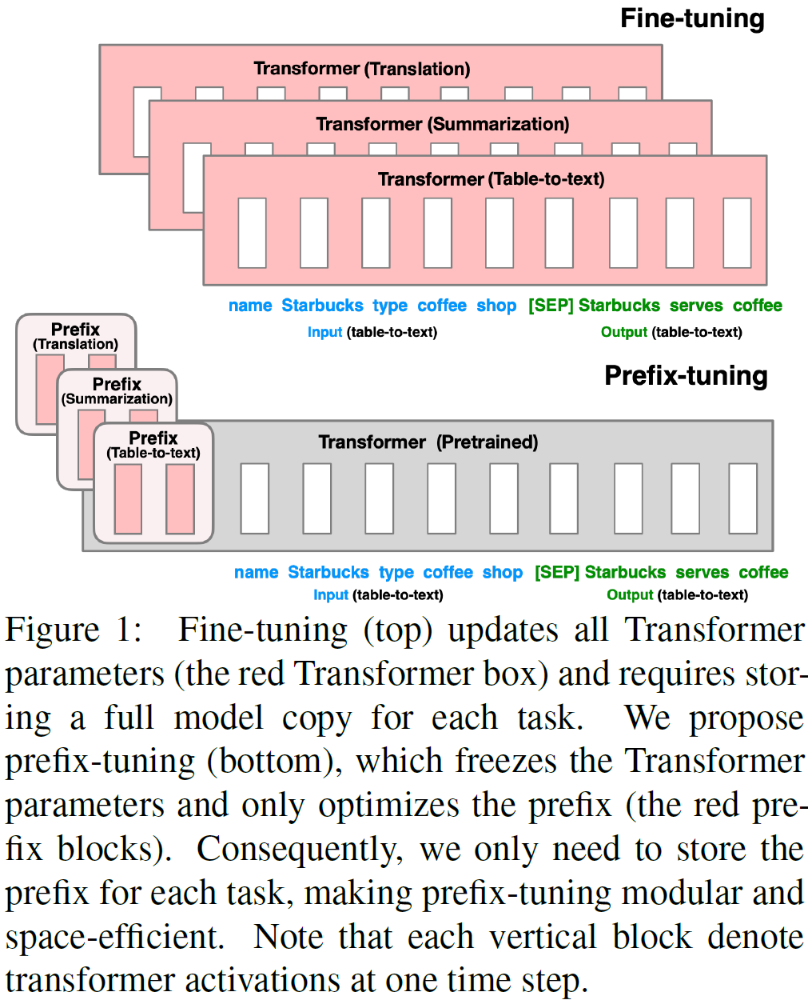
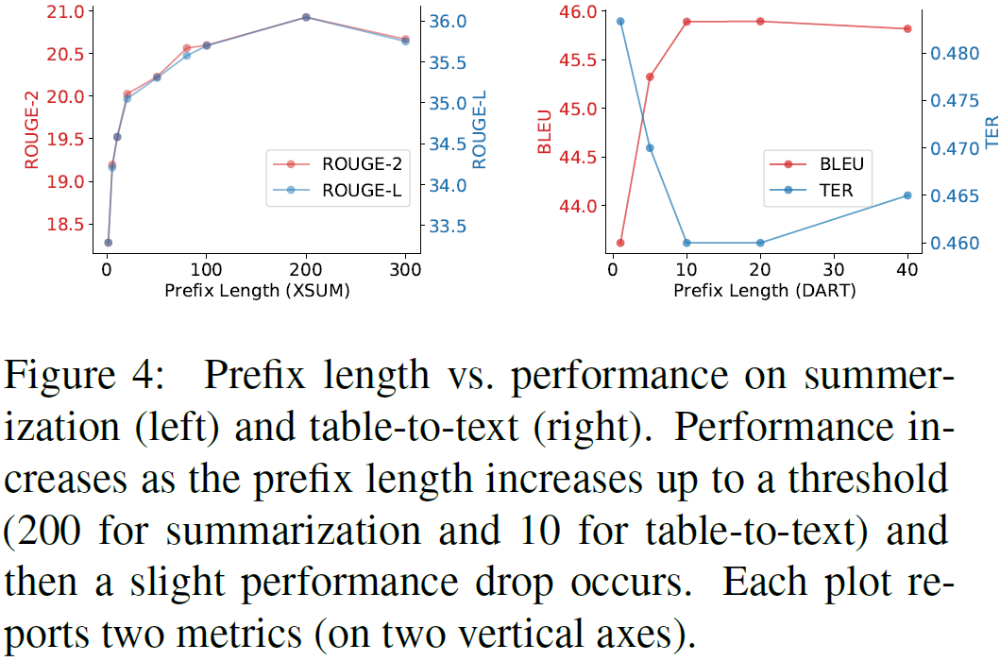

## Prefix Tuning
> 论文：Prefix-Tuning: Optimizing Continuous Prompts for Generation  
> Stanford University, 2021 Jan, ACL 2021


### 主要内容
- 一种prefix对应一种task，即task-specific prefix（可以为同task不同topic），插件形式
- for NLG tasks, keeps language model parameters frozen, but optimizes a small continuous task-specific vector (called prefix)
- prefix as if were previous virtual tokens, 连续的虚拟token向量，而不是离散的prompt向量
- learning only 0.1% of the parameters, prefix-tuning obtains comparable performance in the full data setting
- table-to-text, 输入表格信息，输出相应的文本描述
- $X_\text{idx}$ 表示属于$X$部分的序列中下标集合
- $h_i$ 表示 $n$ 层的hidden state
- decoder, `z=[prefix; x; y]`
- encoder-deocer, `z=[prefix_1; x], z1=[prefix_2; y]`
- prefix embedding table: trainable matrix $P_\theta \in \mathbb{R}^{\vert P_\text{idx} \vert \times d}$
- prefix length敏感
```python
import torch
import torch.nn as nn

class PrefixTuning(nn.Module):
    def __init__(self, model, prefix_length=10, hidden_size=768):
        super().__init__()
        self.model = model  # 冻结的预训练模型
        self.prefix_length = prefix_length
        self.prefix_embedding = nn.Parameter(
            torch.randn(prefix_length, hidden_size)
        )  # 可训练的前缀

    def forward(self, input_ids):
        batch_size = input_ids.shape[0]
        prefixes = self.prefix_embedding.unsqueeze(0).expand(batch_size, -1, -1)
        extended_input = torch.cat([prefixes, input_ids], dim=1)
        outputs = self.model(inputs_embeds=extended_input)
        return outputs
```

    $$
    h_i = \begin{cases}
    P_\theta[i: ] & \text{if } i \in P_\text{idx} \\
    \text{LM}_\phi(z_i, h_{\lt i}) & \text{otherwise}
    \end{cases}
    $$

- 实验中中发现直接使用$P_\theta[i:]$可能训练不稳定并带来一定的效果减益，因此 $P_\theta[i:] = \text{MLP}(P'_\theta[i:]), P'_\theta[i:] \in \mathbb{R}^{\vert P_\text{idx} \vert \times d_2}$，在训练完成后可运算一遍后只保存$P_\theta$并舍弃 $P'_{\theta}$
<div class="one-image-container">
    
</div>

- prompt tuning部分的prompt可能过长，容易超出`context_window`
- 6 Main Results
#### Ablation
<div class="one-image-container">
    
</div>
- longer prefixes have a negligible impact on inference speed, because attention computation over the entire prefix is parallellized on GPUs.
- discrete prompting < embedding-only ablation < prefix-tuning
- embedding-only ablation, 只在embedding layer输入时加上prefix；full：所有层上都加prefix
- infix-tuning slightly underperforms prefix-tuning, because prefix-tuning can affect the activations of x and y whereas infix-tuning can only influence the activations of y
- how the prefix is initialized has a large impact in low-data settings, random: low performance + high var; read_word: improve generation
- In particular, initializing with task relevant words such as “summarization” and “table-to-text” obtains slightly better performance than task irrelevant words such as “elephant” and “divide”, but using real words is still better than random
- Additional Results for the Initialization Experiment