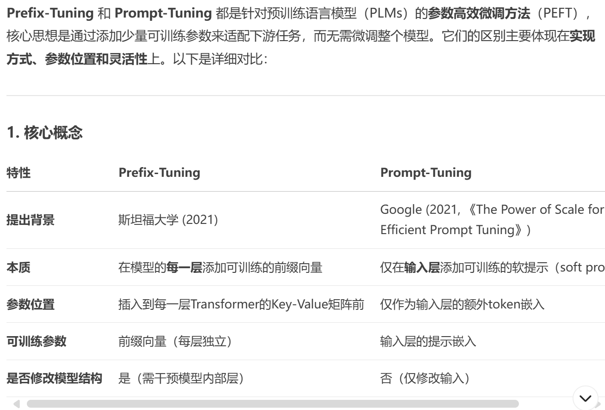
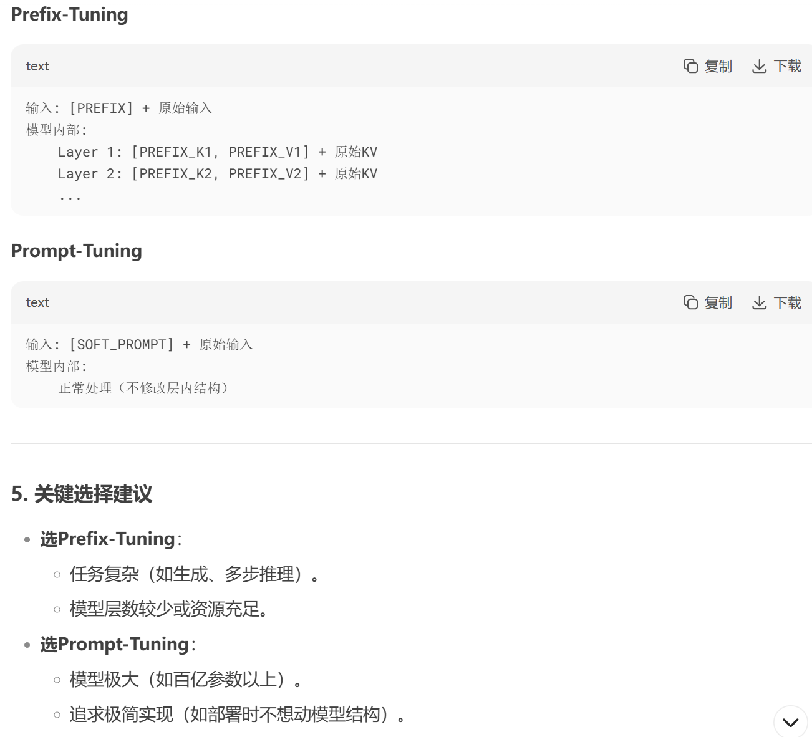

## Prompt Tuning
> 论文：The Power of Scale for Parameter-Efficient Prompt Tuning  
> Google Research, 2021 Apr, ACL 2021

### 主要内容
- prompt ensembling
- freeze the entire pre-trained model and only allow an additional k tunable tokens per downstream task to be prepended to the input text (with no intermediate-layer prefixes or task-specific output layers)
- Prompt tuning removes the restriction that the prompt P be parameterized by $\theta$; instead the prompt has its own dedicated parameters, $\theta_P$ , that can be updated. $P_{\theta, \theta_P}(Y\vert [P; X])$
- 对于encoder-decoder结构中，只在encoder端执行prepend
- compared to random initialization, a word-like representation might serve as a good initialization spot, For classification tasks, a third option is to initialize the prompt with embeddings that enumerate the output classes, similar to the “verbalizers” of [Exploiting cloze-questions for few-shot text classification and natural language inference.]
- prompt length
- 
- 
- 3 Results