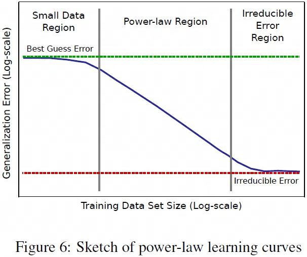

## 1
> 论文：Deep Learning Scaling is Predictable, Empirically  
> Baidu Research, 2017 Dec

### 主要内容
- this paper is the first to empirically characterize learning curve and model size scaling trends for a broad range of application domains and models.
- Our empirical results show power-law generalization error scaling across a breadth of factors, resulting in power-law exponents——the "steepness" of the learning curve——yet to be explained by theoretical work. Further, model improvements only shift the error but do not appear to affect the power-law exponent. We also show that model size scales sublinearly with data size.
- These scaling relationships have significant implications on deep learning research, practice, and systems. They can assist model debugging, setting accuracy targets, and decisions about data set growth. They can also guide computing system design and underscore the importance of continued computational scaling.
- accurately predicting generalization error scaling with training set size would provide a powerful tool for estimating the costs—in data and compute requirements—for advancing state-of-the-art (SOTA).

#### Generalization Error Scaling with Data
- learning curves measure how much training data a model family requires to reach a particular accuracy.
- generalization error curve
- loss learning curve
- Many studies theoretically predict that generalization error "learning curves" take a power-law form, $\epsilon (m) \propto \alpha m^{\beta_g}$. 
    - $\epsilon$ 为generalization error  
    - $m$ number of training samples
    - $\alpha$ is a scalar
    - $\beta_g$ scaling exponent，一般为负数, g=generation error

- Our results show that power-law learning curves exist across all tested domains. Although different applications yield different power-law exponents and intercepts
- Improved model architectures and optimizers can improve the power-law intercept, but not the exponent

#### Model Capacity Required to Fit Data
- model size scaling
- number of model parameters to fit a data set should follow $s(m) \propto  \alpha m^{\beta_p}$
    - $s(m)$ is the required model size to fit a training set of size m
    - $\alpha$ is a scalar
    - $\beta_p \in [0.5, 1]$ p=parameter

- These studies show that while model capacity might explain a model’s ability to memorize training examples, capacity may not adequately explain the model’s ability to generalize to new examples.
- Rather than reason through these complexities, it is currently easier for researchers and practitioners to over-parameterize models to fit training data
- train "hyperparameter-reduced" versions of these models on successively larger subsets (shards) of a training set to see how the accuracy of the model grows with training set size.
- "large data set" is a training set that could be reduced in size by 2-3 orders of magnitude and still be significant enough to perform valuable model architecture studies.
- Data sets: shard in steps of roughly 2x, e.g., 0.1% T, 0.2% T, 0.2% T, ...
- We use either the validation set available with training data, or if such a validation set is not available, we use a hold-out subset of T that does not overlap with any of the T shards.
- $\forall_i V \cap T_i = \phi$

- small data region
- power-law region
- irreducible error region

## 2
> 论文：Scaling Laws for Neural Language Models  
> Johns Hopkins University & OpenAI, 2020 Jan  

## 3
> 论文：Scaling Laws for Autoregressive Generative Modeling  
> OpenAI, 2020 Oct

## 3
> 论文：Training Compute-Optimal Large Language Models  
> DeepMind, 2022 Mar
