## KVQuant
> 论文：KVQuant: Towards 10 million context length LLM inference with KV cache quantization  
> Github：[KVQuant](https://github.com/SqueezeAILab/KVQuant)  
> UC Berkeley & Stanford University & Independent Researcher & UC San Diego, 2023 Sep, SIGOPS 2023

### 主要内容
随着LLM的发展，KV Cache已称为主流的存储优化方案之一，但随着context_window的增长，长序列KV Cache成为了存储空间消耗的重要原因，KVQuant通过采用几种新颖的方法促进了低精度KV Cache量化。

    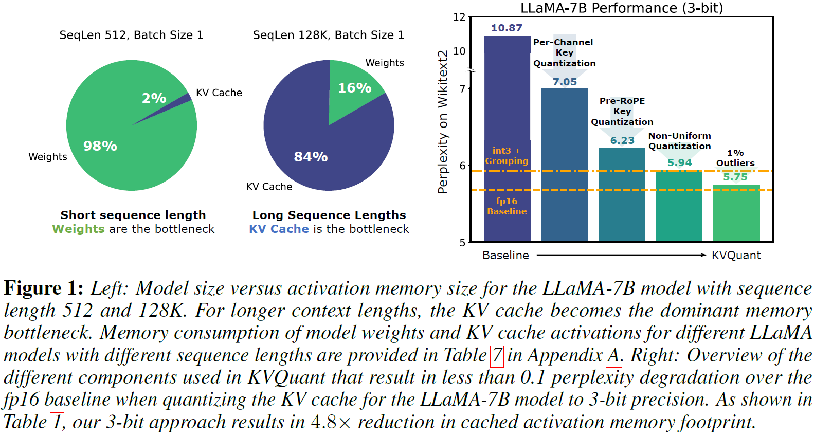

#### Group-wise Pre-RoPE Key Quantization
在LLM中，pre/post-RoPE Key以及Value有不同的表现形式

- pre-RoPE Key在某些特征维度中表现出明显的量级离群值
- post-RoPE Kye相应的离群特征维度的幅度量级不再有一致性
- Value无明显的固定离群值表现形式

    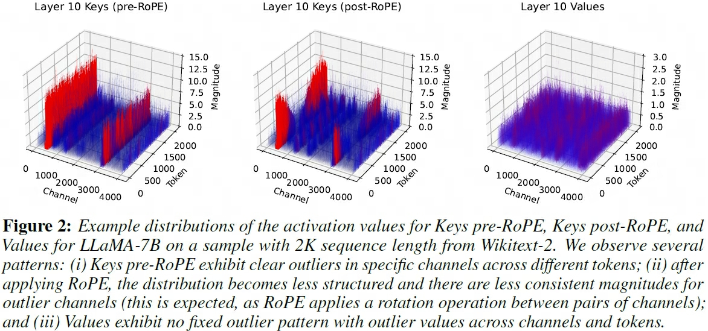

基于上述现象以及消融对比实验，采用了以下量化方案

1. **Token-wise Value Quantization**
2. **Group-wise Pre-RoPE Key Quantization** 先量化pre-RoPE Key，反量化后再实时嵌入位置编码信息RoPE

    

        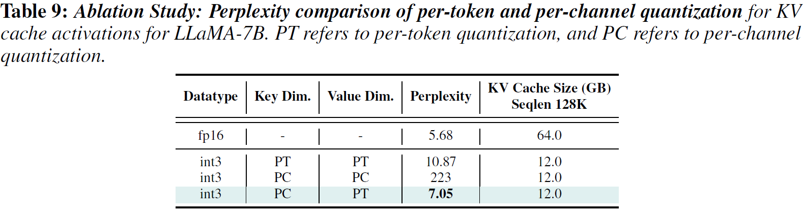
    

    !!! info 
        - Group-wise：pre-RoPE Key Quantization 较 post-RoPE Key Quantization效果更佳
        - Token-wise：post-RoPE Key Quantization 较 pre-RoPE Key Quantization效果更佳
        
    

        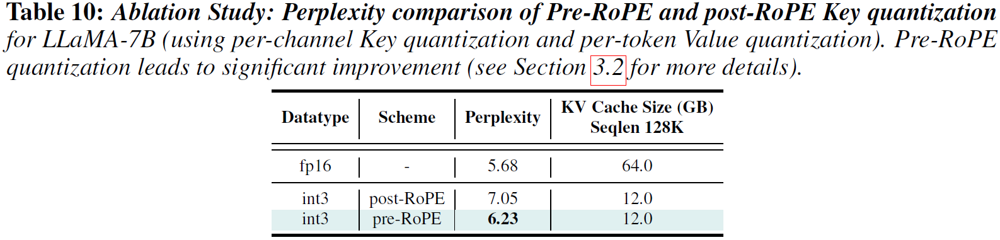
    

    

        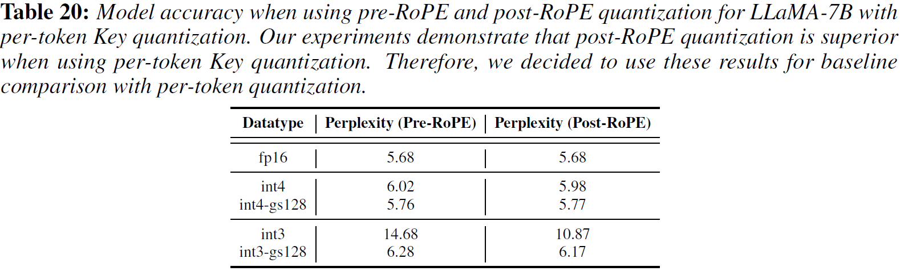
    

    > `gs`: group-size

#### Non-Uniform Quantization

**nuqX** (An X-Bit Sensitivity-Weighted Non-Uniform Datatype) 位宽为X的敏感度加权非均匀量化数据类型，该非均匀量化主要包括以下部分

1. **敏感度**：有标签数据对反向梯度的平方 Fisher Information Matrix  $\mathcal{F}_{i,i}$，用于计算loss时加权
2. **Quantization**：对activation进行归一化后再量化

    $$
    \begin{aligned}
        A_{i, norm} =& \frac{A_i - z_i}{s_i} \\
        \hat{A}_i =& s_i \hat{A}_{i, norm} + z_i \\ 
        \Delta A =& s \cdot (A_{norm} - \hat{A}_{norm})
    \end{aligned}
    $$

    > - $z_i$ 为均值，类型为fp16
    > - $s_i$ 为对应的缩放因子

3. **Calibration Loss**： 用 $N$ 条数据的校正集，离线 k-means 量化校正activation quantization

    $$
    \begin{aligned}
        Q(A) \simeq& \mathop{\text{arg min}}\limits_{Q} \sum_{i=1}^{N} \mathcal{F}_{i,i} \cdot \left(A_i - Q\left(A_i\right)\right)^2
    \end{aligned}
    $$

    ??? info "^^Calibration损失函数推导过程^^：基于有监督MSE"

        $$
        \begin{aligned}
        \mathbb{E}_{\Delta A} \left[ \vert f(A) - f(A + \Delta A) \vert^2\right] \approx & \mathbb{E}_{\Delta A} \left[ \left(J(A)\Delta A)^2\right) \right] \\ 
        =& \mathbb{E}_{\Delta A}\left[ \left(\sum_{i} J_i \Delta A_i \right)^2\right] \\
        =& \mathbb{E}_{\Delta A} \left[ \sum_{i} J_i\Delta A_i^2 \right]\\
        =& \sum_{i} J_i^2 \mathbb{E}_{\Delta A}[\Delta A_i^2]\\
        \end{aligned}
        $$

        - $\approx$ 近似步骤进行了泰勒展开
        - $J(A) = \frac{\partial f}{\partial A} (A), J_i = \frac{\partial f}{\partial A} (A_i)$

4. **Calibration Runtime** 离线量化时间开销
    

        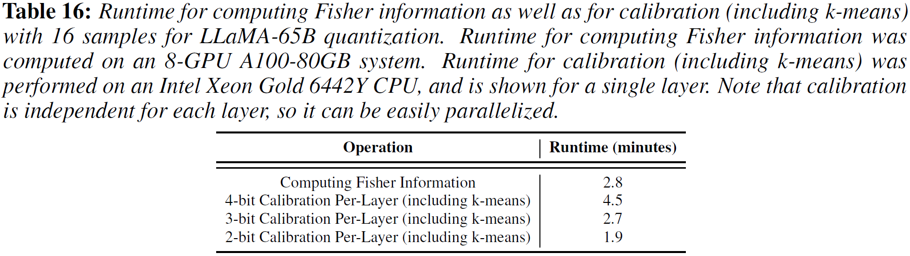
    

5. **各部分效果贡献** 消融对比实现各部分效果贡献
    

        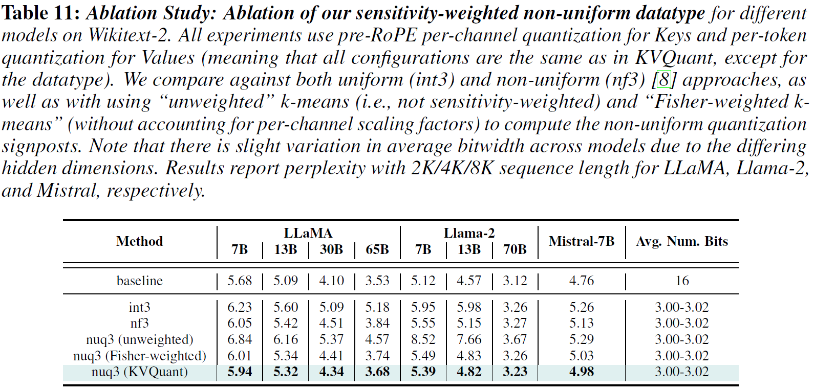
    

#### Per-Vector Dense-and-Sparse Quantization

    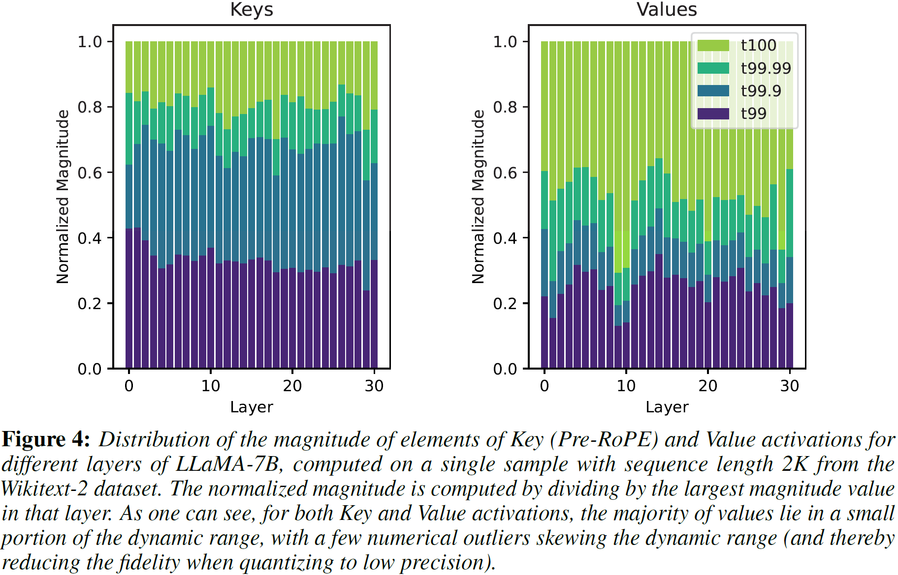

由pre-RoPE Key和Value的normalized数值分布CDF可知，大部分的数据分布在较窄的数值空间内，离群值分布在较大的数值空间内。因此可以通过约束少部分的离群值来将数值空间有效缩小，从而提高量化精度。而不同特征维度的数值量级不同，因此可对 ^^Group-wise pre-RoPE Key Quantization^^ 以及 ^^Token-wise Value Quantization^^ 分别设置离群值阈值：

1. **Clamp + Normalize** 确定上、下离群值阈值，将区间内数据保留并归一化至值域空间$[-1, 1]$，保持离群值数据精度不量化
2. **Calibration** 照上述 [nuqX](#non-uniform-quantization) 方法对区间值进行矫正

在进行Dense-and-Sparse Quantization操作时，发现以下几种方式能够进一步优化量化效果

- [x] 实验表明细粒度的per-Vector方案较per-Matrix方案能够取得更好的量化效果
    

        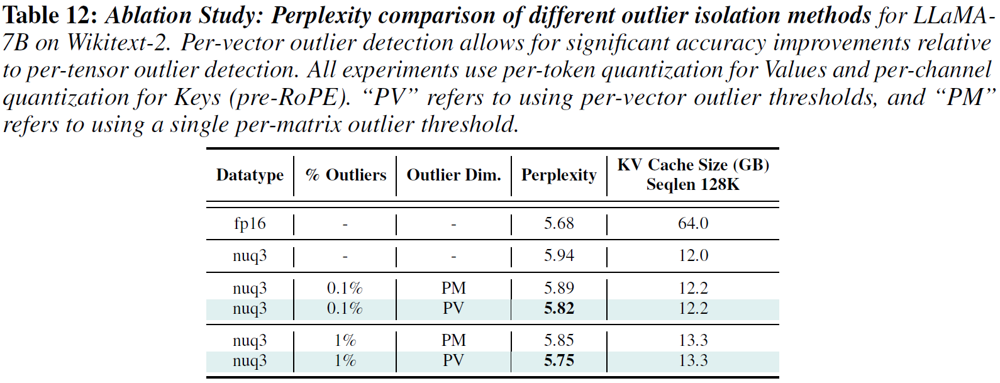
    

- [x] 并行操作`Value Projection + CPU Outlier Isolation && Key Projection` 量化效率更高，前者实时计算量化，后者离线校正量化
    

        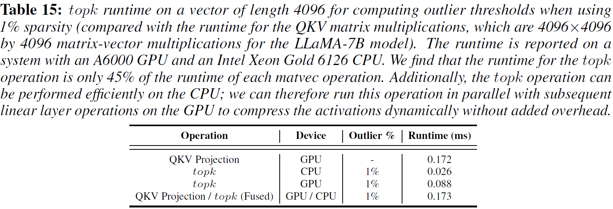
    

> `nuq2-1%` 表示稀疏度为1%，即忽略示1%的离群值不进行量化
#### Attention Sink-Aware Quantization
在LLM中，模型对于第一个token的attention分数会很高，且与第一个token的语义重要度相关性不高，为尽量减少该个token的量化误差，==保持Key中第一个token原有精度不进行量化==。实验表明该方法对量化效果有一定的提升

    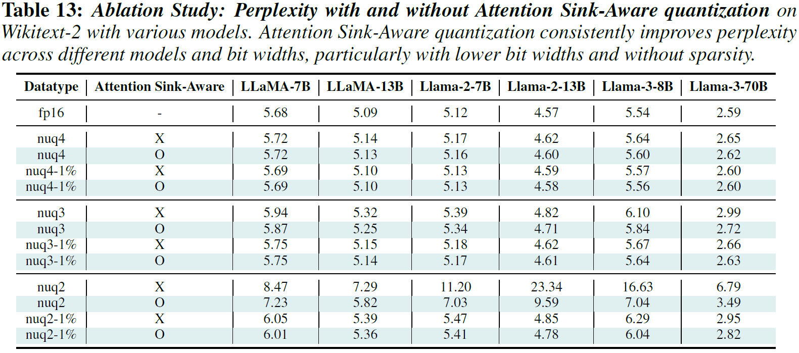

#### Kernel Implementation
通过以下方式实时高效实现activation quantization

- [x] 通过 Compressed-Sparse Row (CSR) or Compressed-Sparse Column (CSC) 数据格式存储Value/pre-RoPE Key离群值, see Appendix R Kernel Implementation Details
- [x] 使用稀疏离群值执行稀疏矩阵密集向量乘法
- [x] 融合 `pre-RoPE Key Quantization + apply RoPE on-the-fly` 算子

    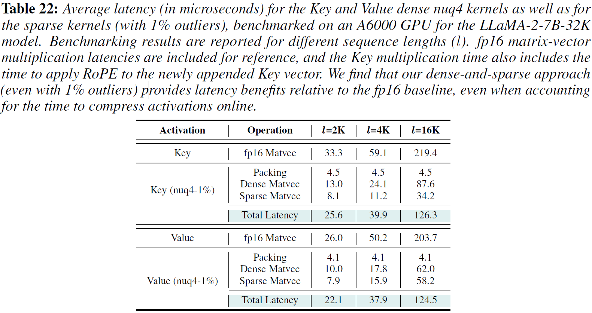

> `matvec`: matrix-vector

#### Evaluation

- [x] 离群值稀疏度在$[0.1\%, 1\%]$ 内，稀疏度越高，量化效果越佳
    

        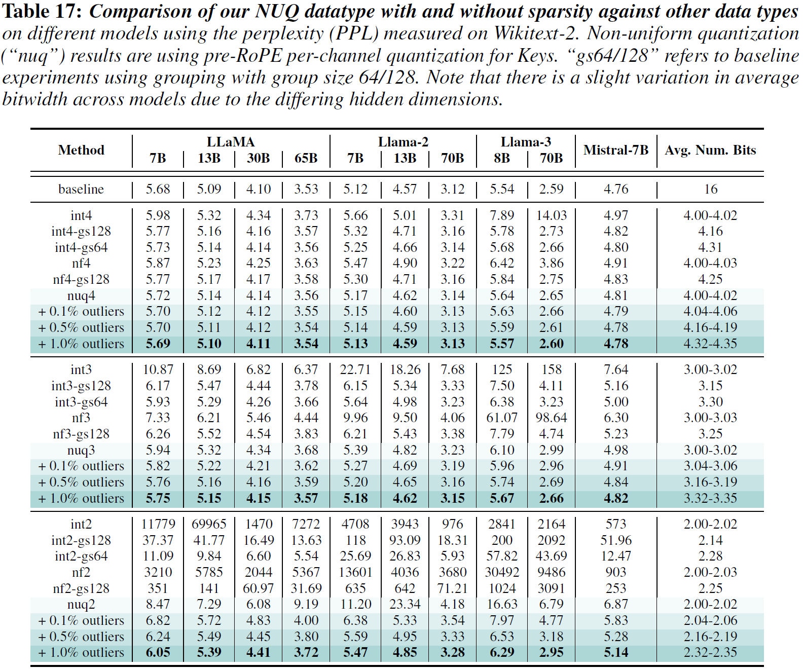
    

    
    > `baseline`: Token-wise post-RoPE Key Quantization

- [x] KVQuant校正精度对校正数据集不敏感

    

        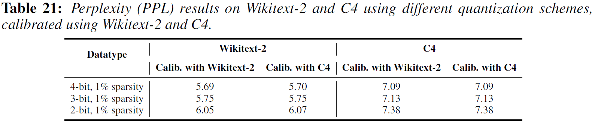
    

