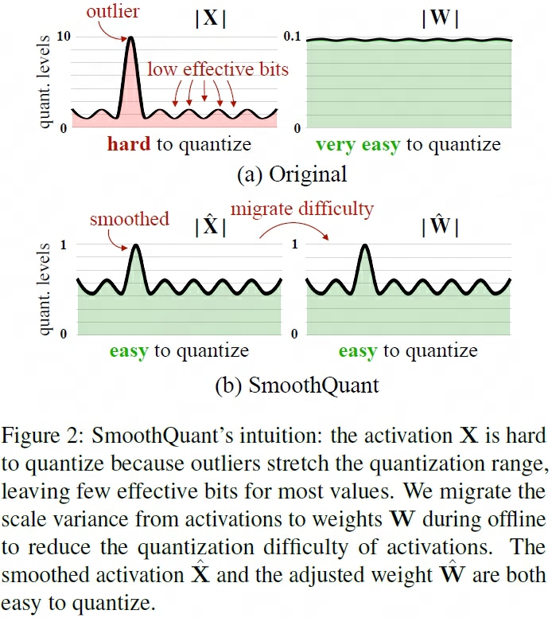
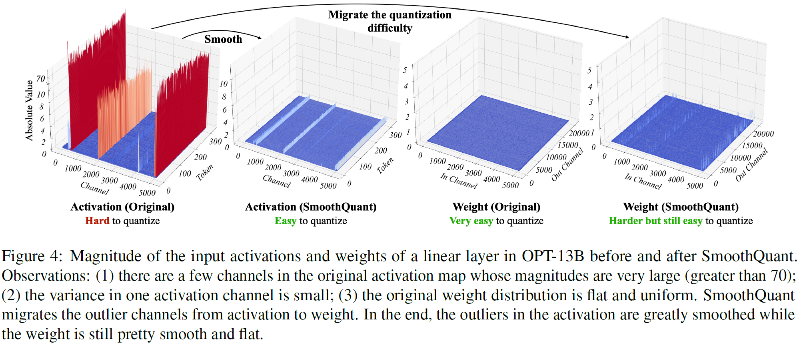
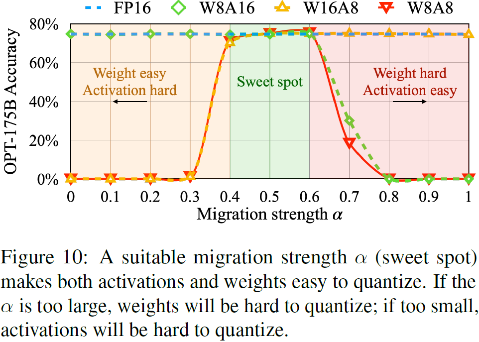
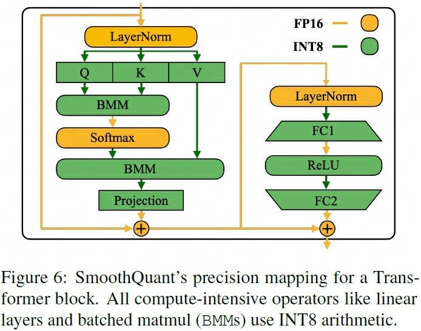

## SmoothQuant
> 论文：SmoothQuant: Accurate and Efficient Post-Training Quantization for Large Language Models  
> Github：[smoothquant](https://github.com/mit-han-lab/smoothquant)  
> Massachusetts Institute of Technology & Nvidia, 2022 Nov, ICML 2023

### 主要内容
由于权重参数 weight 的离群值较激活值 activation 中离群值更少，更容易量化，因此可通过数学式等价变换将 activation量化困难度迁移到 weight来高效实现量化

    

#### SmoothQuant

    

因为activation不同特征维度的数值量级存在明显差异，但不同token同一特征维度的数值量级方差不大，而weight的数值量级与方差均较为平缓均匀，因此可将量化难度从activation转移到weight上，即

$$
Y = (X \text{diag}(s)^{-1})(\text{diag}(s)W) = \hat{X}\hat{W}
$$

其中 **量化难度迁移程度** $\text{diag}(s) \in \mathbb{R}^{d_{in}\times d_{in}}$

- $s_j  = \max(\vert X_j \vert )$ cloumn-wise取$\text{absmax}(X)$，将所有的activation量化难度迁移至weight
- $s_j  = \max\left(1/{\vert W_j \vert} \right)$ row-wise取$\text{absmax}(W)$，将所有的weight量化难度迁移至activation
- $s_j = \max(\vert X_j \vert)^\alpha / \max(\vert W_j \vert)^{1-\alpha}$，超参$\alpha$ 协调activation量化难度迁移至activation的程度

    

#### SmoothQuant to TRM Block
- Attention层的输入以及高算力要求 BMM(Batch Matrix Multiplication) 权重参数使用INT8量化
- ReLU, LN以及Softmax等轻量级element-wise操作使用FP16存储

    

