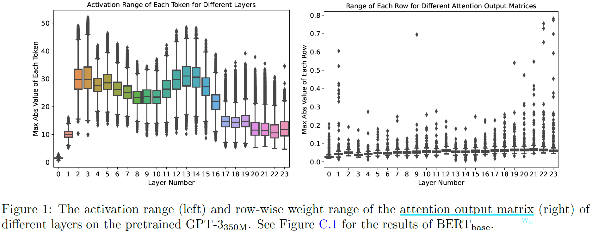
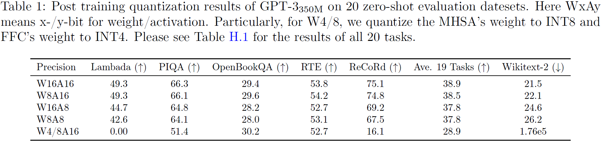
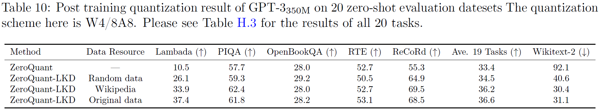
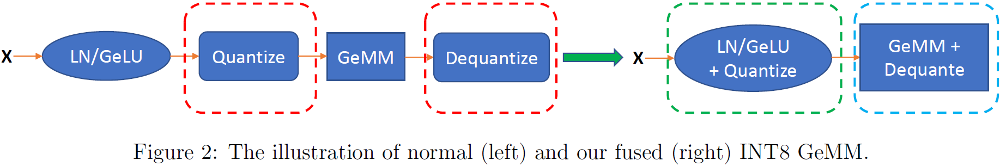
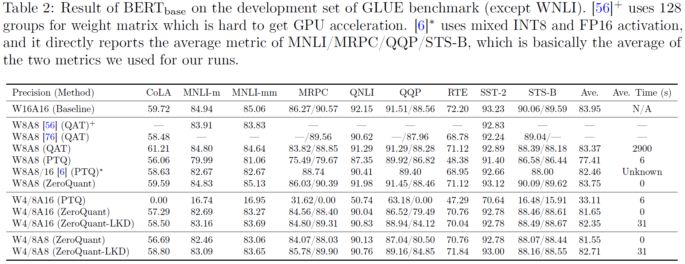
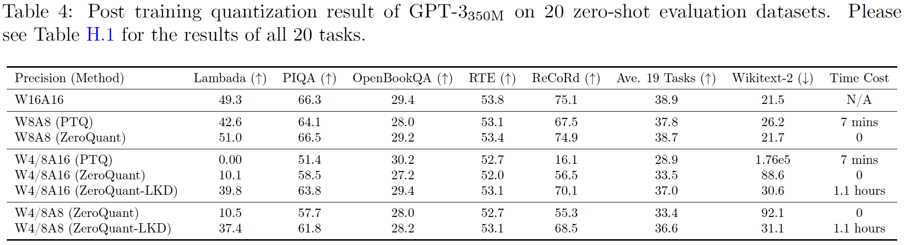
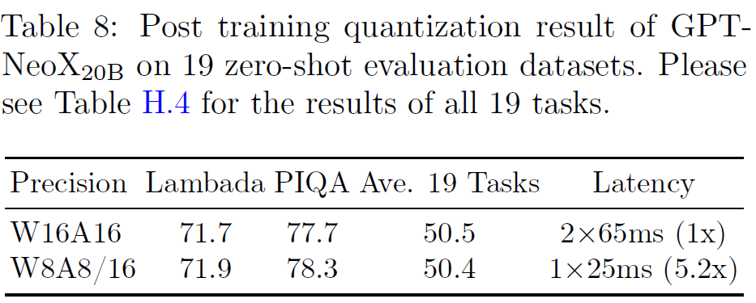
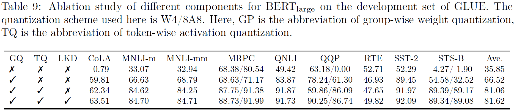

## ZeroQuant
> 论文：ZeroQuant: Efficient and Affordable Post-Training Quantization for Large-Scale Transformers  
> Microsoft, 2022 Jun, NeurIPS 2022

### 主要内容

#### Motivation
- [ ] **Dynamic Activation Range** 激活值范围具有较大的方差，直接对所有token使用相同的INT8量化方案会导致明显的效果下降。
    

        
    

    

        
    

#### ZeroQuant
ZeroQuant在weight 和 activation 上应用了细粒度硬件友好的PTQ量化方案，

- **Group-wise Weight Quantization**, 将矩阵拆分成多组分别进行独立量化（一般基于GEMM $Y=XW$特性采用Column-wise拆分）
- **Token-wise Activation Quantization**，对于每个token 的向量表示 $h_t \in \mathbb{R}^d$，分别计算缩放因子 $s_t = \frac{\text{absmax}(h_t)}{2^{b-1} - 1}$ 用于量化

> TQ动态计算范围，无需静态校正activation range

#### LKD
进一步设计了对量化后的模型权重参数 weight 进行蒸馏的方法LKD (Layer-by-layer Knowledge Distillation)：使用原始模型作为teacher model，目标量化蒸馏模型作为student model，迭代地逐层蒸馏。对于原始模型层 $L_k$
，目标量化蒸馏模型层 $\hat{L}_{k}$

1. 获取teacher model的输出 $L_k(h^{k-1})$ 作为ground-truth
2. 通过损失函数约束student model输出 $\hat{L}_k(h^{k-1})$向teacher model靠齐，即

    $$
    \mathcal{L}_{\text{LKD}, k}=\mathcal{L}\left(L_k(h^{k-1}), \hat{L}_k(h^{k-1})\right)
    $$

    

!!! info
    - 对于层$k$，teacher model与student model共享前$k-1$层，即$L_k$ 与 $\hat{L}_k$ 输入相同，无需端到端，任何时刻只有一层需要被蒸馏，大大减少存储开销  
    - $\mathcal{L}$ 可为MSE也可为KL divergence
    - LKD无需使用原始训练数据蒸馏即可达到与原始训练数据相当效果

#### System Kernel Optimization
在推理过程中，批处理大小通常相对较小，因此模型的推理延迟主要取决于从主内存加载数据的时间。通过将权重和激活量化为较低精度，我们减少了加载这些数据所需的数据量，从而可以更有效地利用内存带宽并提高加载吞吐量。然而，直接使用现有的深度学习框架（如 PyTorch）进行Token-wise Quantization 量化与反量化操作产生的额外数据移动开销非常昂贵，甚至超过了低精度带来的性能提升。因此通过以下方法减少性能损失

1. **CUTLASS INT8 GeMM** CUTLASS(CUDA Templates for Linear Algebra Subroutines) INT8 GeMM库
2. **Fusing Token-wise Activation Quantization** 通过融合算子以较少量化与反量化过程中的数据移动
    - ^^Operation Fusion for Token-wise Activation Quantization^^ 将 `add-bias, GELU, LN` 等element-wise操作与量化步骤融合
    - ^^Dequantization Associated with GeMM Schedule^^ $\tilde{Y} = (\hat{X}*s_X) (\hat{W}*s_W) =$$ \hat{X}\hat{W} * s_Xs_W$，中间值 $Y_\text{int32} = \hat{X}\hat{W}$ 使用更宽的位宽存储防止溢出

    

        
    

3. **Cuda Graph Enhanced Small Model Inference** As the execution time for specific kernels reduce by optimizing the throughput using the INT8 inference pipeline, the overhead of launching the GPU kernels and the CPU-to-GPU communication become a major bottleneck mostly on small-scale models. To address this issue, we add the CUDA-Graph support to our inference pipeline that reduces the CPU overhead, by storing the trace of the kernels launched during the inference forward computation, and creating the computation-graph to be reused in the next call to the inference pipeline. Thus, after storing the graph for the first time, we can replay the graph for the following requests, which substantially improves the performance especially on small models, such as BERTbase. For a fair comparison, we also enable Cuda Graph for FP16 baseline.  
- thread-blocks, WARPs, and WMMA (Tensor cores)  
#### Evaluation
- **ZeroQuant**与**LKD**能够带来明显的效果提升
    - [x] 较PTQ与QAT能带来明显的效果提升，能够更高效地完成量化工作
    - [x] 在超低精度量化条件下依然能够取得较好的效果表现
    

        
    

    

        
    

- Self-Attention模块数值敏感度较高，可保守选择量化比例（$W_{q/k/v}$ 的输入使用FP16）
    

        
    

#### Ablation
- [x] GQ, TQ以及LKD均对PTQ有增益表现
    

        
    
